---

### 一、 进程的表示（Unix V6++系统）

这部分内容主要涉及进程在静态（文件）、虚拟内存和物理内存中的三种存在形态，以及内核如何通过数据结构和MMU机制将它们联系起来。

#### 1. 可执行文件格式
可执行文件是进程的静态形式，存储在磁盘上。
*   **组成结构**：
    *   **程序头 (Header)**：描述程序地址空间中逻辑段的信息（大小、入口地址等）。
    *   **代码段 (.text)**：应用程序中定义的函数，指令指令。
    *   **数据段 (.data)**：带初值的全局变量。
    *   **只读数据段 (.rdata)**：常量（如字符串字面量）。
    *   **符号表**：用于调试和链接。
*   **加载过程**：执行时，内核读取程序头，分配内存，将代码段、数据段复制到内存，**BSS段**（未初始化全局变量）在内存中清零，并初始化用户栈（压入命令行参数）。
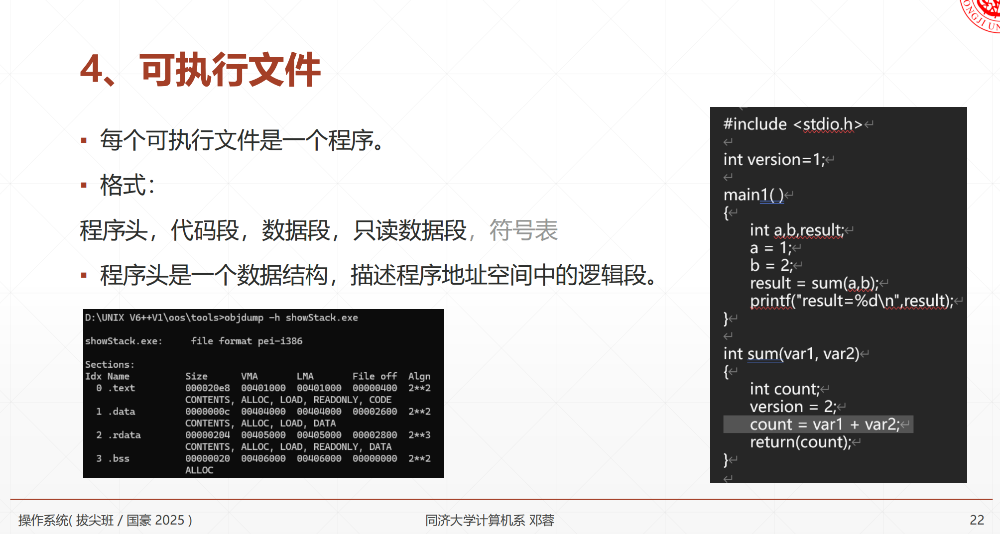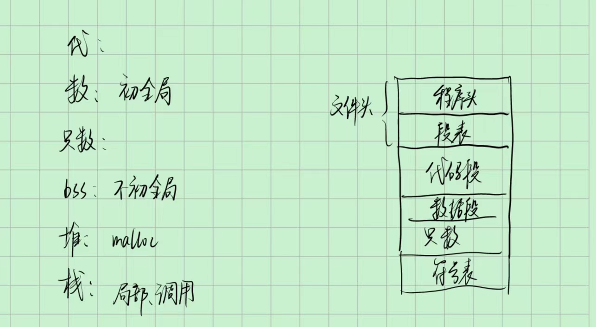

#### 2. 进程图像
进程图像是进程执行时占用的所有资源集合。分为物理空间视角和虚空间视角。

**(1) 物理空间中的进程图像**
Unix V6++ 采用**连续内存管理**方式，进程图像在物理内存中分为三部分：
*   **Process结构**：常驻内存，存放在内核的 `Process` 静态数组中，用于调度和基本控制。
*   **共享正文段 (Shared Text Segment)**：
    *   包含：代码段 。
    *   特点：在物理内存中**连续存放**。起始物理地址由 `x_caddr` 记录。可被执行同一程序的多个进程共享（引用计数管理）。
*   **可交换部分 (Swappable Part)**：
    *   包含：**PPDA** (Per Process Data Area) + 数据段/只读数据段/BSS/堆 + 用户栈。
    *   特点：在物理内存中**连续存放**。起始物理地址由 `p_addr` 记录。内存紧张时可被换出到磁盘交换区。
    *   **PPDA**：大小为1页（4096字节），低地址端是 `user` 结构（存放进程私有数据），高地址端是**核心栈**（用于系统调用）。
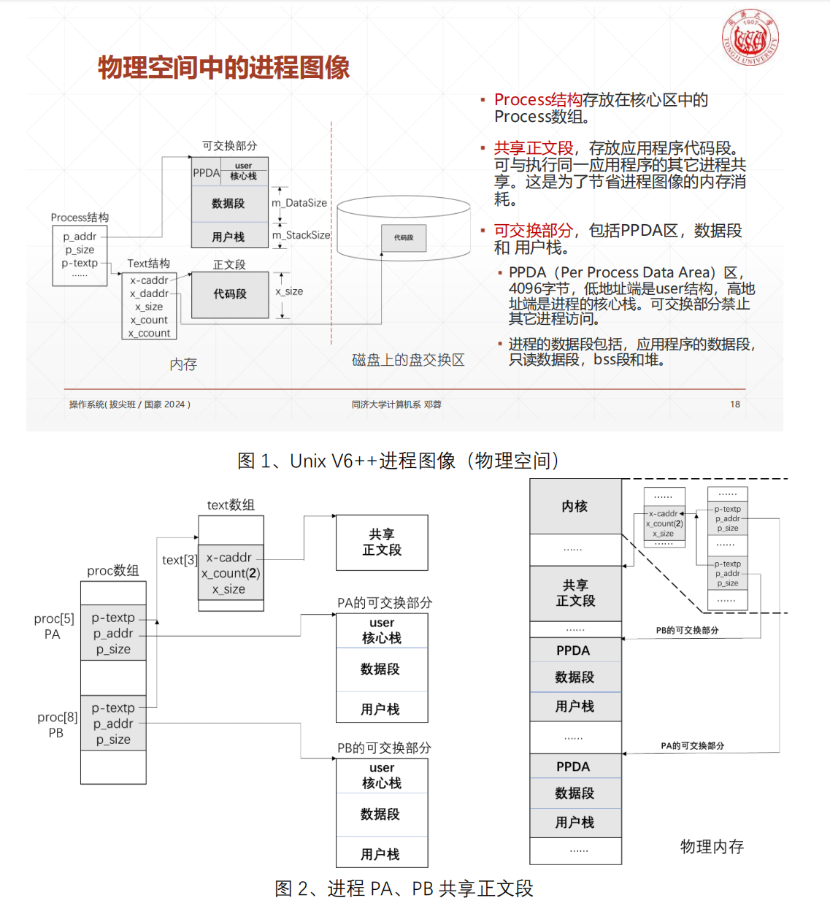

**(2) 虚空间中的进程图像**
Unix V6++ 运行在32位模式下，虚地址空间划分如下：
*   **用户空间 (低地址 [0, 8MB))**：
    *   **0x401000** 起始：代码段 -> 数据段 -> BSS段 -> 堆（向上增长）。
    *   **0x800000** 结束：用户栈（向下生长）。
*   **内核空间 (高地址 [3GB, 4GB))**：
    *   **0xC0000000** 起始：内核代码和数据。
    *   **页表区**：存放系统页表。
    *   **0xC03FF000** (最后一页)：映射到当前运行进程的 **PPDA**。这使得内核可以通过固定虚拟地址访问当前进程的 `user` 结构和核心栈。
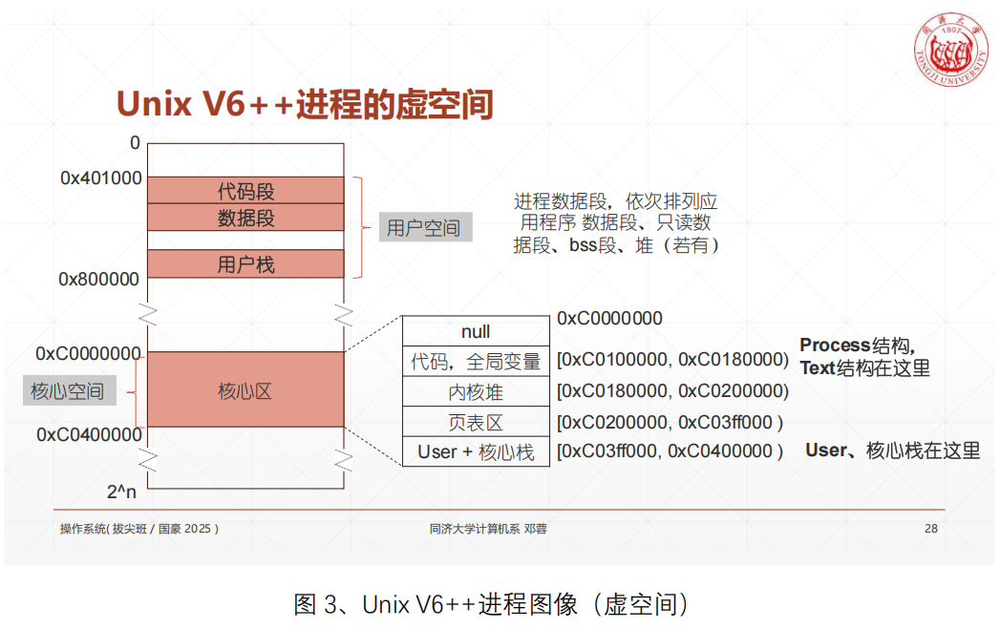

#### 3. 相对虚实地址映射表 (Relative Table)
由于 Unix V6++ 采用连续分配（段式管理的思想），物理页框是连续的，因此内核不需要在软件层面记录每一个页的物理地址，只需要记录**相对于段起始位置的偏移**。
*   **位置**：存放在进程的 `user` 结构中 (`u_MemoryDescriptor`)。
*   **结构**：每个表项包含 `base` 和 `prot`。
    *   **base**：相对于共享正文段起始页框 (`x_caddr`) 或 可交换部分起始页框 (`p_addr`) 的**偏移量**。
    *   **prot**：保护属性（RO只读 / RW可读写）。
*   **作用**：作为**模板**。当进程被调度运行时，内核根据此表和当前的 `p_addr`、`x_caddr` 计算出绝对物理页框号，填入硬件页表。
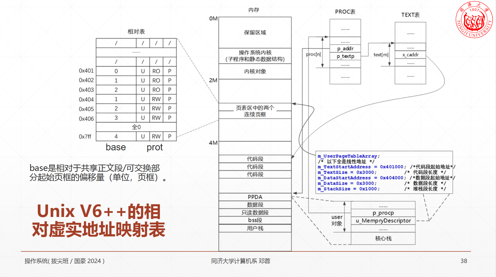

#### 4. MapToPageTable( ) 为新运行进程建立地址映射关系
这是进程切换 (`Swtch`) 中的关键步骤。
*   **目标**：刷新硬件页表（系统用户页表），让 CPU 能正确访问新进程的内存。
*   **步骤**：
    1.  **更新核心页表**：将新进程的 `p_addr`（PPDA物理地址）填入核心页表（映射到虚地址 `0xC03FF000`），刷新 TLB。此时 `u` 变量指向新进程的 user 结构。
    2.  **获取基址**：从 `Process` 结构获取 `x_caddr` (代码段基址) 和 `p_addr` (数据段基址)。
    3.  **遍历相对表并写入硬件页表**：
        *   对于**只读 (RO)** 段（代码）：`物理页框号 = (x_caddr >> 12) + relative_base`。
        *   对于**读写 (RW)** 段（数据/栈）：`物理页框号 = (p_addr >> 12) + relative_base`。
        *   将计算出的物理页框号写入 **0x202** 和 **0x203** 号物理页框（这是 Unix V6++ 存放用户空间页表的固定物理位置）。
    4.  **刷新 TLB**：执行 `FlushPageDirectory()`，使映射生效。
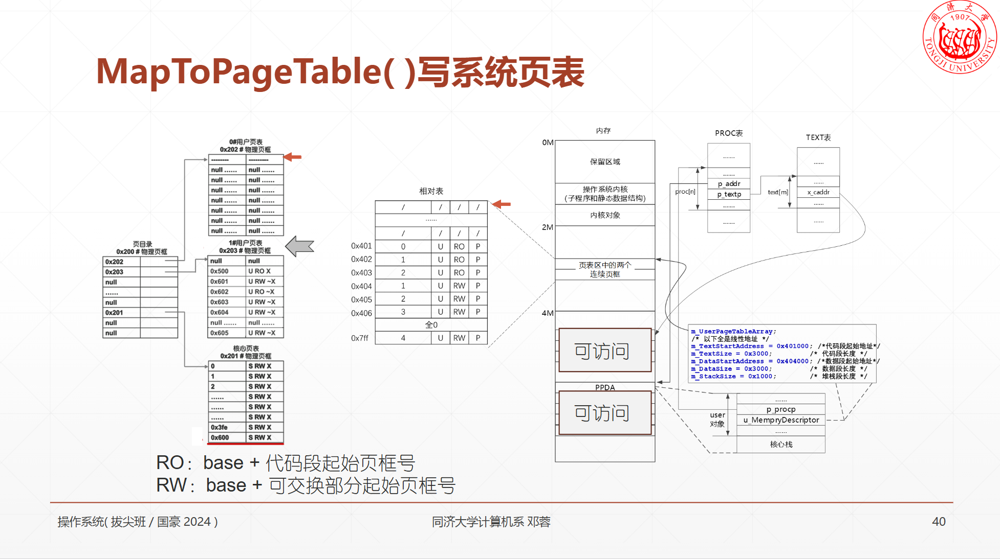
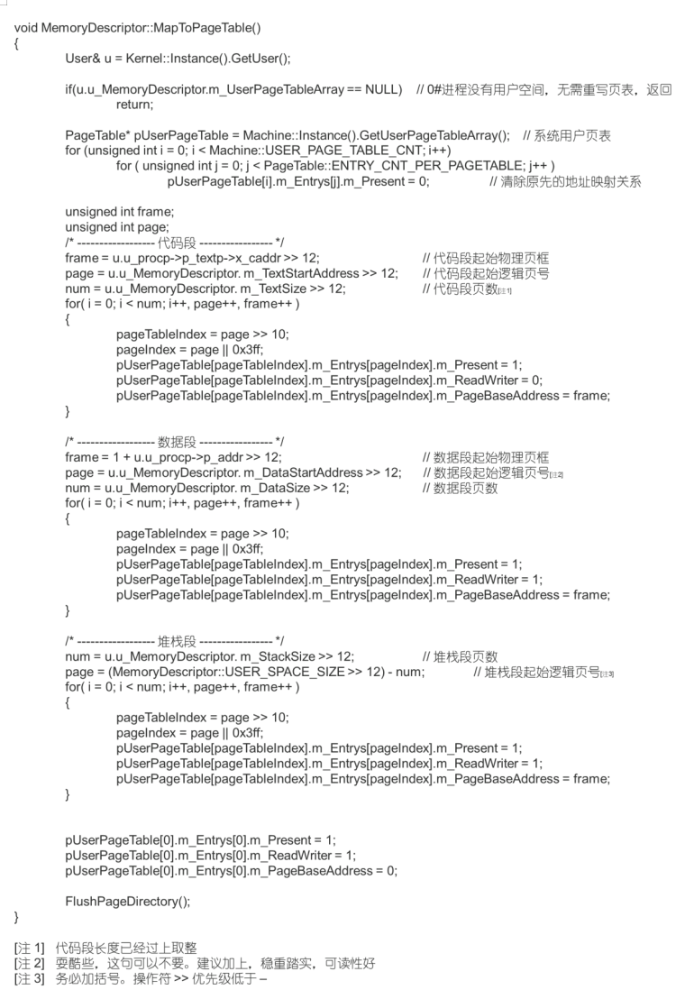

#### 5. 运行时地址转换 (MMU工作原理)
*   **逻辑地址 -> 物理地址**：
    1.  程序运行时，CPU 执行单元给出**逻辑地址**（虚拟地址）。
    2.  **MMU (内存管理单元)** 硬件自动拦截该地址。
    3.  MMU 查询当前有效的**系统用户页表**（由 `MapToPageTable` 刚刚填充好的）。
    4.  如果权限检查通过（如：用户态不能写只读段），MMU 将逻辑页号替换为物理页框号，加上页内偏移，得到**物理地址**，发往内存总线。
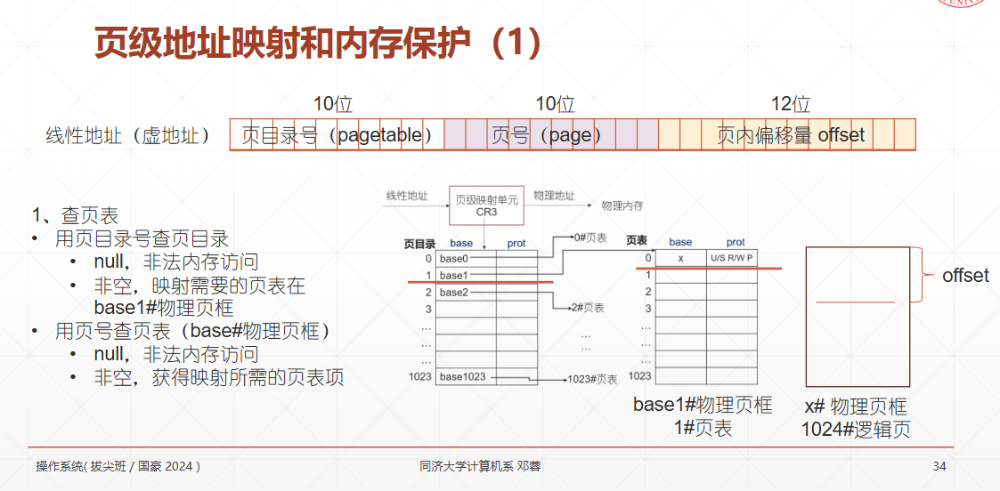
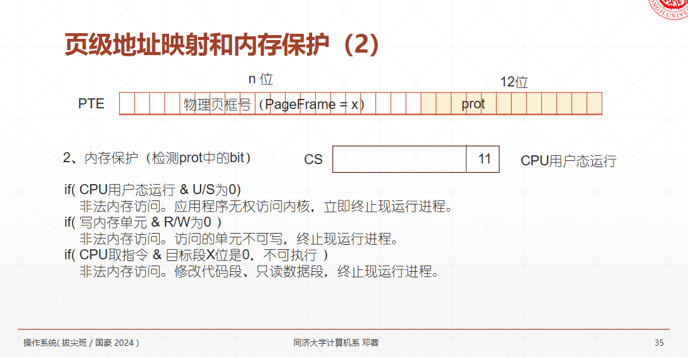
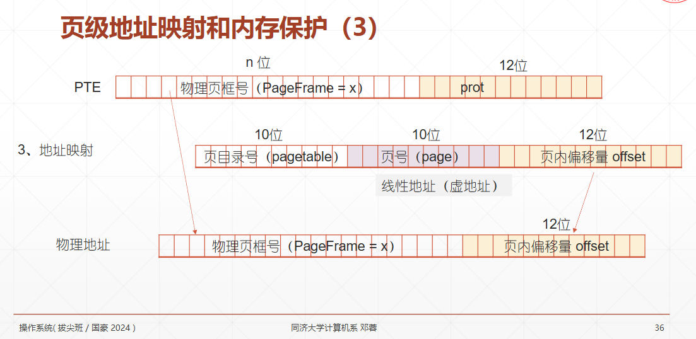
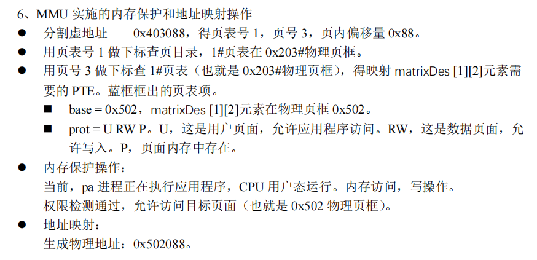

#### 6. i386 MMU 与 二级页表
**来源**：PDF《Unix V6++的内存管理子系统（上）》第30-36页
Unix V6++ 运行在 Intel i386 架构上，使用**二级页表**机制。
*   **地址结构 (32位)**：
    *   **高10位**：页目录索引 (Page Directory Index)。
    *   **中10位**：页表索引 (Page Table Index)。
    *   **低12位**：页内偏移 (Offset)。
*   **寄存器 CR3**：存放**页目录**的物理基地址。
*   **3次访存机制**（重要考点）：
    每次 CPU 取指令或访问内存数据时，如果没有 TLB 缓存，硬件需要访问内存 **3次**：
    1.  **第1次**：访问 **页目录 (Page Directory)**，获取页表的物理地址。
    2.  **第2次**：访问 **页表 (Page Table)**，获取目标物理页框的地址。
    3.  **第3次**：访问 **物理页框**，真正读取指令或数据。
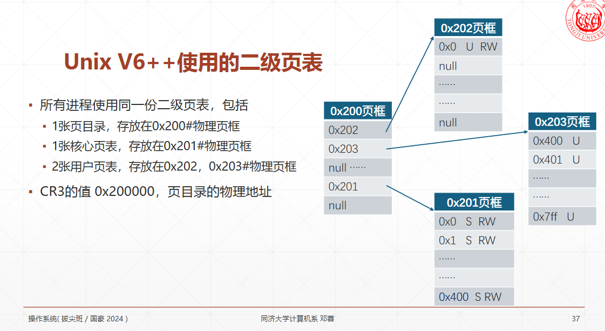
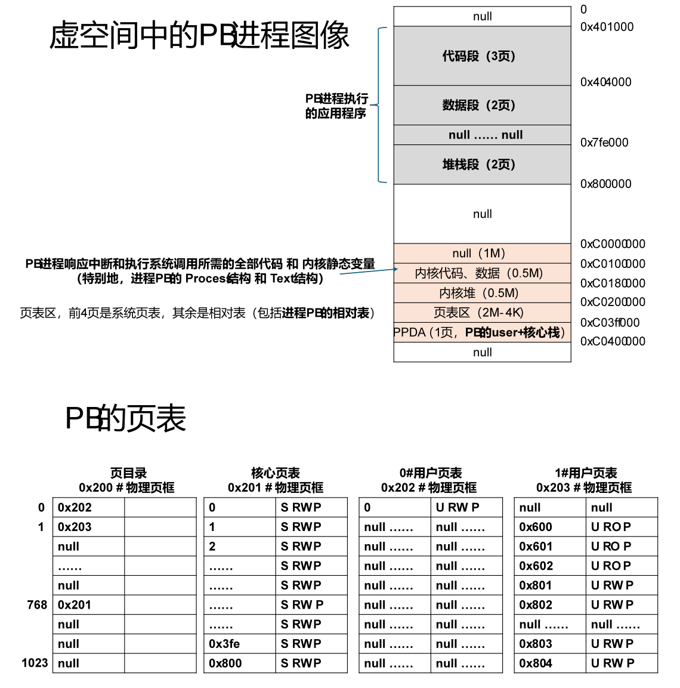
---

### 二、 进程状态转换
### 1. `Swtch( )` 函数：进程切换的“中转站”

`Swtch()` 是 Unix V6++ 实现多道程序并发的核心，负责**保存旧进程现场**并**切换到新进程执行**。

#### **源代码注释与逻辑**
```cpp
int ProcessManager::Swtch()
{	
	User& u = Kernel::Instance().GetUser();
	/* 1. 现场保护：保存即将下台进程的内核栈指针 */
	// 填空考点：u.u_rsav 是 user 结构中专门保存 ESP/EBP 的数组
	SaveU(u.u_rsav); 

	/* 2. 中转：临时切换到 0# 进程（内核线程） */
	// 理由：0# 进程不跑应用，环境最“干净”，由它负责执行 Select() 挑选新王
	Process* procZero = &process[0];

	/* 临界区操作：通过 CLI/STI 禁止中断，防止栈指针恢复到一半被中途打断 */
	X86Assembly::CLI();
	SwtchUStruct(procZero); // 映射 0# 进程的 PPDA
	RetU();                 // 从 0# 进程的 u_rsav 中恢复其 ESP/EBP
	X86Assembly::STI();

	/* 3. 挑选新进程：在就绪队列（SRUN）中找优先级最高的（p_pri 最小） */
	Process* selected = Select();

	/* 4. 恢复新进程现场 */
	X86Assembly::CLI();
	SwtchUStruct(selected); // 切换 MMU 映射，指向新进程的 PPDA
	RetU();                 // 关键：恢复新进程上次下台时保存的 ESP/EBP
	X86Assembly::STI();

	/* 5. 刷新用户页表：根据新进程的相对表重写硬件页表（0x202, 0x203） */
	User& newu = Kernel::Instance().GetUser();
	newu.u_MemoryDescriptor.MapToPageTable();
	
	/* 6. 特殊处理：如果新进程是被 Swap 换出的，通过 aRetU 跳转 */
	if ( newu.u_procp->p_flag & Process::SSWAP )
	{
		newu.u_procp->p_flag &= ~Process::SSWAP;
		aRetU(newu.u_ssav);
	}
	
	/* 子进程 fork 返回时，Swtch 会让它在这里返回 1 */
	return 1;
}
```

#### **代码填空考点归纳**
*   **现场保存宏**：`SaveU(u.u_rsav)`。
*   **现场恢复宏**：`RetU()`（恢复当前进程 `u_rsav` 到寄存器）。
*   **映射建立函数**：`MapToPageTable()`。
*   **0# 进程的作用**：承担 `Select()` 挑选就绪进程的任务。

---

### 2. `Sleep( )` 函数：主动放弃 CPU

当进程需要等待资源（如磁盘 IO、信号量）时，调用此函数进入阻塞态。

#### **源代码注释与逻辑**
```cpp
void Process::Sleep(unsigned long chan, int pri)
{
	User& u = Kernel::Instance().GetUser();
	ProcessManager& procMgr = Kernel::Instance().GetProcessManager();

	if ( pri > 0 ) // 低优先权睡眠：可以被信号（Signal）打断
	{
		/* 检查信号：如果在入睡前就有不可忽略的信号 */
		if ( this->IsSig() )
		{
			// 填空考点：u.u_qsav 用于系统调用出错时的快速返回
			aRetU(u.u_qsav); 
			return;
		}

		X86Assembly::CLI();
		this->p_wchan = chan;       // 设置睡眠通道（通常是内核变量地址）
		this->p_stat = Process::SWAIT; // 状态设为 SWAIT（低优睡眠）
		this->p_pri = pri;             // 设置唤醒后的优先数
		X86Assembly::STI();

		/* 0# 进程检查：如果有进程在磁盘交换区，唤醒 0# 进程去换入 */
		if ( procMgr.RunIn != 0 )
		{
			procMgr.RunIn = 0;
			procMgr.WakeUpAll((unsigned long)&procMgr.RunIn);
		}

		/* 执行进程切换：放弃 CPU */
		Kernel::Instance().GetProcessManager().Swtch();

		/* 被唤醒后再次检查信号（防止睡眠期间收到了信号） */
		if ( this->IsSig() )
		{
			aRetU(u.u_qsav);
			return;
		}
	}
	else // 高优先权睡眠：不可被信号打断（如磁盘IO）
	{
		X86Assembly::CLI();
		this->p_wchan = chan;
		this->p_stat = Process::SSLEEP; // 状态设为 SSLEEP（高优睡眠）
		this->p_pri = pri;
		X86Assembly::STI();

		Kernel::Instance().GetProcessManager().Swtch();
	}
}
```

#### **代码填空考点归纳**
*   **睡眠原因字段**：`p_wchan`。
*   **状态区分**：`SWAIT`（可被打断）、`SSLEEP`（不可被打断）。
*   **信号处理跳转**：`aRetU(u.u_qsav)`。

---

### 3. `WakeUpAll( )` 与 `IsSleepOn( )`：进程同步

#### **源代码注释与逻辑**
```cpp
void ProcessManager::WakeUpAll(unsigned long chan)
{
	/* 遍历全系统的进程表 */
	for(int i = 0; i < ProcessManager::NPROC; i++)
	{
		/* 如果进程正睡在 chan 这个通道上 */
		if( this->process[i].IsSleepOn(chan) )
		{
			/* 唤醒它：状态改为 SRUN */
			this->process[i].SetRun();
		}
	}
}

bool Process::IsSleepOn(unsigned long chan)
{
	/* 判断标准：睡眠原因匹配 且 状态是睡眠态（SWAIT/SSLEEP） */
	if( this->p_wchan == chan 
		&& (this->p_stat == Process::SWAIT || this->p_stat == Process::SSLEEP) )
	{
		return true;
	}
	return false;
}

void Process::SetRun()
{
	ProcessManager& procMgr = Kernel::Instance().GetProcessManager();

	/* 清除睡眠原因，转为就绪状态 */
	this->p_wchan = 0;
	this->p_stat = Process::SRUN;
	if ( this->p_pri < procMgr.CurPri )
	{
		procMgr.RunRun++;
	}
	if ( 0 != procMgr.RunOut && (this->p_flag & Process::SLOAD) == 0 )
	{
		procMgr.RunOut = 0;
		procMgr.WakeUpAll((unsigned long)&procMgr.RunOut);
	}
}
```

---

### 4. `SetPri( )` 函数：优先级动态调节（考纲第 8, 9 点）

这是时钟中断里每秒执行一次的逻辑，体现了 **Unix 的公平性策略**。

#### **源代码注释与逻辑**
```cpp
void Process::SetPri()
{
	int priority;
	ProcessManager& procMgr = Kernel::Instance().GetProcessManager();

	/* 核心公式：p_cpu 是进程最近对 CPU 的使用程度 */
	// 填空考点：除以 16 是为了平滑优先级变化
	priority = this->p_cpu / 16;
	priority += ProcessManager::PUSER + this->p_nice; // PUSER = 100

	if ( priority > 255 ) priority = 255; // 封顶

	/* 抢占检查：如果新算出的优先级变低（数值变大），
	   且比当前正在跑的进程弱了，置 RunRun 标识 */
	if ( priority > procMgr.CurPri )
	{
		procMgr.RunRun++; // 设置强迫调度标识
	}
	this->p_pri = priority;
}
```

---

### **本部分总结（考试避坑指南）**
1.  **u_rsav vs u_qsav**：
    *   `u_rsav`：在 `Swtch()` 中使用，保存/恢复**内核栈**现场。
    *   `u_qsav`：在 `Sleep()` 信号检查中使用，出错时跳转回 `Trap1()` 退出系统调用。
2.  **CLI/STI 的必要性**：在修改 `ESP` 或 `p_wchan` 时必须关中断，保证原子性。
3.  **RunRun 的作用**：它不是立即切换，而是**打一个标记**。CPU 只有在准备返回用户态时，看到 `RunRun > 0` 才会调 `Swtch()`。
4.  **0# 进程身份**：唯一一个不用模式切换（因为它就在内核里）的进程，专门负责调度和交换。
---
*   **`WakeUpAll`** 是 **“后台通知”**：告诉在休息室等着的演员（进程），道具准备好了，可以化妆准备上台了。
*   **`SetPri`** 是 **“评分系统”**：每隔一段时间给台上的演员重新打分，演太久了分就低。
*   **`Swtch`** 是 **“换人动作”**：把当前演员赶下去，换一个新的上来。

下面我按照**“什么时候发生”**这个逻辑，帮你彻底梳理一遍：

---

### 1. `WakeUpAll()` —— 什么时候唤醒？
**核心逻辑**：当**资源来了**或者**事件发生了**。
它的作用是把进程状态从 **“睡眠（阻塞）”** 变成 **“就绪”**，放在就绪队列里排队（还不能马上跑）。

*   **场景一：磁盘读写完了（最常见）**
    *   **谁调用的？** 磁盘中断处理程序（`ATAHandler`）。
    *   **发生了什么？** 硬件通知 CPU 数据好了。内核调用 `WakeUpAll`，唤醒所有在等这个数据的进程（比如 PB）。
    *   **结果**：PB 变成 `SRUN`（就绪），且因为 PB 刚刚做完 IO，优先级很高，通常会把 `RunRun` 标志置位。

*   **场景二：定时器时间到了**
    *   **谁调用的？** 时钟中断处理程序（`Clock`）。
    *   **发生了什么？** `time` 追上了 `tout`。内核调用 `WakeUpAll`，唤醒所有 `sleep` 的进程（比如 PA）。
    *   **结果**：PA 变成 `SRUN`。

*   **场景三：子进程死了**
    *   **谁调用的？** 子进程的 `Exit` 函数。
    *   **发生了什么？** 子进程临死前，调用 `WakeUpAll` 唤醒正在 `Wait` 的父进程。
    *   **结果**：父进程变成 `SRUN`，准备收尸。

---

### 2. `SetPri()` —— 什么时候算分？
**核心逻辑**：**时间片轮转**的驱动力。
它的作用是根据进程最近的表现（CPU 用了多久），重新计算 `p_pri`。**用得越久，优先级越低**。

*   **场景一：每秒钟一次（最核心）**
    *   **谁调用的？** 时钟中断处理程序（`Clock`）。
    *   **发生了什么？** 每过一秒（整数秒），内核要把所有进程的 `p_cpu`（CPU使用量）衰减一下，然后调用 `SetPri` 重新算分。
    *   **结果**：如果当前正在跑的进程分太低了（不如就绪队列里的别人），就置 `RunRun` 标志，准备换人。

*   **场景二：进程刚从内核回用户态时**
    *   **谁调用的？** 系统调用或中断的返回路径。
    *   **发生了什么？** 进程在内核里干完活了（比如 IO 做完了，优先级是 -50），现在要回用户态了，不能带着 -50 这么高的优先级回去。必须调用 `SetPri` 把它降回 100 左右的平民优先级。

---

### 3. `Swtch()` —— 什么时候换人？
**核心逻辑**：**CPU 易手**。
这是真正执行“保存旧栈、恢复新栈”动作的函数。

*   **情况 A：我不想跑了（主动）**
    *   **函数**：`Sleep()`、`Exit()`。
    *   **场景**：进程 A 要读磁盘，数据没在，它必须等。于是它调用 `Sleep()`。
    *   **动作**：`Sleep()` 内部直接调用 `Swtch()`。
    *   **结果**：A 立即下台，B 上台。

*   **情况 B：我被迫下台（被动/抢占）**
    *   **函数**：中断入口程序的汇编代码（返回前夕）。
    *   **场景**：进程 A 正在算数。
        1.  **时钟中断来了** $\to$ `Clock()` 调了 `SetPri` $\to$ 发现 A 时间片到了 $\to$ 置 `RunRun=1`。
        2.  **或者 磁盘中断来了** $\to$ `WakeUpAll` 唤醒了 B $\to$ B 比 A 强 $\to$ 置 `RunRun=1`。
    *   **动作**：中断处理完，准备 `IRET` 回用户态时，检查到 `RunRun` 是 1。于是**强制调用 `Swtch()`**。
    *   **结果**：A 被迫下台（虽然它还想跑），B 上台。

---

### 终极总结表

| 函数          | 谁在用？                | 什么时候用？                                 | 作用是什么？                             | 对应的生活比喻                      |
| :------------ | :---------------------- | :------------------------------------------- | :--------------------------------------- | :---------------------------------- |
| **WakeUpAll** | 中断程序 / Exit         | **资源来了**<br>（IO完成、时间到、子进程死） | 睡眠 $\to$ 就绪<br>（可能触发 `RunRun`） | 叫号员：<br>“3号顾客，你的菜好了！” |
| **SetPri**    | 时钟中断                | **每秒一次**<br>（或者从内核回用户态时）     | 重新评估优先级<br>（可能触发 `RunRun`）  | 考官：<br>“你表现下降了，扣分！”    |
| **Swtch**     | Sleep / Exit / 中断入口 | **必须换人了**<br>（主动放弃 或 被动剥夺）   | 保存现场 $\to$ 换栈 $\to$ 恢复现场       | 导演：<br>“卡！换下一个演员上！”    |

**一句话串联**：
外设做完事调用 **`WakeUpAll`** 唤醒高优进程；时钟每秒调用 **`SetPri`** 降低当前进程优先级；这两种情况都会导致 `RunRun` 变 1，最终在返回用户态前触发 **`Swtch`**。或者进程自己缺资源，直接调 `Sleep` 触发 **`Swtch`**。

现在清晰了吗？

---
### 三、 进程创建、终止、图像扩展、exec
### 1、 Fork( ) 系统调用：进程的诞生

`Fork()` 是 Unix 系统创建新进程的唯一手段（除 0# 进程外）。

1.  **使用方式**：
    *   **父进程**：调用 `fork()` 后，返回值为**子进程的 PID**（一个正整数）。
    *   **子进程**：调用 `fork()` 后，返回值为 **0**。
    *   **用途**：程序员通过判断 `fork()` 的返回值，让父子进程进入不同的执行分支（代码逻辑）。

2.  **执行过程（物理层面的“复刻”）**：
    *   **分配资源**：在内核 `Process` 数组中找空位，分配新 PID。
    *   **复制图像**：
        *   **复制**父进程的 `User` 结构（含相对地址映射表模板）。
        *   **复制**父进程的可交换部分（数据段、用户栈）。
        *   **共享**正文段（`Text` 结构）：父子进程指向同一个物理代码段，代码段引用计数 `x_count` 加 1。
    *   **继承属性**：子进程继承父进程的权限（`p_uid`）、当前工作目录（`u_dirp`）、标准输入输出（`p_ttyp`）等。
    *   **状态设置**：子进程初始状态设为 `SRUN`（就绪），等待调度。

---

### 2、 Exit( ) 与 Wait( )：进程的消亡与收尸

这两个系统调用必须成对配合，否则会产生“僵尸进程”。

1.  **Exit(status) —— 子进程自杀**：
    *   **功能**：进程主动结束运行。
    *   **执行过程**：
        1.  **释放物理资源**：立即释放用户空间物理内存（代码段计数减1，数据段和栈直接回收）、关闭所有打开的文件。
        2.  **保存遗言**：将退出状态码 `status` 左移 8 位存入 `u_arg[0]`。
        3.  **进入僵死态**：进程状态改为 **`SZOMB`**。此时物理内存已空，但 `Process` 结构和 `User` 结构（在磁盘交换区）仍保留。
        4.  **处理孤儿**：如果该进程有孩子，将所有孩子转交给 **1# 进程 (init)** 领养。
        5.  **通知父进程**：唤醒正在 `wait` 的父进程，执行最后一次 `Swtch()` 彻底交出 CPU。

2.  **Wait(&status) —— 父进程收尸**：
    *   **功能**：父进程挂起自己，等待子进程结束并回收其残余资源。
    *   **执行过程**：
        1.  **循环搜寻**：在进程表中找 `ppid` 是自己的子进程。
        2.  **阻塞等待**：如果没有子进程结束，父进程进入 `PWAIT` 睡眠态，让出 CPU。
        3.  **资源回收**：
            *   找到 `SZOMB` 状态的子进程。
            *   将子进程在磁盘上的 `User` 结构读回，累加子进程消耗的 CPU 时间。
            *   **提取退出码**：将子进程的 `u_arg[0]` 右移 8 位，传给父进程的变量 `status`。
            *   **释放 PCB**：彻底清空子进程的 `Process` 项，至此子进程完全消失。

---

### 3、 进程图像扩展（堆栈自动扩展）

当程序运行需要的空间超过初始分配大小时，内核会自动介入。

1.  **用户堆扩展 (`malloc` 背景)**：
    *   当 `malloc` 发现当前堆空间不足，会调用 `Sbrk()` 系统调用。
    *   内核执行 `Expand()`：分配一块更大的连续物理内存，将原数据迁移过去，更新映射表。

2.  **用户栈自动扩展（重点：14# 异常驱动）**：
    *   **触发**：当函数嵌套太深或局部变量太大，`ESP` 指针越出了当前分配的栈页边界，CPU 硬件抛出 **14# 缺页异常 (Page Fault)**。
    *   **识别**：内核异常处理程序查看 `CR2` 寄存器（存放出错的虚地址）。如果该地址靠近当前栈顶，判断为“栈溢出”。
    *   **处理 (`SStack` 函数)**：
        1.  计算新栈大小，分配新的物理内存。
        2.  **平移图像**：将整个可交换部分（PPDA + 数据段 + 栈）拷贝到新区域。
        3.  **栈下移**：将用户栈在虚空间中向下（低地址方向）扩展 1 页。
        4.  **更新映射**：重写相对表和系统用户页表（`MapToPageTable`）。
        5.  **恢复执行**：`IRET` 返回用户态，重新执行刚才失败的指令，此时栈空间已够用。

---

### 4、 Exec( ) 系统调用：进程的变身

1.  **功能**：在不改变 PID 的前提下，用一个新的程序（磁盘上的可执行文件）替换当前运行的程序。
2.  **执行逻辑**：
    *   **清洗旧像**：清除当前进程的代码段、数据段、用户栈（保留 `Process` 结构、`PPDA` 和权限信息）。
    *   **装载新像**：
        *   读 PE/ELF 文件头，获取新程序的各段长度。
        *   分配物理内存，将磁盘上的代码和初始数据读入。
        *   在用户栈底构造 **main 栈帧**，将命令行参数（`argv`）压入栈中。
    *   **重置映射**：调用 `EstablishUserPageTable` 和 `MapToPageTable`。
    *   **启动新程**：`IRET` 后不回到刚才调用的位置，而是跳到虚地址 0 处的 `runtime()`，由它调用 `main()`。

---

### **核心考点提示总结：**

*   **状态迁移**：`fork` 产生 `SRUN`，`wait` 可能导致 `SSLEEP/SWAIT`，`exit` 导致 `SZOMB`。
*   **资源处理**：`fork` 是**复制**，`exec` 是**替换**。
*   **退出码处理**：记住 **“左移 8 位存储，右移 8 位回收”** 的逻辑。
*   **0# 与 1#**：0# 是所有进程的根（内核态），1# 是所有用户进程的祖先及“收尸人”。
*   **栈扩展**：理解它是靠 **14# 异常** 触发的**透明**（用户感知不到）扩展过程。

根据您提供的考纲和之前所有课件（特别是《进程管理》系列PDF），我为您详细总结了**“四、中断与调度”**这一部分的每一个考点。

这一部分是操作系统内核中最核心、最复杂的机制，涵盖了硬件（中断）、汇编（模式切换）、C语言内核（调度算法）的交互。

---

### 四、中断与调度（详细总结）

#### 1 & 2. 运行状态与堆栈的使用
*   **用户态 (User Mode)**：
    *   进程执行应用程序代码（Text段）。
    *   **堆栈**：使用**用户栈**（位于虚地址空间的高端，向下生长）。
    *   **权限**：低权限（Ring 3），不能直接访问硬件或内核数据。
*   **核心态 (Kernel Mode)**：
    *   进程执行操作系统内核代码（如系统调用服务例程、中断处理程序）。
    *   **堆栈**：使用**核心栈**。
        *   核心栈位于进程的 **PPDA (Per Process Data Area)** 区的高地址端。
        *   每个进程都有自己独立的核心栈。
    *   **权限**：高权限（Ring 0），拥有对系统的完全控制权。

---

#### 3. 模式切换 (Mode Switch)

模式切换是指 CPU 执行状态在用户态和核心态之间的转换。

*   **切换方向与触发机制**：
    *   **用户态 $\to$ 核心态**：
        *   **触发源**：
            1.  **外设中断**（如时钟、磁盘IO完成）：异步发生。
            2.  **异常**（Exception）：如缺页异常、除零错误。
            3.  **系统调用**（System Call）：应用程序主动执行 `int 0x80` 指令。
        *   **实现**：CPU 硬件自动完成部分现场保护（压入 SS, ESP, EFLAGS, CS, EIP），然后跳转到中断入口程序（Entrance）。
    *   **核心态 $\to$ 用户态**：
        *   **触发源**：中断/系统调用处理结束。
        *   **实现**：执行 **`IRET`** 指令，硬件弹出 CS, EIP, EFLAGS, ESP, SS，恢复用户现场。

*   **为什么要模式切换？（提权与剥夺）**
    *   **提权（用户 $\to$ 核心）**：让现运行进程临时拥有操作系统特权。
        *   **原因**：普通应用程序无权直接操作硬件或核心资源。
        *   **特权操作举例**：
            *   向外设（如磁盘控制器）发送 IO 命令。
            *   访问/修改 CPU 内部控制寄存器（如加载页表基址到 **CR3**，修改 **GDTR/IDTR**）。
            *   执行特权指令：**CLI**（关中断）、**STI**（开中断）、**HLT**（停机）。
    *   **剥夺特权（核心 $\to$ 用户）**：保护系统安全，防止应用程序破坏内核或其他进程。

*   **模式切换的实现细节（关注中断入口）**：
    *   **第一现场保护**：CPU 硬件自动将用户态的 **SS, ESP, EFLAGS, CS, EIP** 压入核心栈。
    *   **第二现场保护**：中断入口程序（汇编代码，如 `SystemEntrance`）使用 `push` 指令将通用寄存器（EAX, EBX...）压入核心栈。

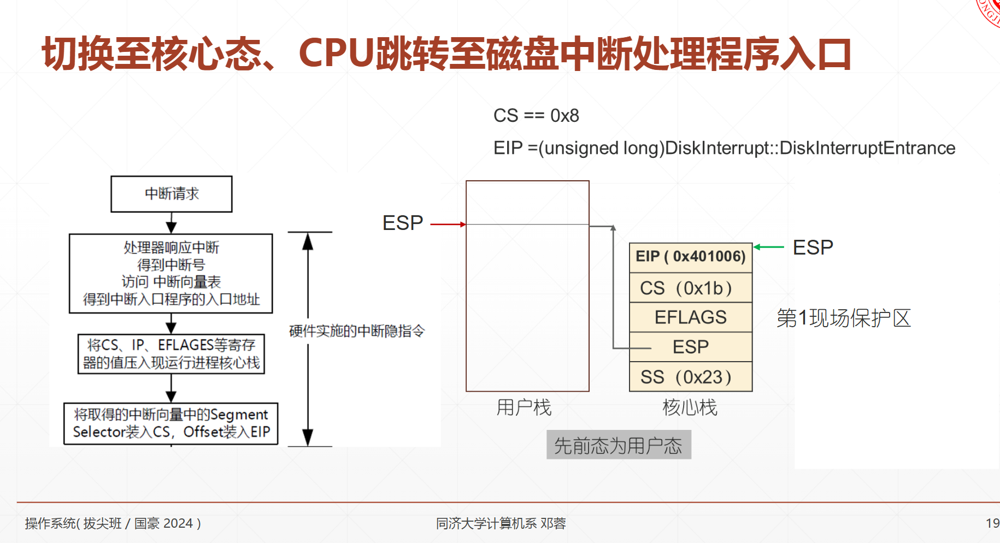

---

#### 4. 进程切换 (Process Switch) —— 核心难点

进程切换是指 CPU 的使用权从一个进程（现运行进程）转移到另一个进程（新运行进程）。

*   **核心函数：`Swtch( )`**
    *   这是 Unix V6++ 实现多道程序并发的核心函数。
    *   **触发时机**：
        1.  进程主动入睡（`Sleep`）。
        2.  进程终止（`Exit`）。
        3.  被抢占（`RunRun > 0` 且准备返回用户态时）。

*   **Swtch() 的执行步骤（考纲详解）**：

    1.  **现场保护（保存旧进程）**：
        *   **操作对象**：核心栈的栈顶指针。
        *   **实现**：使用宏 **`SaveU(u.u_rsav)`**。
        *   **细节**：将当前 CPU 的 **ESP**（栈顶指针）和 **EBP**（栈帧基址）保存到当前进程 `user` 结构的 **`u_rsav`** 数组中。
        *   *注*：通用寄存器和程序计数器（EIP）之前在中断入口或系统调用时已经保存在核心栈里了，所以 `Swtch` 只需要记住“栈顶在哪里”。

    2.  **中转（切换到 0# 进程）**：
        *   为了安全地挑选下一个进程，系统通常会先切换到 **0# 进程**（内核线程，永不换出）的上下文。
        *   **0# 进程执行 `Select()`**：遍历进程表（`Process` 数组），寻找状态为 `SRUN`（就绪）且优先级最高（`p_pri` 值最小）的进程，记为 `PA`。

    3.  **恢复现场（恢复新进程 PA）**：
        *   **操作对象**：`PA` 进程保存的栈指针。
        *   **实现**：使用宏 **`RetU()`**。
        *   **细节**：从 `PA` 进程 `user` 结构的 **`u_rsav`** 数组中，读出上次保存的 ESP 和 EBP，装入 CPU 寄存器。
        *   **效果**：此时 CPU 的栈指针瞬间指向了 `PA` 的核心栈。

    4.  **建立地址映射（刷新 MMU）**：
        *   **函数**：**`MapToPageTable()`**。
        *   **细节**：根据 `PA` 进程的相对虚实地址映射表，重写系统的用户页表（物理页框 0x202/0x203），并刷新 TLB（快表）。
        *   **目的**：确保 CPU 访问用户空间地址（如 0x400000）时，能正确映射到 `PA` 的物理内存。

    5.  **返回**：
        *   `Swtch()` 函数执行 `return 1`。由于栈已经切换到了 `PA` 的核心栈，这个 `return` 实际上是返回到了 `PA` 上次调用 `Swtch()` 的代码位置。

---

#### 5. 接下来，PA 会去哪？（Swtch 返回后的去向）

当 `Swtch()` 函数返回后，进程 `PA` 恢复执行，它接下来的行为取决于它**上次是如何失去 CPU 的**：

*   **情况 A：PA 上次是因为“入睡”而放弃 CPU**
    *   **场景**：PA 之前调用了 `Sleep()`（例如等待磁盘 IO）。
    *   **位置**：`Swtch()` 返回到 `Sleep()` 函数内部，`Sleep` 接着返回。
    *   **后续**：PA 继续执行 **系统调用的下半段**。如果是 0# 进程，它会继续跑 `Sched` 函数执行换入换出。
    *   **特征**：此时 PA 还在核心态。

*   **情况 B：PA 上次是因为“被剥夺”而放弃 CPU**
    *   **场景**：PA 之前在用户态运行，被中断打断（如时钟中断），中断处理完发现有更牛的进程，于是被迫调用 `Swtch()`。
    *   **位置**：`Swtch()` 返回到中断处理程序的末尾（如 `Clock` 或 `Trap` 的返回处）。
    *   **后续**：执行中断返回流程（`RestoreContext` -> `IRET`）。
    *   **结果**：**返回用户态执行应用程序**。

---

#### 6. 模式切换与进程切换的关系（判断题考点）

*   **命题**：“没有模式切换，就没有进程切换。”
*   **一般情况：对**。
    *   对于普通用户进程，进程切换（`Swtch`）必须在**核心态**执行。要进入核心态，必须经过模式切换（中断/系统调用）。所以，用户进程之间的切换，必然伴随着“用户$\to$核心$\to$切换$\to$核心$\to$用户”的过程。
*   **特殊情况：不全对**。
    *   **特例**：**内核线程（如 0# 进程）**。
    *   0# 进程始终运行在核心态。当它调用 `Sleep()` 或 `Swtch()` 放弃 CPU 时，它本身就在核心态，**不需要**经过“用户态$\to$核心态”的模式切换。
    *   所以，核心态线程入睡导致的进程切换，不涉及模式切换。

---

#### 7. 4种中断类型与时钟管理

*   **中断分类**：
    1.  **外设中断**：磁盘、键盘等硬件产生。异步。
    2.  **时钟中断**：时间片轮转的驱动力。
    3.  **异常**：程序错误（缺页、除0）。同步。
    4.  **系统调用**：`int 0x80`。同步。

*   **Unix 时钟管理**：
    *   **时钟中断**：每秒 HZ 次（如60次）。负责驱动 `p_cpu` 增加、重算优先级、处理 `RunRun`。
    *   **`sleep(seconds)`**：系统调用。
        *   进程设置定时器（全局变量 `tout`）。
        *   进程状态设为 `SWAIT`（可中断睡眠）。
        *   调用 `Swtch()` 主动让出 CPU。

---

### 8. 中断嵌套与优先级（硬件逻辑 vs 软件逻辑）—— 深度解析

这部分的核心在于理解：**硬件（8259A PIC）** 如何控制“谁能进来”，以及 **软件（内核）** 如何通过操作硬件来实现灵活的嵌套。

#### 1. 中断优先级（硬件层面）
*   **优先级定义**：由硬件连线决定。在 Unix V6++ 中，优先级顺序为 **时钟 (IRQ0) > 键盘 (IRQ1) > 磁盘 (IRQ14)**。
*   **硬件屏蔽机制（ISR 寄存器）**：
    *   当 CPU 正在响应该中断（如时钟）时，8259A 会将 ISR 寄存器对应位置 1。
    *   **屏蔽规则**：只要 ISR 某一位是 1，所有**同级或低级**的中断请求都会被屏蔽（进不来）；只有**更高级**的中断请求能穿透。

#### 2. 中断嵌套的执行流程（高打低 vs 低打高）

*   **场景 A：高优先级 打断 低优先级（真正的嵌套）**
    *   **前提**：CPU 正在执行磁盘中断处理程序（低优），且已经执行了 `STI`（开中断）。
    *   **触发**：此时发生时钟中断（高优）。
    *   **过程**：
        1.  8259A 判断时钟优先级 > 磁盘，允许请求通过。
        2.  CPU 暂停磁盘 ISR，保存现场（压入磁盘 ISR 的栈帧）。
        3.  CPU 跳转执行时钟 ISR。
    *   **结果**：形成“汉堡包”式的堆栈结构（磁盘现场在下，时钟现场在上）。

*   **场景 B：低优先级 想要打断 高优先级（EOI 的作用）**
    *   **前提**：CPU 正在执行时钟中断处理程序（高优）。此时发生磁盘中断（低优）。
    *   **阻挡**：由于时钟 ISR 还没结束，8259A 的 ISR 寄存器中“时钟位”是 1，磁盘请求被屏蔽，在 IRR 中排队。
    *   **转折点（EOI 命令）**：
        *   考纲纠正：不需要等时钟处理程序全部跑完（IRET），只需等待软件发送 **EOI (End Of Interrupt)** 命令。
        *   在 Unix V6++ 的 `Clock` 函数中，为了处理耗时的“每秒例行任务”，内核会**提前发送 EOI** 并执行 `STI`。
    *   **后果**：
        1.  发送 EOI $\to$ 8259A 清除 ISR 中的时钟位 $\to$ 优先级屏蔽解除。
        2.  执行 STI $\to$ CPU 允许响应中断。
        3.  **瞬间响应**：刚才积压的磁盘中断立刻进入 CPU。
    *   **结论**：通过**提前发 EOI**，高优先级中断可以主动“降级”，允许低优先级中断插入，从而避免高优先级任务长时间阻塞硬件响应。

---

### 9. 中断返回前的例行调度（RunRun）—— 源码级深度解析

这一部分是**软件调度策略**的核心。考纲要求“盯住 RunRun 标识的使用”，我们需要看它在**哪里被设置**，在**哪里被检查**。

#### 1. 谁在改变调度状态？（RunRun 的设置点）

`RunRun` 是一个全局标志（强迫调度标识），`RunRun > 0` 意味着“有比当前进程更急的进程想跑”。

*   **情形一：时钟中断（时间片用完/优先级衰减）**
    *   **位置**：`Clock()` $\to$ `SetPri()`。
    *   **逻辑**：
        1.  每秒钟，`SetPri` 重新计算当前进程的 `p_pri`（`p_cpu` 增加导致优先数变大，优先级变低）。
        2.  **比较**：`if (current->p_pri > procMgr.CurPri)`。即：如果我变弱了，且弱于就绪队列里最强的那个。
        3.  **动作**：`procMgr.RunRun++`。

*   **情形二：外设中断（唤醒了高优先级进程）**
    *   **位置**：磁盘/键盘中断处理程序 $\to$ `WakeUpAll()` $\to$ `SetRun()`。
    *   **逻辑**：
        1.  IO 完成，唤醒正在睡眠的进程（如等待磁盘数据的进程 A）。
        2.  **比较**：`if (进程A->p_pri < current->p_pri)`。即：醒来的 A 是高优先级的（比如磁盘 IO 进程优先级 -50），比当前跑的进程（用户进程 100）强得多。
        3.  **动作**：`procMgr.RunRun++`。

#### 2. 谁在执行调度？（RunRun 的检查点）

调度**不会**在 `Clock` 或 `WakeUp` 函数内部立即发生（因为那是内核深处），而是推迟到**中断入口程序（汇编部分）准备返回用户态的前夕**。

*   **位置**：中断入口程序（如 `SystemCallEntrance` 或 `DiskInterruptEntrance`）的末尾，在调用 `IRET` 之前。
*   **代码逻辑（伪代码）**：
    ```cpp
    // 中断处理函数返回后，回到入口程序的汇编代码
    L: 
        if (RunRun != 0 && 先前状态 == USER_MODE) {
            // 满足例行调度条件
            Call Swtch(); // 现运行进程被剥夺！
            
            // Swtch返回后（说明将来又轮到我了），再次检查
            goto L; 
        }
        
    RestoreContext(); // 恢复寄存器
    IRET;             // 回到用户态
    ```
*   **考纲解析**：
    *   **“返回用户态前夕”**：这是唯一的被动调度窗口。
    *   **“调用 Swtch()”**：在这里，当前进程被挂起，`Swtch` 会切换栈指针，等下次回来时，代码会从 `Swtch()` 后面的语句继续执行，最终 `IRET` 回用户态。

---

### 10. 多道系统的轮流使用（总结）—— 详细流程对比

这里必须区分**主动**和**被动**两种路径，这是考试分析题的重点。

#### 路径 A：主动放弃 CPU（Voluntary）
进程自己调用了阻塞函数（如 `Wait`, `Read` 导致的 `Sleep`）。

1.  **应用程序**：调用 `read()` 系统调用。
2.  **陷入内核**：执行 `Sys_Read`，发现数据不在缓存中。
3.  **调用 Sleep()**：
    *   设置 `p_stat = SWAIT/SSLEEP`。
    *   设置 `p_wchan`（睡眠原因）。
    *   **主动调用**：`procMgr.Swtch()`。
4.  **Swtch 执行**：
    *   `SaveU`：保存核心栈 ESP/EBP 到 `u_rsav`。
    *   `Select`：挑一个新进程 B。
    *   `RetU`：加载 B 的 ESP/EBP。
    *   `MapToPageTable`：切换页表。
5.  **结果**：CPU 开始在 B 的核心栈上运行。

#### 路径 B：被动剥夺 CPU（Preemption/Involuntary）
进程想继续跑，但系统（中断）强制它下台。

1.  **应用程序**：正在用户态疯狂计算（`while(1)`）。
2.  **中断发生**：例如时钟中断到来。
    *   **硬件动作**：压入 SS, ESP, EFLAGS, CS, EIP。切换到核心栈。
3.  **执行 ISR**：运行 `Clock()`。
    *   计算发现时间片到了（优先级降了）。
    *   **设置标志**：`RunRun++`。
4.  **准备返回（例行调度点）**：
    *   中断入口程序检查到：`RunRun > 0` 且 `CS` 的低两位是 11（用户态）。
    *   **强制调用**：`Swtch()`。
5.  **Swtch 执行**：
    *   **保存现场**：注意，此时保存的 `u_rsav` 是**中断入口程序**的堆栈状态（里面包含了被中断的用户态现场）。
    *   `Select` $\to$ `RetU` $\to$ 切换到新进程 C。
6.  **未来恢复**：
    *   当该进程再次被选中时，`Swtch` 返回 $\to$ 回到中断入口程序 $\to$ 执行 `IRET` $\to$ 恢复用户态现场 $\to$ 继续那段 `while(1)` 代码。

---

### 总结关键区别

| 特征         | 主动放弃 (Sleep)                | 被动剥夺 (Preemption)                        |
| :----------- | :------------------------------ | :------------------------------------------- |
| **触发原因** | 等待资源 (IO, 子进程, 信号量)   | 时间片耗尽 或 高优先级进程被唤醒             |
| **发生位置** | 内核函数内部 (System Call Body) | 中断入口程序的返回路径 (Exit Path)           |
| **关键标志** | 不依赖 `RunRun` (直接调 Swtch)  | 必须依赖 `RunRun > 0`                        |
| **状态变化** | `SRUN` $\to$ `SWAIT/SSLEEP`     | `SRUN` $\to$ `SRUN` (依然是就绪，只是排队去) |
| **返回位置** | `Sleep` 函数内                  | 用户态应用程序的某条指令处                   |

---
#### 作业10 
#### `注意！select( )函数挑选就绪进程时，从lastSelect下标开始找`
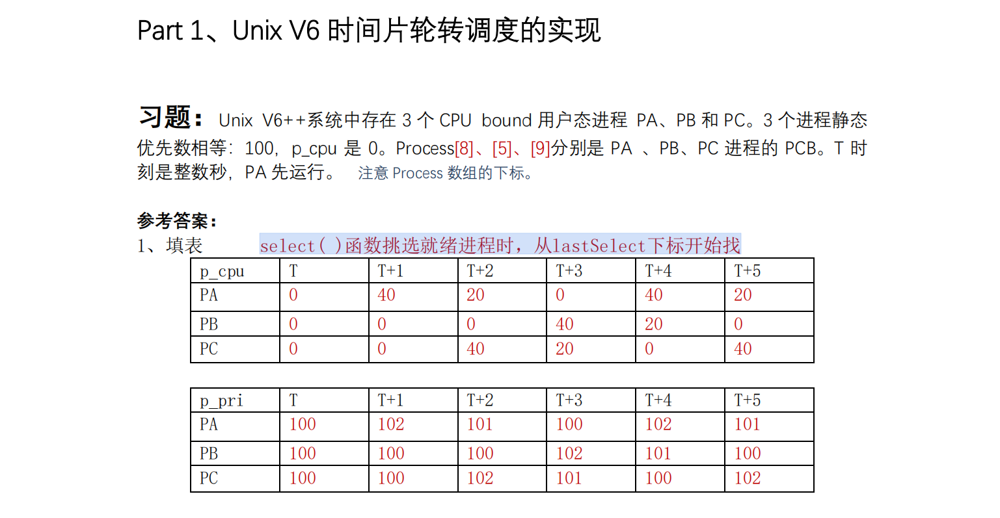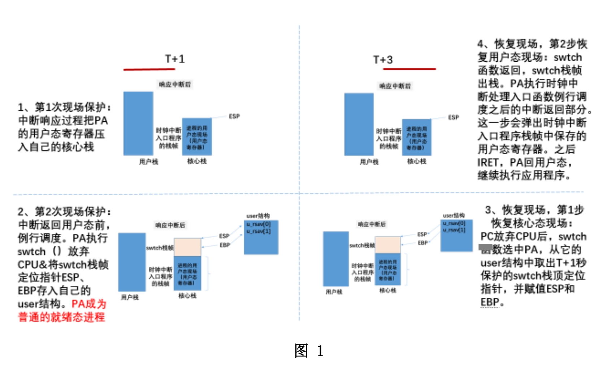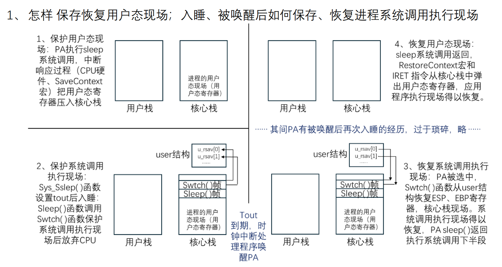


---

## **“系统调用上下半段”** 是理解**阻塞式 I/O** 和 **多道程序并发** 的核心机制。

这里的“分界线”是 **`Sleep()`** 函数。

*   **上半段（Upper Half）**：从陷入内核开始，到调用 `Sleep()` 主动放弃 CPU 为止。负责发起请求。
*   **下半段（Lower Half）**：从 `Sleep()` 返回开始，到最终 `IRET` 返回用户态为止。负责收尾和数据传输。

以下是详细的流程总结：

---

### 1、 场景设定
以 `read(fd, &c, 1)` 为例。进程 A 试图从磁盘读取一个字节。

### 2、 系统调用上半段 (The Upper Half)
**核心任务：发起 I/O 请求，因资源未就绪而主动让出 CPU。**

1.  **陷入内核 (Trap)**：
    *   用户程序执行 `int 0x80`。
    *   CPU 硬件完成模式切换（用户态 $\to$ 核心态），保存 SS, ESP, EFLAGS, CS, EIP 到核心栈。
    *   软件（`Trap` 函数）保存通用寄存器。

2.  **参数准备**：
    *   内核调用 `Sys_Read()`。
    *   内核验证文件描述符 `fd`，找到对应的文件控制块（Inode）。

3.  **发起 I/O (Start I/O)**：
    *   `Sys_Read` 向磁盘驱动程序发出读命令（`Strategy`）。
    *   **关键点**：磁盘是慢速设备，数据还没读出来，内核不能干等。

4.  **主动入睡 (Voluntary Sleep)**：
    *   进程 A 调用 **`Sleep(&buffer, PRIBIO)`**。
    *   **状态改变**：`p_stat` 从 `SRUN` 变为 `SSLEEP`（高优睡眠）或 `SWAIT`。
    *   **调用 `Swtch()`**：这是上半段的最后一步。
        *   `SaveU`：保存 A 的核心栈现场（ESP/EBP）。**注意：此时栈里保存了 `Sys_Read` 还没执行完的上下文**。
        *   CPU 切换给其他进程（如进程 B）运行。

### 3、 中场休息 (The Interlude)
**此时进程 A 在睡眠，CPU 在跑进程 B。**

1.  **I/O 完成**：磁盘转到了数据，DMA 将数据写入内存缓冲区。
2.  **硬件中断**：磁盘控制器向 CPU 发送中断信号。
3.  **中断处理**：
    *   CPU 暂停进程 B，执行磁盘中断处理程序。
    *   中断处理程序调用 **`WakeUpAll(&buffer)`**。
4.  **唤醒**：
    *   进程 A 的 `p_stat` 重新变为 **`SRUN` (就绪)**。
    *   **抢占判断**：如果 A 的优先级高于 B，置 `RunRun` 标志。
    *   中断返回，若 `RunRun` 置位，进程 B 被剥夺，调用 `Swtch()`。

### 4、 系统调用下半段 (The Lower Half)
**核心任务：从睡眠中醒来，完成数据搬运，返回用户态。**

1.  **进程切换回 A**：
    *   调度器选中进程 A。
    *   `RetU` 恢复 A 的核心栈指针。
    *   **“穿越”**：CPU 的指令指针 **瞬间回到 A 当初调用 `Swtch()` 的地方**（即 `Sleep` 函数内部）。

2.  **从 Sleep 返回**：
    *   `Sleep` 函数执行完毕，返回到调用它的 `Sys_Read` 函数中。
    *   **此时上下文完全恢复**：`Sys_Read` 就像做了一场梦，醒来后继续执行下一行代码。

3.  **数据传输**：
    *   此时数据已经在内核缓冲区了。
    *   `Sys_Read` 执行数据搬运指令：将内核缓冲区的数据**复制**到用户空间变量 `c` 的地址。

4.  **设置返回值**：
    *   读取成功，将读取的字节数（1）写入 `u.u_ar0[EAX]`。这就是用户态即将看到的返回值。

5.  **返回用户态**：
    *   `Sys_Read` 返回 $\to$ `Trap` 返回。
    *   **例行调度检查**：检查 `RunRun`，决定是否要再切走（通常刚醒来优先级高，不会切）。
    *   **`IRET`**：硬件恢复用户态现场。
    *   进程 A 回到 `main` 函数，`read()` 调用结束，拿到数据。

---

### 5、 核心考点总结（必背）

1.  **为什么分上下半段？**
    *   为了**并发**。如果 CPU 傻等磁盘 IO 完成（同步等待），CPU 利用率会极低。通过 `Sleep` 切分，CPU 可以在 IO 进行时去服务其他进程。
2.  **连接上下半段的关键结构是什么？**
    *   **核心栈（Kernel Stack）**。上半段执行到一半的状态（局部变量、返回地址）都保存在核心栈里。`Swtch` 保存了栈指针，保证了下半段能无缝对接。
3.  **系统调用是原子的吗？**
    *   **不是**。对于慢系统调用（如读写磁盘、终端），它会被阻塞，中间会发生进程切换。
4.  **执行状态的区别**：
    *   上半段：在核心态，拥有 CPU，准备发起请求。
    *   中间：在睡眠态（逻辑上）或就绪态（物理上），**没有** CPU。
    *   下半段：在核心态，重新获得 CPU，处理结果。
---

### 五、内存分配 & 盘交换区的使用（详细总结）

#### 1. 内存分配与回收机制

**来源**：PDF《Unix V6++的内存管理子系统（下）》

**(1) 内存管理策略**
*   **连续内存管理**：Unix V6++ 要求进程的**共享正文段**和**可交换部分**（PPDA+数据+栈）在物理内存中必须是**连续存放**的。
*   **可变分区分配**：内存被划分成若干个大小不等的空闲分区，分区的数量和大小随进程的创建与终止动态变化。
*   **首次适应算法 (First Fit)**：
    *   **分配时**：从空闲分区表（`map`）的第一个表项开始扫描，找到第一个**长度足够**（`m_Size >= size`）的空闲区。
    *   **切割**：如果空闲区比所需的大，就将其分割。前一部分分配给进程，后一部分仍作为空闲区留在表中（修改表项的起始地址 `m_AddressIdx` 和长度 `m_Size`）。
    *   **优点**：优先利用低地址空间，保留高地址的大空闲区，有利于大作业的装入。
    *   **缺点**：低地址端容易产生大量小的外部碎片。

**(2) 核心数据结构**
*   **空闲分区表 (`map`)**：
    *   这是一个数组，每个元素（`MapNode`）记录一个空闲分区的**起始地址**（页框号）和**长度**（页数）。
    *   **排序规则**：按**起始地址递增**的顺序排列。这对于内存回收时的合并操作至关重要。
*   **全局分配器 (`Allocator`)**：
    *   `Alloc(map, size)`：执行内存分配。
    *   `Free(map, size, addr)`：执行内存回收。

**(3) 具体的内存资源管理器**
系统中有多个不同的 `PageManager` 实例，分别管理不同区域的内存：
*   **`g_UserPageManager`**：管理**用户区**（4MB ~ 32MB）的物理内存。分配粒度为**页 (4KB)**。
*   **`g_KernelPageManager`**：管理**页表区**（2MB ~ 4MB-4KB）的物理内存。分配粒度为**页 (4KB)**。
*   **`g_SwapperManager`**：管理**盘交换区**。分配粒度为**扇区 (512B)**。注意：它虽然管磁盘，但使用的算法和内存分配一模一样（First Fit）。

**(4) 内存分配流程 (`AllocMemory`)**
1.  计算所需的页数（向上取整）。
2.  调用 `Allocator::Alloc` 在 `map` 中查找并切割空闲区。
3.  返回分配到的物理地址（页框号 * 4096）。
4.  如果分配失败（返回 0），说明内存不足。此时需要触发**交换（Swap Out）**机制。

**(5) 内存回收流程 (`FreeMemory`)**
1.  调用 `Allocator::Free`。
2.  将释放的区域插入到 `map` 中适当的位置（保持地址递增顺序）。
3.  **合并 (Coalescing)**：
    *   **向后合并**：如果释放区尾部紧挨着下一个空闲区，合二为一。
    *   **向前合并**：如果释放区头部紧挨着上一个空闲区，合二为一。
    *   这保证了内存碎片的最小化。
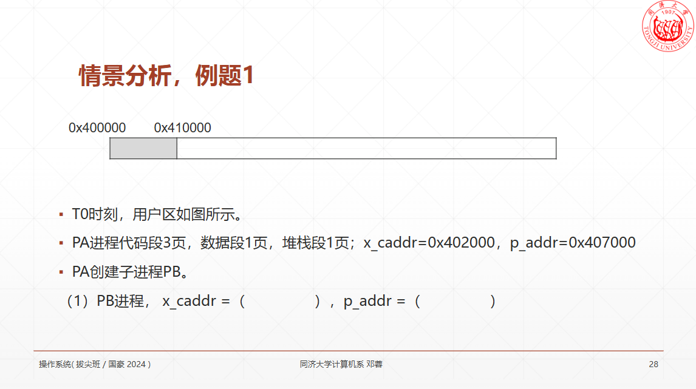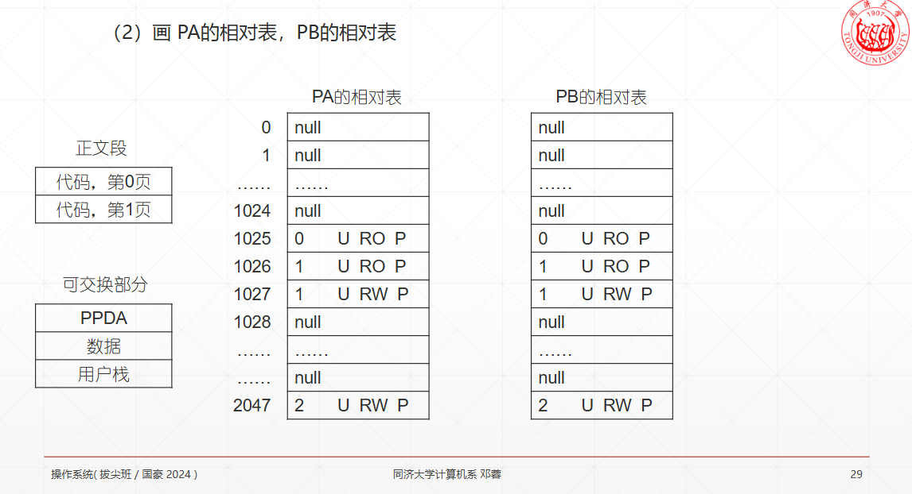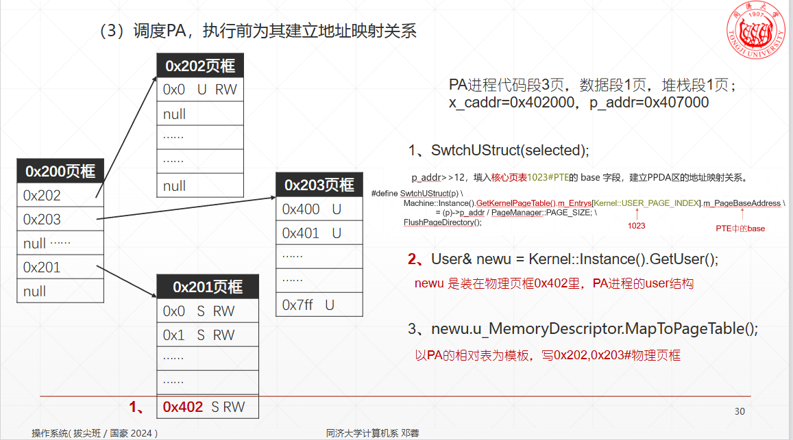
---

#### 2. 盘交换区的使用 (Swapping)

**来源**：PDF《盘交换区》

**(1) 基本概念**
*   **盘交换区 (Swap Area)**：磁盘上的一块连续区域（Unix V6++ 中为 `[18000, 200000)` 扇区），用于存放**内存装不下**的进程图像。
*   **目的**：实现内存扩充。
*   **SLOAD 标志**：
    *   `p_flag & SLOAD == 1`：进程图像在**内存**中，可以执行。
    *   `p_flag & SLOAD == 0`：进程图像在**盘交换区**，不可执行。

**(2) 换出操作 (Swap Out)**
*   **触发时机**：
    1.  **内存不足**：`AllocMemory` 失败（如 `fork` 创建子进程、`exec` 加载大程序、堆栈扩展时）。
    2.  **0#进程调度**：系统发现有长时间驻留内存的僵尸或睡眠进程，主动腾空间。
*   **执行过程 (`XSwap`)**：
    1.  在盘交换区分配空间（使用 `g_SwapperManager`）。
    2.  启动磁盘写操作，将内存中的进程图像（PPDA + 数据 + 栈）复制到盘交换区。
    3.  如果是共享正文段，且引用计数减为0，也将其换出。
    4.  释放内存空间。
    5.  更新 PCB：`p_addr` 指向盘交换区扇区号，清除 `SLOAD` 标志。

**(3) 换入操作 (Swap In)**
*   **负责人**：**0# 进程 (Sched / Swapper)**。它是内核线程，专门负责换入。
*   **触发时机**：盘交换区上有就绪进程（`RunIn != 0`），且内存有足够空间。
*   **执行过程 (`Sched`)**：
    1.  **策略**：寻找盘交换区中驻留时间（`p_time`）最长的就绪进程。
    2.  **分配内存**：为该进程分配物理内存。
        *   如果内存不够，0# 进程会根据策略（如 `p_time`）选择一个内存中的进程**换出**（Swap Out），腾出地方。
    3.  **读入图像**：启动磁盘读操作，将进程图像从盘交换区读回内存。
    4.  **释放盘空间**：归还盘交换区资源。
    5.  **更新 PCB**：`p_addr` 指向内存物理地址，设置 `SLOAD` 标志，清零 `p_time`。

**(4) 盘交换区的特殊用途：共享正文段**
*   共享正文段（Text Segment）不仅在内存里有一份，在**盘交换区上也始终保留一份副本**。
*   **好处**：当内存紧张需要回收正文段时，**不需要写回磁盘**（因为盘上已经有了），直接丢弃内存副本即可，极大提高了换出效率。

**(5) 进程图像的扩展与收缩 (Expand / SStack)**
**来源**：PDF《进程图像扩展和收缩》
当进程需要更多内存（如 `malloc` 或 栈溢出）时：
1.  **原处扩展**：如果当前进程内存区后面紧邻着空闲区，直接“吞并”空闲区。
2.  **搬迁扩展**：如果后面被堵住了，必须找一块更大的新内存区，将整个进程图像**搬家**过去，然后释放旧地盘。
3.  **换出扩展**：如果内存里实在找不出这么大的地盘，就先把自己**换出到盘交换区**（盘通常很大），在盘上完成扩展，等待将来作为一个更大的进程被换入。

---
**总结关键点**：
*   **Map**：空闲分区表，地址递增排序。
*   **First Fit**：从头找第一个够大的，切分。
*   **Swap**：内存不够时换出到磁盘，0#进程负责换入。
*   **SLOAD**：区分进程在内存还是磁盘的核心标志。
*   **碎片整理**：内存回收时的前后合并。
  

---

# 六、外设管理（详细总结）

## 第一部分：外设控制方式与硬件基础
*这部分是理解操作系统如何指挥硬件工作的基石。*

### 1. 计算机与外设的交互接口
CPU 并不直接控制磁头或网线，而是通过**外设控制器（Device Controller）**交互。
*   **三大类寄存器（端口）**：
    *   **状态寄存器 (Status)**：CPU 读取，判断设备是忙 (`busy`)、空闲、出错还是完成 (`done`)。
    *   **命令寄存器 (Command)**：CPU 写入，发送指令（如读、写、复位）。
    *   **数据寄存器 (Data)**：CPU 读写，用于交换数据（通常有数据缓存）。

### 2. 三种 IO 控制方式（进化史）
1.  **忙等/轮询 (Busy Waiting / Polling)**
    *   **逻辑**：CPU 发出命令后，在一个循环中不断查询状态寄存器，直到设备完成。
    *   **缺点**：CPU 全程参与，无法执行其他进程，**CPU 利用率极低**。
    *   **适用**：极快的外设或简单嵌入式系统。

2.  **中断驱动 (Interrupt-Driven)**
    *   **逻辑**：CPU 发出命令后，**挂起当前进程**（去运行别的），设备完成后向 CPU 发送**中断信号**。CPU 收到中断后暂停当前工作，执行中断处理程序来处理数据。
    *   **优点**：CPU 和外设可以**并行工作**。
    *   **缺点**：对于大数据量传输（如磁盘），每个字节或小块都要中断一次，CPU 仍然要做大量的数据搬运工作（从控制器搬到内存）。

3.  **DMA (直接存储器访问)**
    *   **逻辑**：CPU 告诉 DMA 控制器：“把磁盘 X 位置的 N 个字节搬到内存 Y 位置”。DMA 全权负责搬运，**搬完了一次性**给 CPU 发一个中断。
    *   **优点**：CPU 完全从“搬砖”工作中解放，仅需处理开始和结束。
    *   **地位**：现代块设备（硬盘、网卡）的标准工作方式。

---

## 第二部分：硬盘 IO 性能优化（计算与算法）
*这部分是计算题和选择题的重灾区。*

### 1. 磁盘访问时间公式（背诵）
$$T_{access} = T_{seek} + T_{rotation} + T_{transfer}$$

1.  **寻道时间 ($T_{seek}$)**：磁臂移动到指定**柱面（磁道）**的时间。**（占比最大，最慢，约 10ms 级，是优化的核心对象）**。
2.  **旋转延迟 ($T_{rotation}$)**：等待目标**扇区**转到磁头下的时间。
    *   平均耗时 = $\frac{1}{2} \times$ 旋转一周的时间。
    *   *例：7200 RPM 硬盘，转一圈 8.3ms，平均延迟约 4.15ms。*
3.  **传输时间 ($T_{transfer}$)**：磁头读写数据经过的时间。
    *   公式：$\frac{数据量}{扇区容量} \times \frac{旋转一周时间}{每磁道扇区数}$。

### 2. 磁盘调度算法（优化寻道时间）
假设有一堆 IO 请求队列，如何排序执行？

*   **FCFS (先来先服务)**：
    *   按请求顺序执行。
    *   **评价**：公平，但性能最差，磁头可能大幅度往复摆动。
*   **SSTF (最短寻道时间优先)**：
    *   优先处理离当前磁头位置最近的请求。
    *   **评价**：吞吐率高，但**可能导致“饥饿”**（远处的请求一直得不到服务）。
*   **SCAN (电梯算法)**：
    *   磁头保持一个方向移动（如从小磁道到大磁道），处理沿途请求，直到到达边缘或该方向无请求才掉头。
    *   **评价**：**推荐算法**。解决了饥饿，性能较好。
*   **C-SCAN (循环扫描)**：
    *   磁头只在单向移动时服务（如只从里向外），到达最外层后**直接弹回**最内层（回程不服务）。
    *   **评价**：各个位置的请求等待时间期望值均匀（对两端的磁道更公平）。

*   **SCAN (电梯算法) 的缺陷**：
    *   **磁臂粘着 (Arm Stickiness)**：如果某个磁道（或附近的磁道）上有极其密集的 I/O 请求不断涌来（比如一个进程正在高速写一个大文件），磁头就会一直停留在该位置附近处理这些新请求，导致磁头迟迟不能移动到磁盘的另一端。
    *   **后果**：远处的请求被“饿死”（Starvation）。

为了解决这个问题，核心思路是：**将磁盘请求队列分段，正在处理的这一段不允许插入新请求。**

---

### 1. N-Step-SCAN 算法

**核心逻辑：分批处理**

1.  **队列分割**：将磁盘 I/O 请求队列分割成若干个**长度为 N** 的子队列。
2.  **处理机制**：
    *   磁盘控制器一次只处理**一个**子队列。
    *   在这个子队列内部，使用 **SCAN (电梯)** 算法进行调度。
    *   **关键点**：在处理当前子队列的过程中，**新到达的请求**不会插入当前队列，而是放入**下一个**子队列中。
3.  **循环**：当当前子队列处理完毕后，再处理下一个子队列。

**特点/性能**：
*   **彻底解决了“磁臂粘着”**：因为当前队列长度有限（最大为 N），处理完必须走，磁头一定会移动。
*   **性能表现**：
    *   当 $N$ 很很大（接近无限）时 $\approx$ 标准 SCAN 算法。
    *   当 $N = 1$ 时 $\approx$ FCFS (先来先服务) 算法。

---

### 2. FCSCAN (或 FSCAN) 算法

**核心逻辑：双队列切换 (N-Step-SCAN 的简化版，N=2)**

这是 N-Step-SCAN 的一种特例，实现起来更简单，也是实际系统中常用的策略。

1.  **两个队列**：系统只维护两个队列，我们称之为 **当前队列 (Service Queue)** 和 **等待队列 (Waiting Queue)**。
2.  **处理机制**：
    *   所有的**新请求**全部扔进 **等待队列**。
    *   磁头只负责处理 **当前队列** 中的请求（使用 SCAN 算法）。
    *   **隔离**：即使当前队列正在处理时来了新请求，也绝不许插队，必须去等待队列排队。
3.  **切换**：
    *   当 **当前队列** 空了（所有请求处理完），系统将两个队列**交换角色**。
    *   原来的等待队列变成新的当前队列，开始服务；原来的当前队列变空，准备接收新请求。

**特点**：
*   **硬件实现简单**：类似于“乒乓缓存”机制。
*   **公平性好**：任何请求最多等待一个“扫描周期”就能被服务，绝对不会饿死。

---

### 考试对比总结（必背表）

| 算法            | 策略                           | 优点                   | 缺点                                  | 适用场景       |
| :-------------- | :----------------------------- | :--------------------- | :------------------------------------ | :------------- |
| **SSTF**        | 找最近的                       | 吞吐量高               | 可能饿死远处请求                      | 负载轻的系统   |
| **SCAN**        | 单向移动到底，再回头           | 解决饿死，效率不错     | **磁臂粘着** (局部密集请求导致不移动) | 通用系统       |
| **N-Step-SCAN** | 分成 N 个子队列                | 解决磁臂粘着           | N=1时退化为 FCFS                      | 高负载系统     |
| **FCSCAN**      | **双队列** (正在服务 + 新请求) | 解决磁臂粘着，实现简单 | 平均延迟可能略高于纯 SCAN             | 现代高性能磁盘 |

### 考试技巧
如果题目问：**“如何防止磁盘调度中的‘磁臂粘着’现象？”** 或者 **“如何保证磁盘请求的公平性，防止饿死？”**
*   首选回答：**FCSCAN** 或 **N-Step-SCAN**。
*   解释核心：通过将**新到来的请求**放入**新队列**，而不是插入当前正在服务的队列，从而强制磁头在处理完当前批次后必须移动。

### 3. 旋转延迟优化（硬件机制）
*   **扇区交错 (Interleaving)**：
    *   **问题**：读完 1# 扇区，控制器处理数据需要微小时间，此时磁盘已经转过了 2# 扇区的开头。如果要读 2#，只能等磁盘多转一圈。
    *   **解决**：逻辑相邻的扇区在物理上间隔存放（如 1, 3, 5...）。给控制器留出处理时间，支持连续的高速读取。


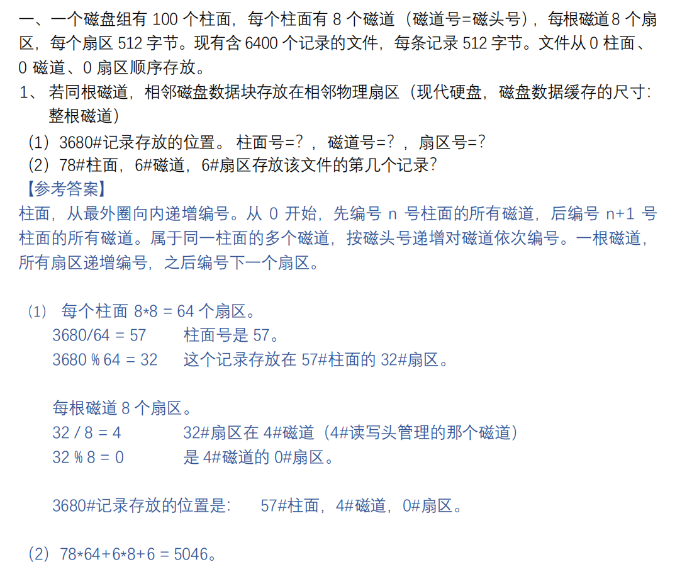


---

## 第三部分：基于磁盘高速缓存的读写（核心逻辑）
*这部分考察逻辑流程和数据一致性策略。*

### 1. 缓存池结构
*   **组成**：内存中的一组缓存块（Buffer）。
*   **映射**：1 个缓存块（Buffer） $\leftrightarrow$ 1 个磁盘块（Block/Sector）。
*   **管理**：
    *   **Hash 表**：用于快速查找（输入 `dev, blkno`，返回缓存指针）。
    *   **空闲队列 (FreeList)**：使用 **LRU (最近最久未使用)** 算法管理空闲块。用完的块挂到队尾，分配时从队首拿。

### 2. 缓存块的状态标记
*   `B_BUSY`：忙（已上锁，其他进程需等待）。
*   `B_DONE`：有效（内容与磁盘一致，或者是最新的有效数据）。
*   `B_DELWRI`：**延迟写/脏**（内容比磁盘新，尚未写回）。
*   `B_ASYNC`：异步（IO 完成后由中断程序自动释放）。

### 3. 核心接口逻辑

#### A. 申请缓存 (`GetBlk`)
1.  **查 Hash 表**：
    *   **命中**：该块在内存中。如果被锁 (`B_BUSY`)，则睡眠等待；否则，加锁并从空闲队列摘除，返回。
    *   **不命中**：
        1.  从空闲队列 (`FreeList`) 队首拿一个块。
        2.  如果这个块是“脏”的 (`B_DELWRI`)，先执行异步写回，再重新找空块。
        3.  标记新身份 (`dev, blkno`)，加锁，返回（此时 `B_DONE=0`，内容无效）。

#### B. 释放缓存 (`Brelse`)
1.  唤醒等待该块的进程。
2.  将该块挂入**空闲队列尾部**（LRU 机制）。
3.  清除 `B_BUSY` 标志。

### 4. 读写流程（重点辨析）

#### **读操作 (`Bread`)**
*   **逻辑**：
    1.  `GetBlk` 拿缓存。
    2.  如果缓存已有效 (`B_DONE`) $\rightarrow$ 直接返回（**完全不产生 IO**）。
    3.  如果无效 $\rightarrow$ 发送读命令给磁盘驱动 $\rightarrow$ **进程睡眠 (Sleep)**。
    4.  硬盘转动... 读取完成... 产生中断。
    5.  中断程序唤醒进程 $\rightarrow$ 进程醒来，标记 `B_DONE`，返回数据。

#### **写操作 (`Bwrite` / `Bdwrite` / `Bawrite`)**
*   **Step 1: 准备缓存**（见前文分析）：
    *   **整块写 (=512)**：`GetBlk` 拿空块，直接覆盖，**不读盘**。
    *   **部分写 (<512)**：`Bread` **先读盘**，读出旧数据，修改部分内容。

*   **Step 2: 写回策略（输出端优化）**：
    *   **同步写 (`Bwrite`)**：马上写盘，进程**睡眠等待**写完。（极少用，除非是极其重要的元数据）。
    *   **异步写 (`Bawrite`)**：
        *   **触发条件**：**缓存块写满了**（或者写到了末尾 `offset+size==512`）。
        *   **动作**：放入 IO 队列，进程**不等待**，直接返回。
    *   **延迟写 (`Bdwrite`)**：
        *   **触发条件**：**缓存块没写满**（还有空间）。
        *   **动作**：标记 `B_DELWRI`（脏），释放缓存（`Brelse`）。
        *   **后果**：数据暂留内存。
        *   **何时真写？**
            1.  LRU 淘汰该块需要重用时。
            2.  系统定时 Sync。
            3.  关机。
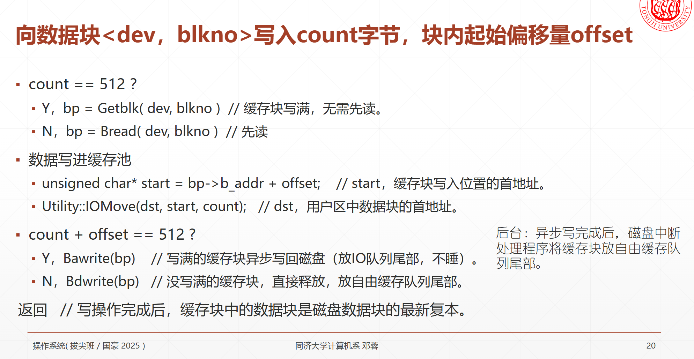

### 5. 总结：IO 性能优化的两个层次
1.  **硬件/驱动层**：使用 DMA 释放 CPU；使用电梯算法（SCAN）减少寻道时间。
2.  **操作系统/缓存层**：
    *   **Cache Hit**：完全避免 IO。
    *   **延迟写 (Delayed Write)**：合并多次小写入，减少写 IO 次数。
    *   **整块写优化**：避免不必要的读 IO。

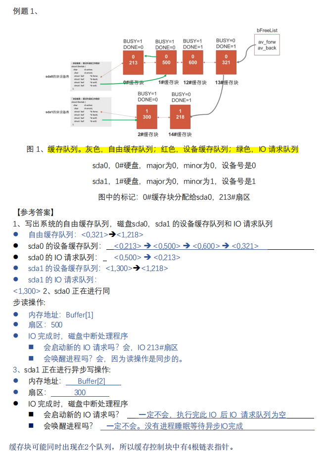
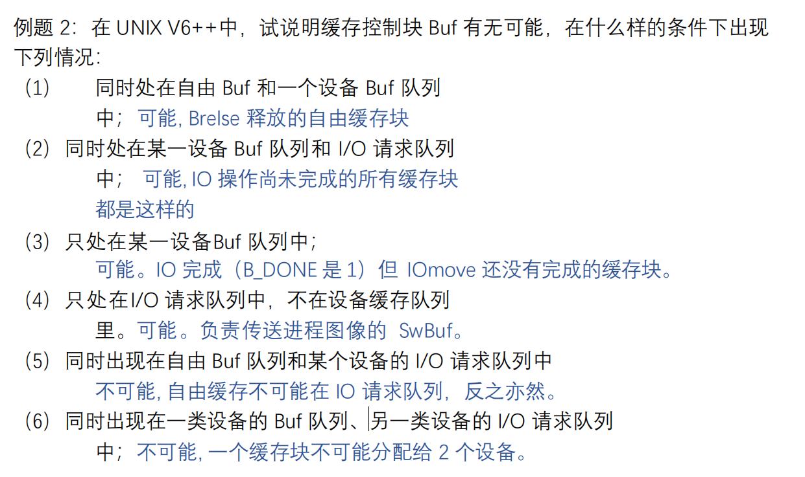
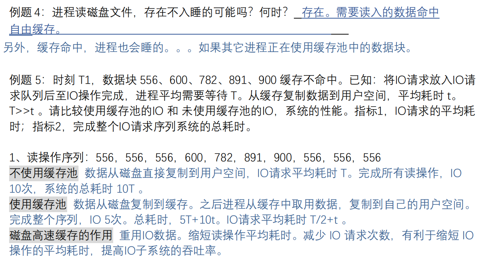
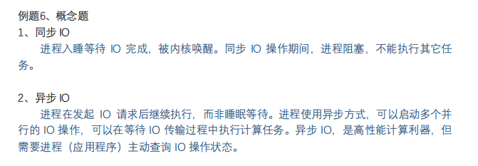
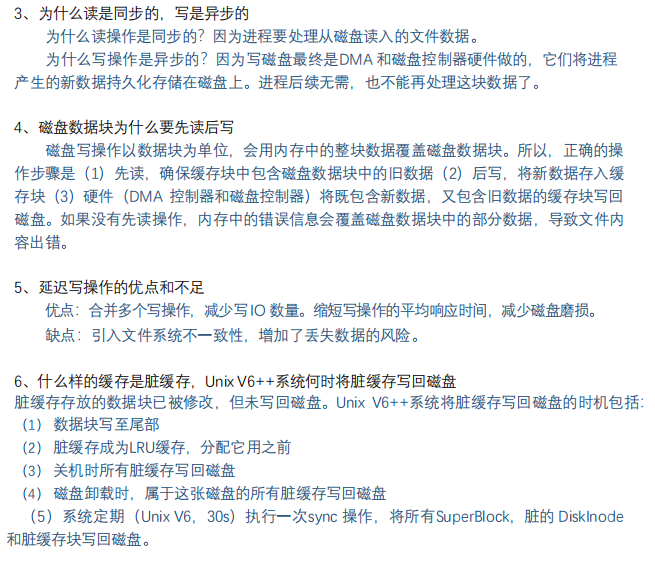
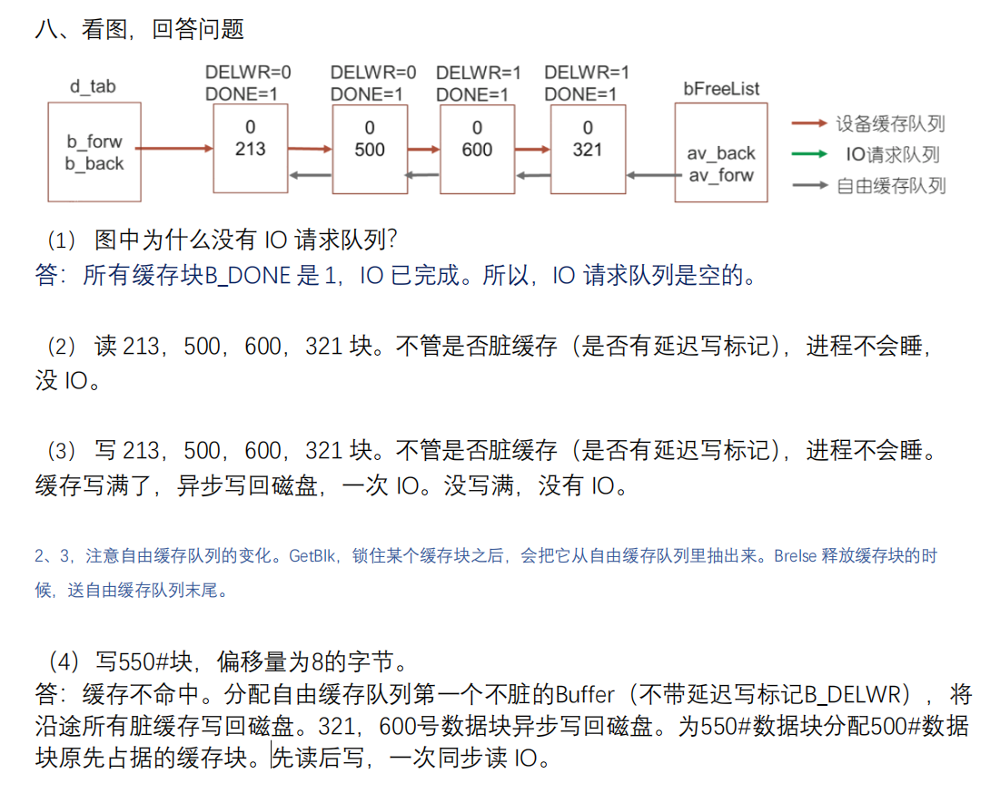
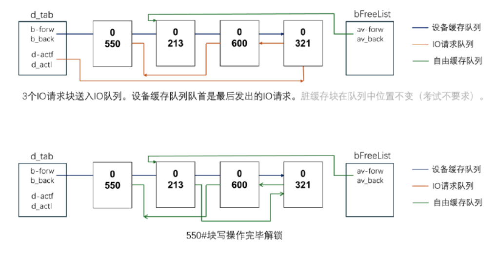

---

### 六、外设管理（详细总结1）

#### 1. 硬盘 IO 性能优化

**来源**：PDF《外设管理（下）》第 30-38 页

**A. 机械硬盘的物理特性与访问耗时**
*   **物理结构**：
    *   **盘片**：分上下两面，每个面配一个磁头。
    *   **磁道 (Track) / 柱面 (Cylinder)**：所有盘面上相同半径的磁道组成柱面。
    *   **扇区 (Sector)**：访问的最小物理单位，通常 512 字节。物理地址表示为（柱面号, 磁头号, 扇区号）。
*   **IO 耗时组成**：
    1.  **寻道时间 (Seek Time)**：磁头移动到目标柱面的时间。**最慢**（平均 ~10ms），是优化的重点。
    2.  **旋转延时 (Rotational Delay)**：等待目标扇区转到磁头下。平均为旋转周期的一半（$T/2$）。
    3.  **数据传输时间 (Transfer Time)**：磁头读写数据的时间。取决于转速和扇区密度（$T/N$）。

**B. 寻道时间优化：磁臂调度算法**
*   **FCFS (先来先服务)**：按请求到达顺序服务。简单公平，但磁头乱跳，效率极低。
*   **SSTF (最短寻道时间优先)**：优先服务离当前磁头最近的请求。效率高，但边缘磁道的请求可能**饿死**。
*   **SCAN (电梯算法)**：磁头在内外磁道间往复运动，单向扫描时服务沿途请求。解决了饿死问题。
*   **C-SCAN (循环扫描)**：规定磁头单向移动（如只从外向内服务），到达终点后迅速复位到起点。提供更均匀的等待时间。

**C. 旋转延时优化（硬件层面）**
*   **扇区交错 (Interleaving)**：逻辑相邻的扇区在物理上间隔存放（如 n 和 n+1 之间隔几个扇区）。
    *   **原因**：从读完一个扇区到准备好读下一个，控制器需要处理时间。如果不交错，磁头可能正好错过下一个扇区，必须多转一圈。

**D. 综合优化：预读技术 (Read-Ahead)**
*   **原理**：利用程序的**局部性原理**。当进程请求读扇区 $n$ 时，系统预测它很快会读 $n+1$，于是顺便把 $n+1$ 也读入缓存。
*   **实现**：`Breada`（Read Ahead）函数。
    *   构造两个 IO 请求：当前块 $n$（同步读）和 预读块 $n+1$（异步读）。
    *   **优势**：大幅减少磁头移动（相邻扇区一次读完），提高吞吐率。

---

### 2. 基于磁盘高速缓存的磁盘数据块读写

**来源**：PDF《外设管理（下）》全篇

Unix V6++ 在内存中开辟了一块区域（Core Map 附近）作为 **Buffer Cache（磁盘高速缓存池）**，用于缓解 CPU 与磁盘的速度差异。

**A. 缓存池结构**
*   **缓存块 (Buffer)**：每个缓存块大小（512B）与磁盘扇区一致。
*   **缓存控制块 (Buf)**：记录缓存块的状态（`b_flags`）、对应磁盘地址（`b_dev`, `b_blkno`）等。
*   **两类队列**：
    *   **设备缓存队列**：挂载特定设备（如硬盘）的所有缓存块，用于快速查找（Hash 思想）。
    *   **自由缓存队列 (Av_List)**：链接所有当前未被使用的缓存块（LRU 策略）。分配时从队首摘取（最近最久未使用），释放时挂入队尾。

**B. 缓存块的状态 (`b_flags`)**
*   `B_BUSY`：上锁，正被某个进程使用。
*   `B_DONE`：包含有效数据（是最新的磁盘副本）。
*   `B_DELWRI`：**延迟写**标识。数据已修改，但尚未写回磁盘。
*   `B_ASYNC`：异步操作，不需要等待 IO 完成。

**C. 读操作流程 (`Bread`)**
1.  **查缓存**：根据 `(dev, blkno)` 在设备队列中搜索。
2.  **命中 (Hit)**：
    *   如果缓存块有有效数据 (`B_DONE`)，直接返回该缓存块指针。
3.  **不命中 (Miss)**：
    *   从自由队列摘一个空闲块。
    *   如果该块是“延迟写”的 (`B_DELWRI`)，先把它写回磁盘（异步写），再另找一个。
    *   构造 IO 请求，启动磁盘驱动程序（`Strategy`），进程**睡眠**等待 (`IOWait`)。
    *   磁盘中断唤醒进程，数据已在缓存中，返回。
4.  **数据拷贝**：将缓存块中的数据复制到用户空间 (`IOMove`)。
5.  **释放**：使用完后，调用 `Brelse` 解锁，将缓存块放入自由队列尾部。

**D. 写操作流程 (`Bwrite`) —— 延迟写 (Delayed Write)**
1.  **获取缓存**：同读操作。如果不是整块重写，需要先读入旧数据。
2.  **写入缓存**：将用户数据写入缓存块。
3.  **延迟策略**：
    *   **不立即写盘**：仅将缓存块标记为 `B_DELWRI`（脏），然后释放 (`Brelse`)。
    *   **写盘时机**：
        *   该缓存块被回收用于其他数据时。
        *   系统定时同步（`update` 进程，每 30 秒调一次 `sync`）。
        *   缓存块被填满时（某些实现）。
    *   **优势**：减少物理写次数（多次小写合并为一次大写），提高效率。
    *   **风险**：断电数据丢失。

**E. 异步写 (`Bawrite`)**
*   用于预读或延迟写触发的写盘。
*   启动 IO 后**不等待**（不调用 `IOWait`），进程直接返回。
*   IO 完成由中断处理程序负责清理（释放缓存块）。

---

**核心考点总结**：
1.  **为什么要有缓存？** 减少磁盘 IO 次数，利用内存的高速。
2.  **LRU 策略**：自由队列的管理遵循 LRU，最久没用的最先被拿去重用。
3.  **同步 vs 异步**：
    *   **读**通常是同步的（进程等数据）。
    *   **写**通常是延迟/异步的（进程写完缓存就走）。
4.  **预读**：用空间换时间，利用磁盘物理特性（顺序访问快）。


# 七、文件管理 复习总结

## 第一部分：文件系统静态结构
*这部分主要关注文件存放在磁盘上时的样子（持久化数据结构）。*

### 1. 磁盘布局（Unix V6++ 风格）
一个文件卷（File System Volume）在物理磁盘上通常分为三个主要区域（从低地址到高地址）：

1.  **超级块 (SuperBlock)**
    *   **位置**：0#、1# 扇区（通常引导扇区占一部分，超级块紧随其后）。
    *   **作用**：文件系统的“总指挥部”，存放文件系统的全局配置信息和**空闲资源管理信息**。
    *   **核心内容**：
        *   文件系统的大小、Inode区大小。
        *   **空闲资源栈**：
            *   `s_inode`：空闲 DiskInode 号栈（直接缓存一部分可用的 Inode 号）。
            *   `s_free`：空闲盘块号栈（成组链接法的栈顶）。
        *   状态标记（如 `s_fmod` 脏标记，指示超级块是否需要写回磁盘）。

2.  **Inode 区 (索引节点区)**
    *   **位置**：从 2# 扇区开始，占据若干连续扇区。
    *   **内容**：存放所有的 **DiskInode**（文件控制块 FCB）。
    *   **特点**：每个文件（包括目录）都在磁盘上有且仅有一个 DiskInode。Unix 将文件的**元数据**（属性）和**文件名**分开存放，Inode 存元数据。

3.  **数据区 (Data Area)**
    *   **位置**：Inode 区之后的所有扇区。
    *   **内容**：
        *   **普通文件**的数据块。
        *   **目录文件**的数据块（存放目录项）。
        *   **间接索引块**（存放巨大的文件所需的索引表）。
        *   **空闲盘块**。

### 2. 文件控制块 (DiskInode)
*文件ID（i_number）就是 DiskInode 在数组中的下标。*

*   **核心字段**：
    *   `d_mode`：文件类型（目录/普通/设备）和访问权限（rwx）。
    *   `d_nlink`：硬链接计数（有多少个目录项指向这个 Inode）。
    *   `d_uid`/`d_gid`：文件拥有者和组 ID。
    *   `d_size`：文件大小（字节数）。
    *   **`d_addr` (混合索引表)**：最关键的字段，用于建立 **逻辑块 (Logical Block) -> 物理块 (Physical Block)** 的映射。

*   **混合索引树结构 (Unix V6++)**：
    *   **直接寻址**：`d_addr[0] ~ [5]`，直接存放物理盘块号。用于存小文件。
    *   **一次间接寻址**：`d_addr[6] ~ [7]`，存放**索引块**的号。索引块中存放物理盘块号。
    *   **二次间接寻址**：`d_addr[8] ~ [9]`，存放**二级索引块**的号。二级索引块指向一级索引块，一级指向数据块。用于存超大文件。
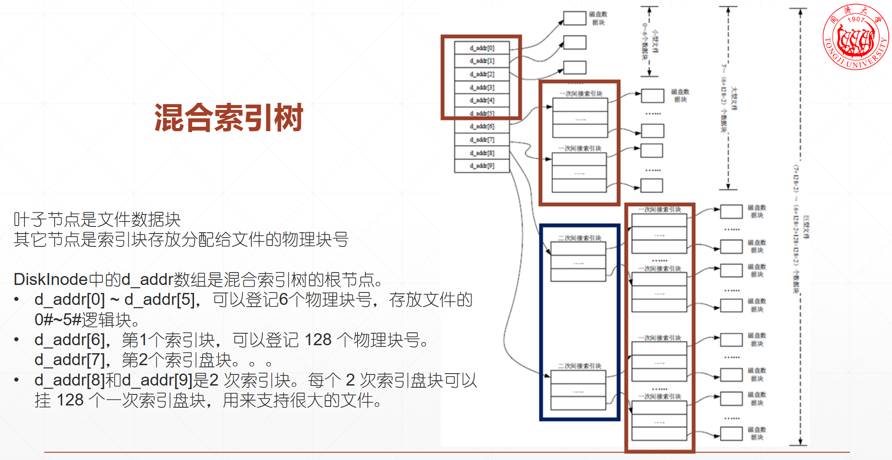
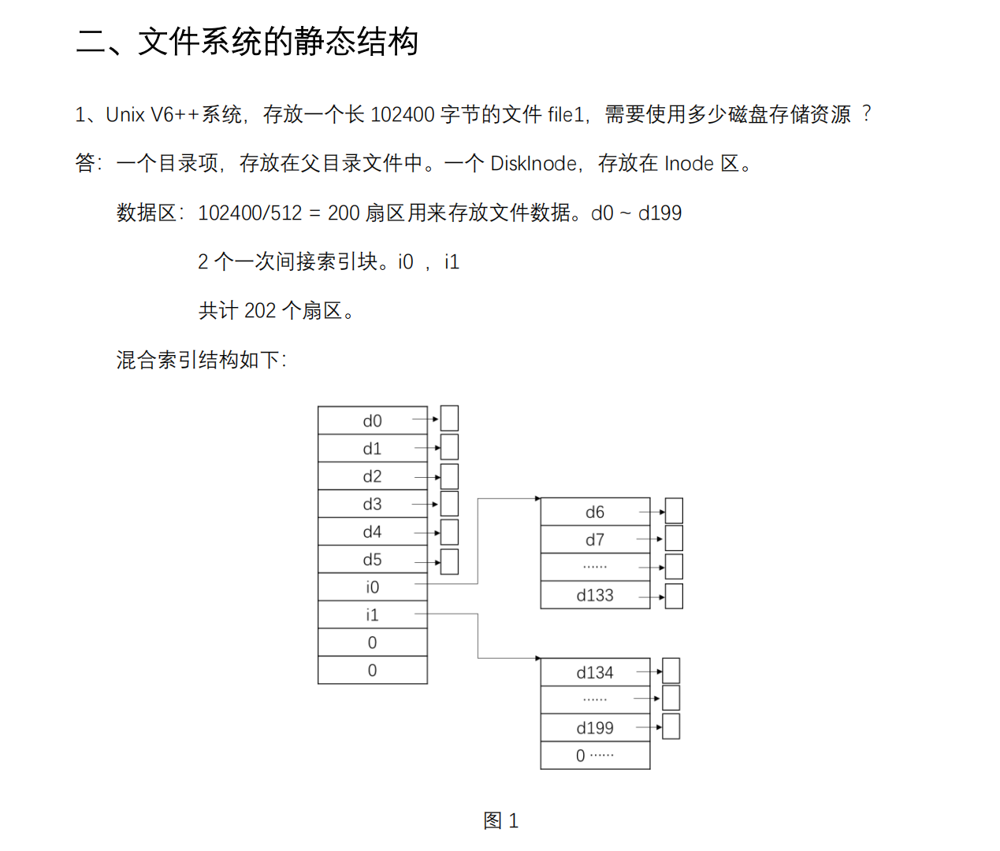


### 3. 目录结构与目录文件
*   **目录项 (Directory Entry)**：
    *   Unix 中，文件名不包含在 Inode 中，而是存放在**目录项**里。
    *   结构：`文件名` + `Inode号` (i_number)。
    *   大小：固定大小（如 16字节 或 32字节）。
*   **目录文件**：
    *   目录本身也是一个文件。
    *   它的“数据”就是**一系列目录项**。
    *   **特殊目录项**：
        *   `.` (当前目录)。
        *   `..` (父目录，用于实现相对路径跳转)。

### 4. 空闲资源管理 (重点逻辑)
*   **空闲 Inode 管理**：
    *   使用 **栈 (Stack)** 方式。
    *   超级块中维护一个数组 `s_inode` 作为栈，存放最多 100 个空闲 Inode 号。
    *   **分配**：从栈顶弹出一个号。若栈空，则扫描磁盘 Inode 区寻找新的空闲节点填充栈（可能有优化策略）。
    *   **回收**：将 Inode 号压入栈。

*   **空闲盘块管理**：
    *   使用 **成组链接法 (Group Linked List)**（结合了栈和链表的优势）。
    *   **原理**：
        *   超级块中的 `s_free` 数组作为**第一组**空闲盘块号栈（最多 100 个）。
        *   `s_free[0]` (栈底元素) 指向**下一组**空闲盘块的索引块（即下一个组长块）。
        *   下一组的索引块中又记录了 100 个空闲块号，且第一个指向再下一组。
    *   **分配**：从超级块栈顶弹出。如果弹出的刚好是栈底（组长块），则先把该块中记录的下一组信息读入超级块，再分配该块。
    *   **回收**：压入超级块栈。如果栈满了（100个），则把当前超级块的栈写入刚回收的这个盘块，使其成为新的组长块，然后清空超级块栈指向它。

---

## 第二部分：文件系统的使用
*这部分主要关注内存中的数据结构和运行时流程。*

### 1. 打开文件结构 (三级映射表 - 必考点)
进程访问文件时，内核通过三层数据结构来管理：

1.  **进程级：打开文件描述符表 (User File Descriptor Table)**
    *   位于进程的 `User` 结构（或 PCB）中。
    *   **文件描述符 (fd)** 就是这个数组的**下标**。
    *   **内容**：指向系统打开文件表 (`File` 结构) 的指针。

2.  **系统级：打开文件表 (Open File Table / File Structure)**
    *   全局唯一的表（或动态分配的结构链表）。
    *   **核心内容**：
        *   `f_offset`：**读写指针**（当前读写到文件的哪个位置）。**注意：这是会话级别的，父子进程共享，不同进程打开同一文件不共享。**
        *   `f_flag`：打开模式（读/写/读写）。
        *   `f_count`：引用计数（有多少个 fd 指向它）。
        *   `f_inode`：指向内存 Inode 的指针。

3.  **系统级：内存 Inode 表 (InMemory Inode Table)**
    *   是磁盘 DiskInode 在内存中的副本。
    *   **核心内容**：
        *   DiskInode 的所有属性。
        *   `i_count`：引用计数（有多少个 File 结构指向它）。
        *   `i_lock`：互斥锁（防止多进程同时修改元数据）。
        *   `i_flag`：状态标记（如脏标记，指示 Inode 是否需写回磁盘）。
    *   **共享性**：无论多少个进程打开同一个文件，内存中只有**一个**对应的内存 Inode。

### 2. 目录搜索 (Namei 过程)
*如何根据路径名 `/home/user/file` 找到对应的 Inode？*

1.  **确定起点**：
    *   如果是绝对路径（`/` 开头）：从**根目录 Inode** 开始。
    *   如果是相对路径：从当前进程的**工作目录 Inode** (`u_cdir`) 开始。
2.  **逐层解析**：
    *   读取当前目录的数据块。
    *   在目录项中线性搜索匹配的文件名（如 `home`）。
    *   找到后获取其 Inode 号。
    *   通过 `IGET` 操作载入下一级目录的 Inode。
    *   重复上述步骤，直到路径结束。
3.  **结果**：返回目标文件的内存 Inode 指针。

### 3. 系统调用的执行过程 (核心流程)

#### A. `fd = open(path, mode)`
1.  **解析路径**：调用 `Namei` 根据 `path` 搜索目录，找到目标文件的 Inode。
    *   如果文件不存在且 mode 为创建，则分配新 Inode。
2.  **分配资源**：
    *   在**系统打开文件表**中分配一个空闲的 `File` 结构。
    *   在进程的**文件描述符表**中分配一个空闲的 `fd`。
3.  **建立关联**：
    *   `fd` 指向 `File` 结构。
    *   `File` 结构指向 Inode。
    *   初始化 `File` 的 `f_offset = 0`，`f_flag = mode`。
    *   Inode 的引用计数 `i_count++`。
4.  **返回**：返回 `fd` 给用户。

#### B. `n = read(fd, buf, size)`
1.  **参数校验**：通过 `fd` 找到 `File` 结构，检查是否有读权限 (`FREAD`)。
2.  **确定位置**：获取当前的读写指针 `f_offset`。
3.  **逻辑地址转换**：
    *   计算 `f_offset` 对应的**逻辑块号 (lbn)** 和 **块内偏移 (offset)**。
    *   查 Inode 的索引表 (`Bmap`)，将 `lbn` 转换为物理块号 (`bn`)。
4.  **读数据 (IO 操作)**：
    *   请求缓存层读入物理块 `bn`。
    *   **缓存命中**：直接使用。
    *   **缓存不命中**：启动磁盘 IO (`Bread`)。
    *   **预读优化**：如果是顺序读，可能同时启动下一块的异步预读 (`Breada`)。
5.  **数据传输**：将缓存块中从 `offset` 开始的数据复制到用户空间的 `buf`。
6.  **更新状态**：`f_offset += 实际读入字节数`。
7.  **循环**：如果 `size` 跨越多个块，重复上述步骤。

#### C. `n = write(fd, buf, size)`
1.  **参数校验**：通过 `fd` 找到 `File` 结构，检查写权限。
2.  **确定位置**：获取 `f_offset`。
3.  **逻辑地址转换**：计算 `lbn` 和 `offset`。
    *   如果该逻辑块尚未分配物理块，则此时**分配物理块**并更新索引表。
4.  **写数据 (缓存交互)**：
    *   **整块写 (512字节)**：不需要读旧数据，直接申请空闲缓存块 (`GetBlk`)，覆盖写入。
    *   **部分写 (<512字节)**：必须先将磁盘上的旧数据读入缓存 (`Bread`)，修改对应部分（读-改-写）。
5.  **数据传输**：将用户空间 `buf` 的数据复制到缓存块。
6.  **延迟写/异步写**：
    *   如果缓存块**写满**了：发起异步写 (`Bawrite`)，立刻放入 IO 队列，进程不等待。
    *   如果**没写满**：标记为脏（延迟写 `Bdwrite`），暂留内存，等待后续写入合并。
7.  **更新状态**：`f_offset += 写入字节数`。如果文件变大，更新 Inode 的 `i_size`。

#### D. `lseek(fd, offset, whence)`
*   这是一个纯内存操作，**不产生磁盘 IO**。
1.  通过 `fd` 找到 `File` 结构。
2.  根据 `whence`（从头、当前、末尾）计算新的位置。
3.  修改 `File` 结构中的 `f_offset` 字段。

#### E. `close(fd)`
1.  清空进程描述符表中 `fd` 的指向。
2.  **释放 File 结构**：`File->f_count--`。
    *   如果 `f_count` 降为 0，说明没有进程在用这个会话了，释放 `File` 结构。
3.  **释放 Inode**：`File` 释放时，会导致 `Inode->i_count--`。
    *   如果 `Inode->i_count` 降为 0，说明内存中没有进程打开该文件了。
    *   如果 Inode 被修改过（脏），将其内容写回磁盘 Inode 区。
    *   释放内存 Inode。

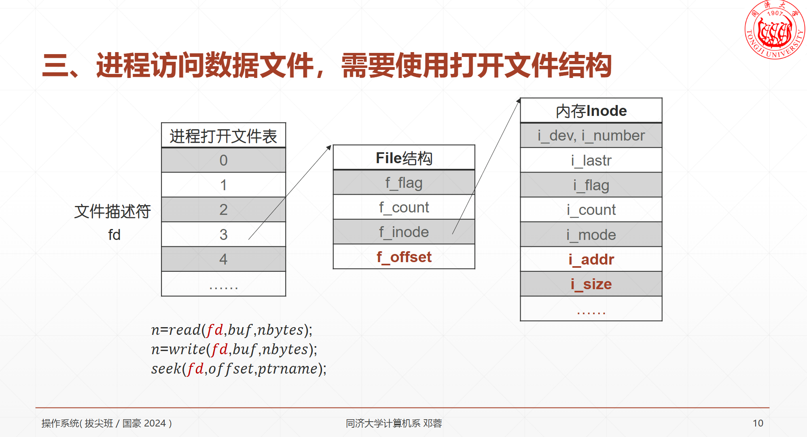
---

### 七、文件管理（详细总结1）

#### 1. 文件系统静态结构

**来源**：PDF《文件系统静态结构》

**(1) 基本概念**
*   **文件**：可重复访问的字节序列。
*   **元数据 (Metadata)**：管理用户文件所需的数据结构（如 inode、目录项）。
*   **逻辑块 vs 物理块**：文件按数据块切分，离散存放。逻辑块是文件内的索引（lbn），物理块是磁盘上的地址（bn）。
*   **文件卷**：文件系统的物理载体（磁盘分区）。Unix V6++ 卷结构分为三部分：
    1.  **超级块 (SuperBlock)**：0#、1#扇区。管理全卷状态、空闲资源（inode栈、盘块栈）。
    2.  **Inode 区**：从 2# 扇区开始。存放所有文件的 DiskInode。
    3.  **数据区**：存放文件内容和目录内容。

**(2) 核心数据结构：DiskInode**
*   **定义**：文件的内部控制块，磁盘上的身份证。每个文件对应一个唯一的 inode 号。
*   **内容**：
    *   `d_mode`：文件类型（目录/数据/特殊）和权限（rwx）。
    *   `d_nlink`：硬链接计数。
    *   `d_uid/d_gid`：文件主标识。
    *   `d_size`：文件大小（字节）。
    *   **`d_addr[10]` (混合索引表)**：核心字段，记录文件数据块的物理地址。

**(3) 混合索引树 (Hybrid Indexing)**
Unix V6++ 使用多级索引来支持大文件：
*   **直接寻址 (`d_addr[0-5]`)**：存储文件前 6 个逻辑块的物理块号。
*   **一次间接索引 (`d_addr[6-7]`)**：指向一个索引块（存放 128 个物理块号）。
*   **二次间接索引 (`d_addr[8-9]`)**：指向一个二级索引块（存放 128 个一次索引块号）。
*   **优点**：小文件访问快（直接查 inode），大文件也能支持（通过多级索引扩展）。

**(4) 目录与文件树**
*   **目录文件**：一种特殊的文件，其内容是**目录项 (Directory Entry)** 的列表。
*   **目录项**：包含 **文件名** 和 **inode 号**。
    *   大小：32字节（14字节文件名 + 2字节inode号）。
    *   特殊项：`.`（本目录）、`..`（父目录）。
*   **路径解析**：从根目录（`/`）或当前目录出发，逐层查找目录项，找到对应的 inode，再通过 inode 找到下一级目录或文件的数据块。

**(5) 硬链接 vs 软链接**
*   **硬链接**：多个目录项指向同一个 inode。`d_nlink` 计数增加。删除时仅减少计数，计数为0才真正释放 inode 和数据。
*   **软链接**：一个独立的小文件，内容是目标文件的路径名。

---

#### 2. 文件系统的使用

**来源**：PDF《文件系统的使用（上）》

**(1) 打开文件结构 (内存三级表)**
进程访问文件时，内核在内存中建立三级数据结构来维护会话：

1.  **进程打开文件表 (`u_ofiles`)**：
    *   位于进程的 `User` 结构中。
    *   数组下标即为 **文件描述符 (fd)**。
    *   表项指向系统打开文件表中的 `File` 结构。
2.  **系统打开文件表 (`File` 结构)**：
    *   管理一次“打开”会话。
    *   **核心字段**：
        *   `f_offset`：**读写指针**（当前读到哪了）。这是 File 结构最关键的作用。
        *   `f_flag`：读写模式（只读/只写）。
        *   `f_count`：引用计数（如 fork 后父子进程共享同一个 File 结构）。
        *   `f_inode`：指向内存 Inode。
3.  **内存 Inode 表 (`Inode` 结构)**：
    *   DiskInode 的内存副本。
    *   **共享**：所有打开同一个文件的进程共享同一个内存 Inode（无论读写指针在哪里）。
    *   **作用**：缓存元数据，同步互斥（`i_flag` 锁），记录引用计数。

**(2) 系统调用的执行过程**

**A. `open(path, mode)`**
1.  **目录搜索 (`NameI`)**：解析路径 `path`，找到文件的 inode 号。
2.  **获取 Inode (`IGet`)**：查看内存 Inode 表，如果已存在则引用计数加1；否则分配新项，从磁盘读入 DiskInode。
3.  **权限检查 (`Access`)**：对比进程 UID 和文件权限。
4.  **分配 File 结构**：在系统表中分配一个 `File`，初始化 `f_offset = 0`，指向 Inode。
5.  **分配 fd**：在进程表中找一个空闲槽位，指向 `File` 结构。
6.  **返回 fd**。

**B. `read(fd, buf, n)` / `write(fd, buf, n)`**
1.  **参数解析**：通过 `fd` 找到 `File` 结构，获取 `f_offset` 和 `Inode`。
2.  **地址转换 (`Bmap`)**：
    *   计算逻辑块号 `lbn = f_offset / 512`。
    *   查 Inode 的混合索引表，找到物理块号 `bn`。
3.  **读写操作**：
    *   **Read**：调用 `Bread`（读缓存/磁盘），将数据从内核缓存拷贝到用户空间 `buf`。
    *   **Write**：调用 `Bwrite`（写缓存/磁盘），将数据从用户空间 `buf` 拷贝到内核缓存。
4.  **更新指针**：`f_offset += 实际读写字节数`。
5.  **返回**：实际读写的字节数。

**C. `lseek(fd, offset, whence)`**
*   **功能**：修改 `File` 结构中的 `f_offset`。
*   **注意**：不涉及磁盘 IO，仅仅是修改内存中的变量。

**D. `close(fd)`**
1.  **释放 fd**：清空进程表项。
2.  **释放 File**：`f_count--`。如果减为 0，释放 `File` 结构，并对 `Inode` 进行 `IPut`。
3.  **释放 Inode (`IPut`)**：`i_count--`。如果减为 0 且没有链接（`nlink=0`），则释放文件数据和 inode（真删除）；否则仅释放内存 inode 槽位。

---

### 重点习题回顾（考纲特别强调）

**例 4 (PDF《文件系统的使用（上）》第 36 页)**
*   **场景**：父子进程并发读写。
*   **考点**：`fork` 后，父子进程复制了 `u_ofiles` 数组，**共享同一个 `File` 结构**。
*   **推论**：
    *   父进程读了 1 字节，`f_offset` 加 1。
    *   子进程再读，是从 `f_offset = 1` 的位置开始读（接力读），而不是从头读。

**目录搜索例题 (PDF《文件系统静态结构》第 21-22 页)**
*   **场景**：访问 `/usr/ast/Jerry`。
*   **过程**：
    1.  读根目录 `/` 的 inode $\to$ 读数据块 $\to$ 找 "usr" 的 inode 号。
    2.  读 `usr` 的 inode $\to$ 读数据块 $\to$ 找 "ast" 的 inode 号。
    3.  读 `ast` 的 inode $\to$ 读数据块 $\to$ 找 "Jerry" 的 inode 号。
    4.  读 `Jerry` 的 inode。
*   **IO计算**：每一级目录查找通常需要读一次 inode 块 + 至少一次数据块（假设目录很小）。

---

**总结**：
*   **静态**：超级块管全局，Inode 管文件，混合索引管大数据。
*   **动态**：fd $\to$ File $\to$ Inode。File 记录 offset 是实现“接力读”的关键。
*   **操作**：Open 建结构，Read/Write 搬数据改 offset，Close 拆结构。

**祝你考试顺利！**