---
# 大题
---

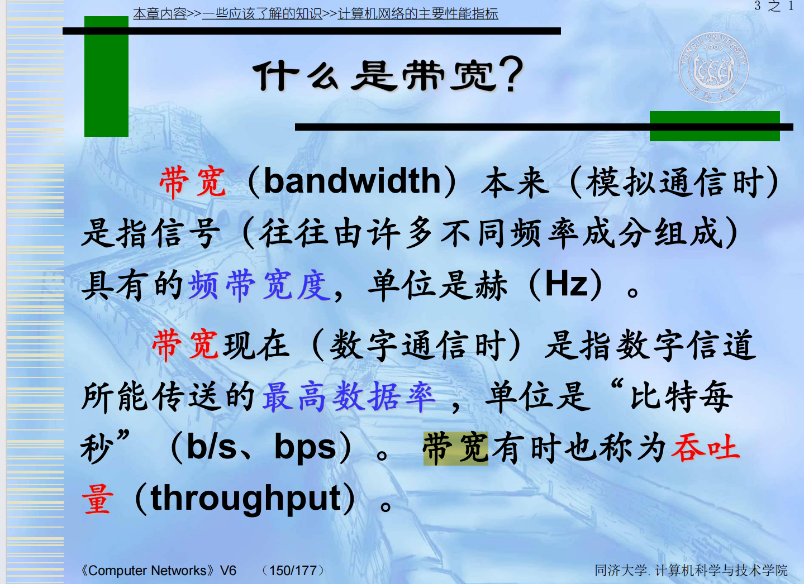
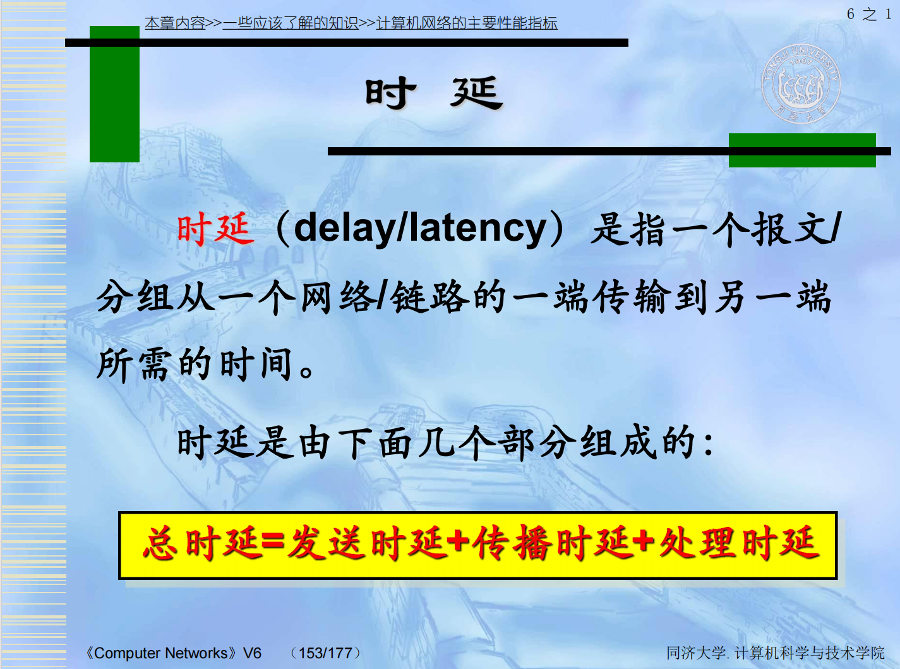
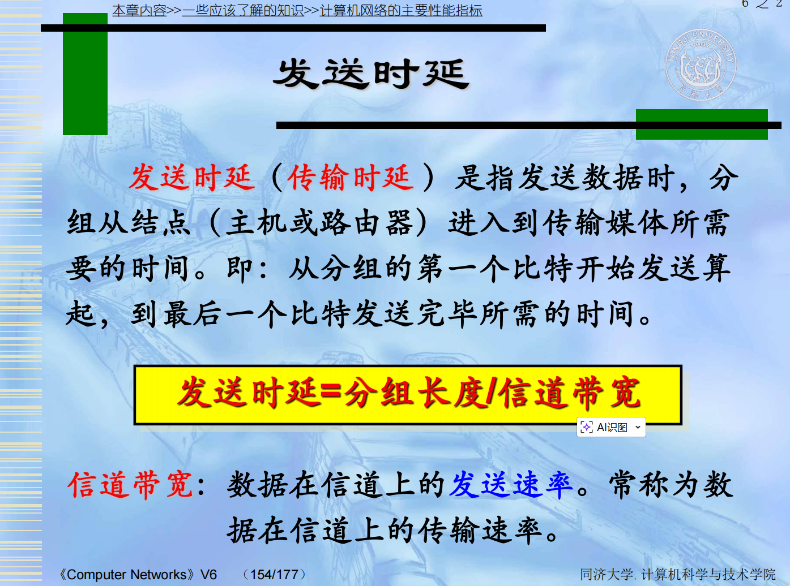
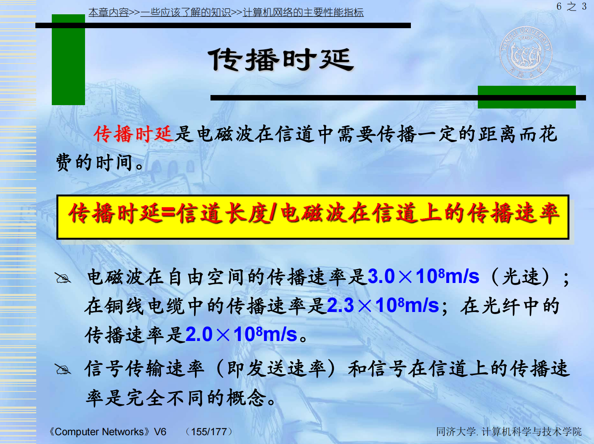
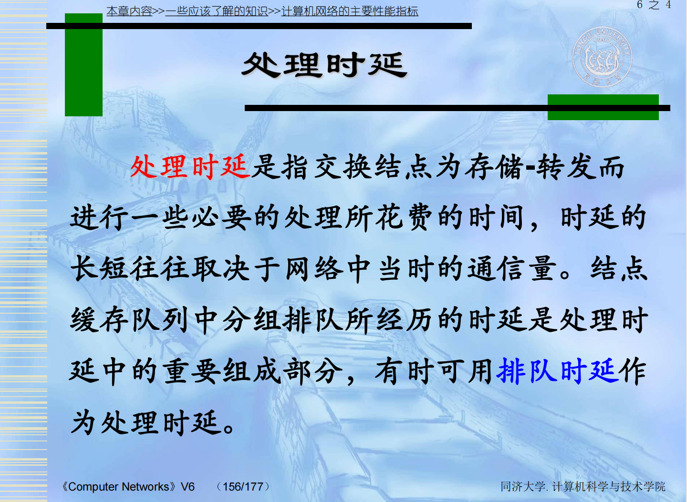
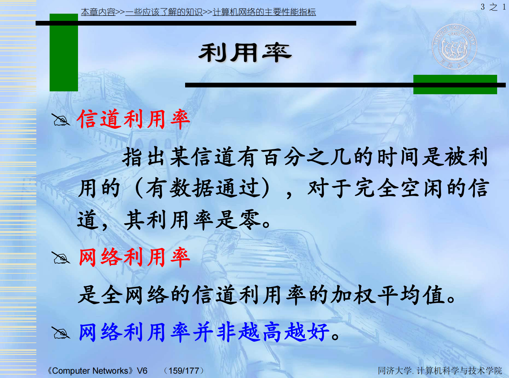
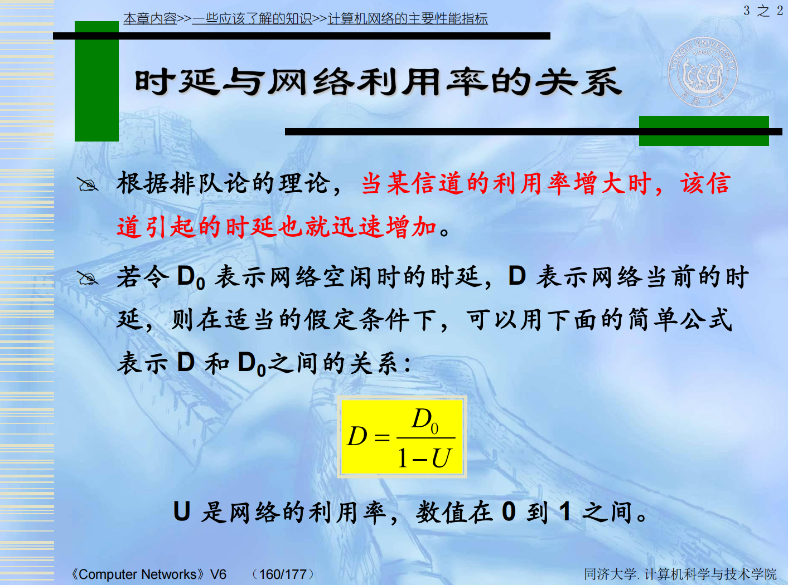
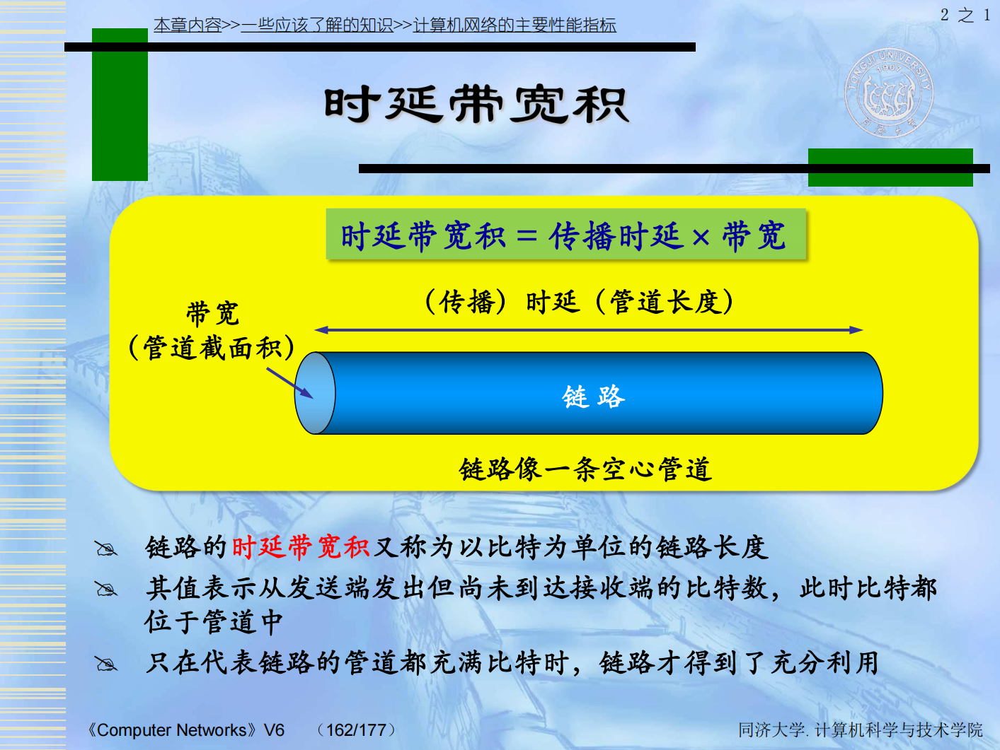

#### 1. 带宽 (Bandwidth)
*   **定义的演变**：
    *   **模拟通信（频域）**：指信号具有的频带宽度，单位是 **赫兹 (Hz)**。
    *   **数字通信（时域）**：指数字信道所能传送的**最高数据率**（即数据传送速率），单位是 **比特每秒 (b/s 或 bps)**。
    *   **别名**：在数字网络中，带宽有时也被称为**吞吐量 (Throughput)**。
*   **单位换算注意 (P151)**：
    *   **速率 (Speed/Rate)**：采用**十进制**。例如 $1 \text{Kbps} = 1000 \text{bps} = 10^3 \text{bps}$。
    *   **容量 (Capacity)**：采用**二进制**。例如 $1 \text{KB} = 1024 \text{B} = 2^{10} \text{B}$。
*   **误区澄清 (P152, 158)**：
    *   “高带宽”并不意味着比特在链路上传播得更快（电磁波传播速度是固定的）。
    *   高带宽意味着**发送速率**更快，即在单位时间内能向链路注入更多的比特（比特在时间轴上更“窄”）。

#### 2. 时延 (Delay/Latency)
时延是指数据（报文/分组）从网络的一端传送到另一端所需的时间。**总时延**由以下四部分组成：

1.  **发送时延 (Transmission Delay)** (P154)：
    *   **定义**：主机或路由器将分组发送到传输媒体所需的时间（从第一个比特算起到最后一个比特发送完毕）。
    *   **公式**：$$ \text{发送时延} = \frac{\text{分组长度 (bit)}}{\text{信道带宽 (bps)}} $$
    *   *注*：提高带宽只能减小发送时延。

2.  **传播时延 (Propagation Delay)** (P155)：
    *   **定义**：电磁波在信道介质中传播一定距离所需的时间。
    *   **公式**：$$ \text{传播时延} = \frac{\text{信道长度 (m)}}{\text{电磁波在信道上的传播速率 (m/s)}} $$
    *   **常见传播速率**：
        *   自由空间：$3.0 \times 10^8 \text{ m/s}$ (光速)
        *   铜线电缆：$2.3 \times 10^8 \text{ m/s}$
        *   **光纤**：$2.0 \times 10^8 \text{ m/s}$ (注意：光在光纤中比在铜线中慢)

3.  **处理时延 (Processing Delay)** (P156)：
    *   交换结点（路由器）为存储转发而进行必要处理（如分析首部、差错检测、查找路由表）所花费的时间。

4.  **排队时延 (Queuing Delay)** (P156)：
    *   分组在路由器缓存队列中排队等待处理和发送的时间。取决于网络当时的通信量。

**往返时间 RTT (Round-Trip Time) (P163)**：
*   表示从发送方发送完数据，到发送方收到来自接收方的确认总共经历的时间。
*   **计算逻辑**：$$ \text{RTT} \approx 2 \times \text{传播时延} + \text{末端处理与发送时延} $$

#### 3. 时延带宽积 (Bandwidth-Delay Product)
*   **定义**：$$ \text{时延带宽积} = \text{传播时延} \times \text{带宽} $$
*   **物理意义 (P162)**：
    *   表示以比特为单位的**链路长度**。
    *   形象地比喻为**“空心管道”的体积**。它表示从发送端发出但尚未到达接收端的比特数（即正在链路上传播的比特数）。
    *   只有当代表链路的管道都充满比特时，链路才得到了充分利用。

#### 4. 利用率 (Utilization)
*   **信道利用率**：某信道有百分之几的时间是被利用的（有数据通过）。
*   **网络利用率**：全网络信道利用率的加权平均值。
*   **时延与利用率的关系 (P160-161)**：
    *   **结论**：利用率并非越高越好。根据排队论，当信道利用率增大时，引起的时延会**急剧增加**。
    *   **公式**：若 $D_0$ 为空闲时延，$U$ 为利用率，则当前时延 $D$ 为：
        $$ D = \frac{D_0}{1 - U} $$
    *   当 $U$ 接近 1 时，$D$ 趋于无穷大。

---
# 其他题
---

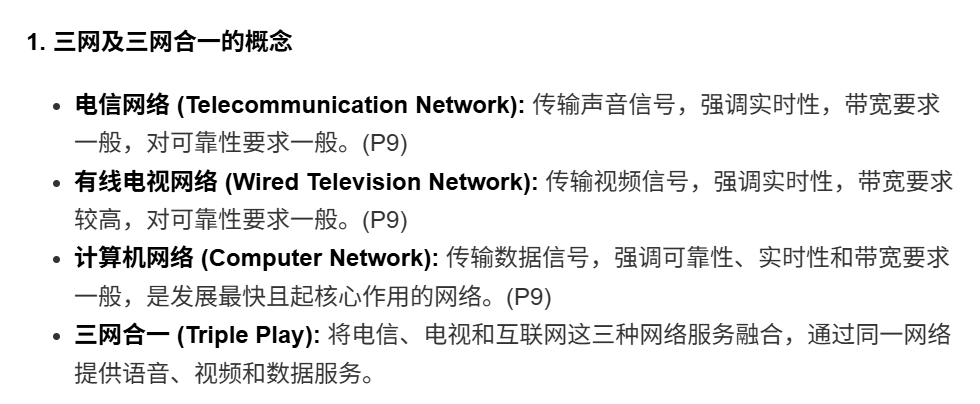

---

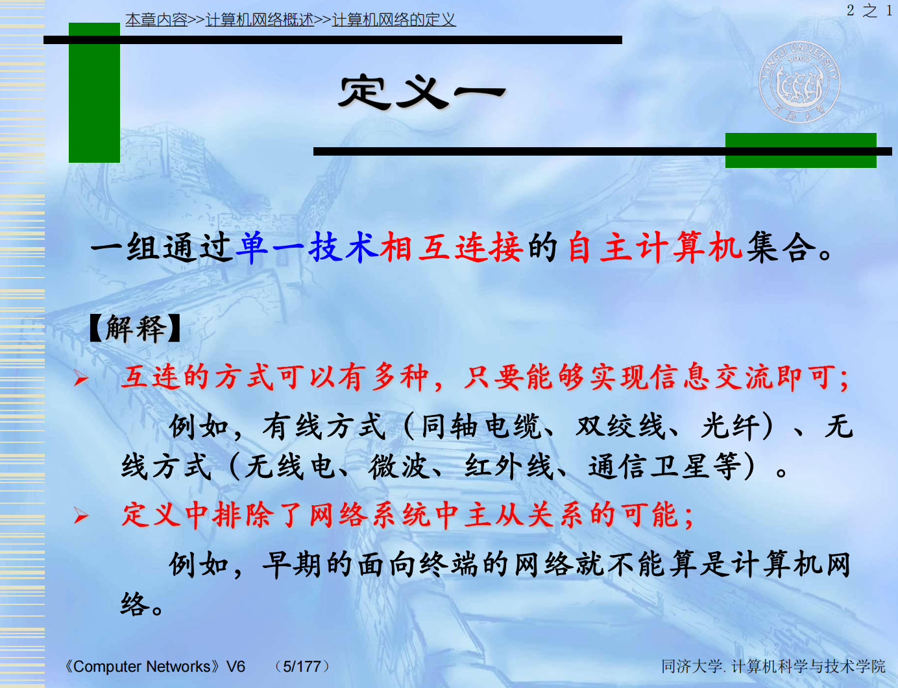
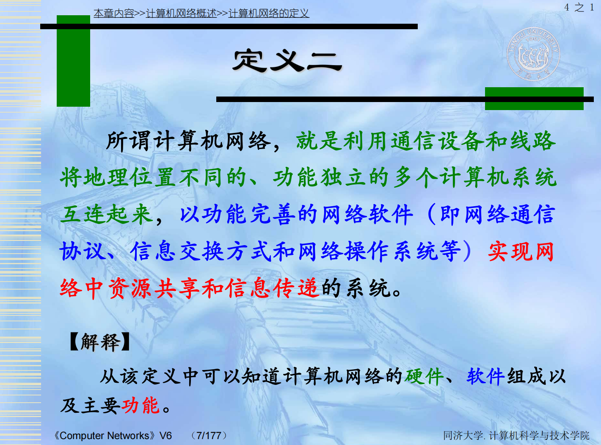
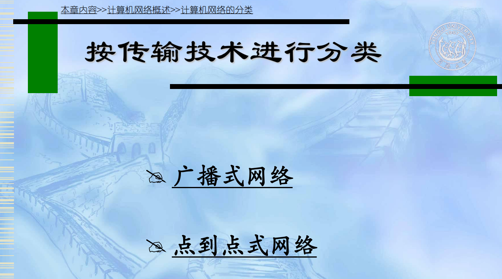
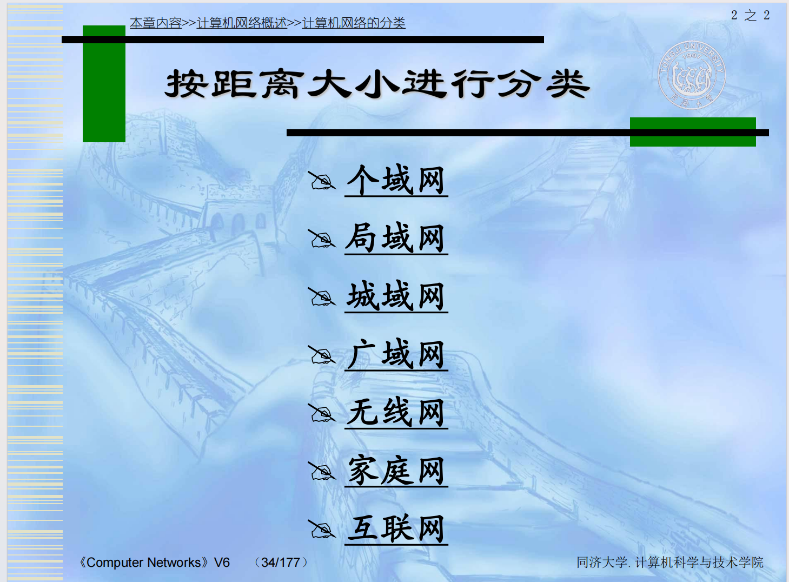
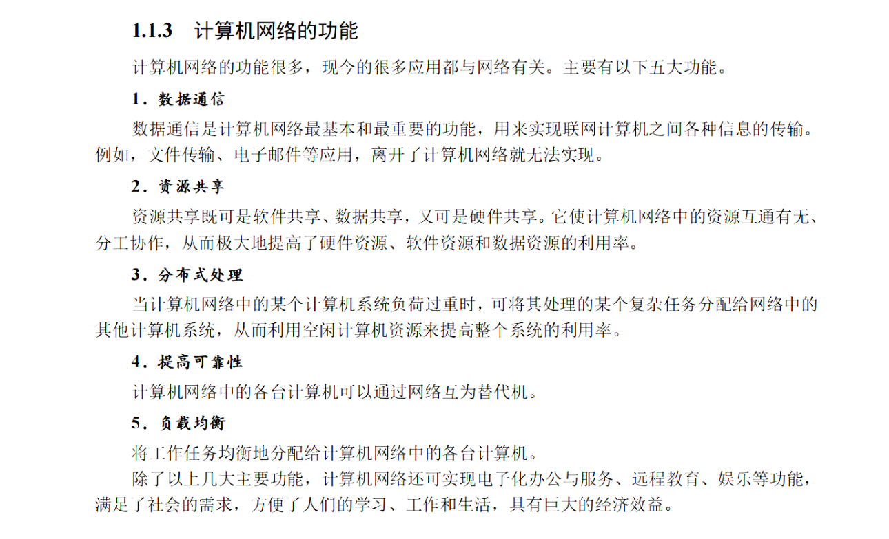

---

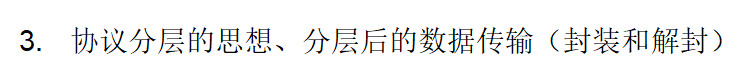
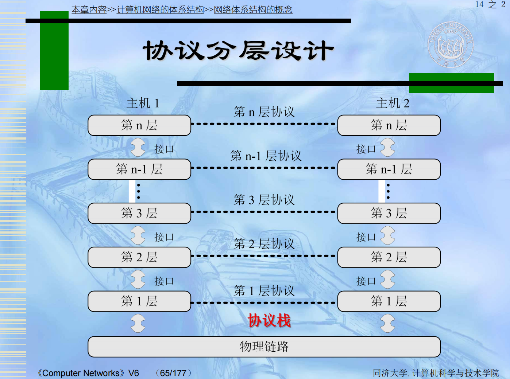
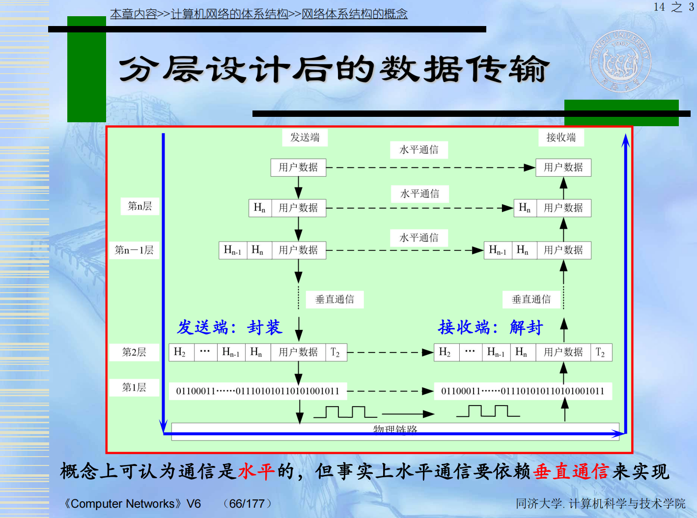

---

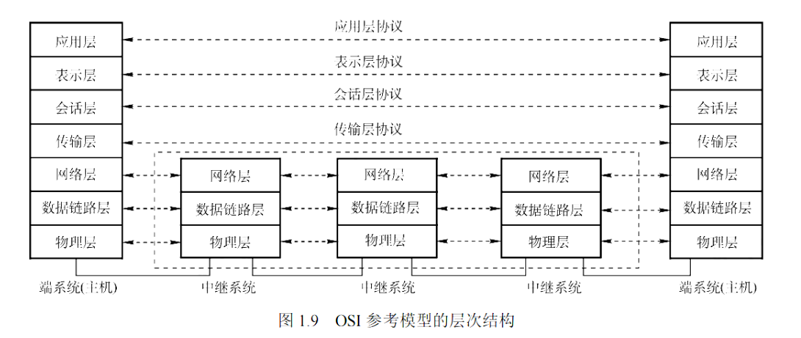
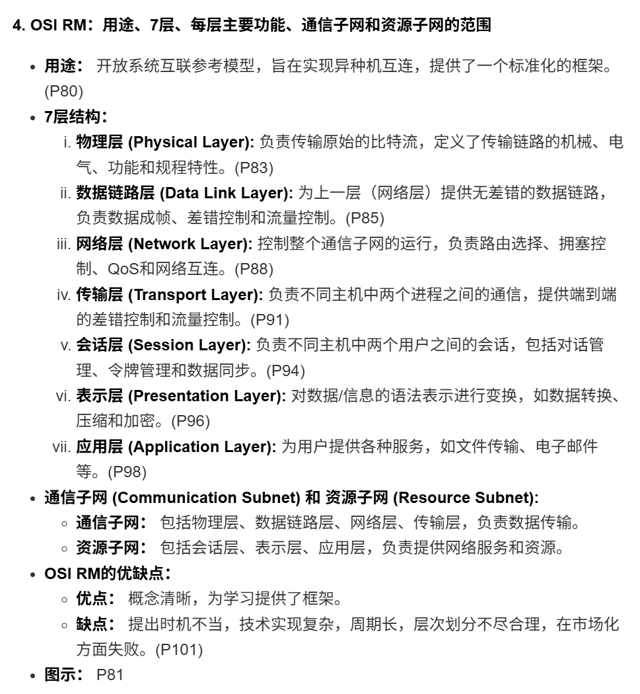

---

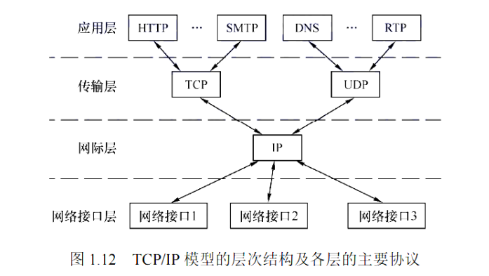
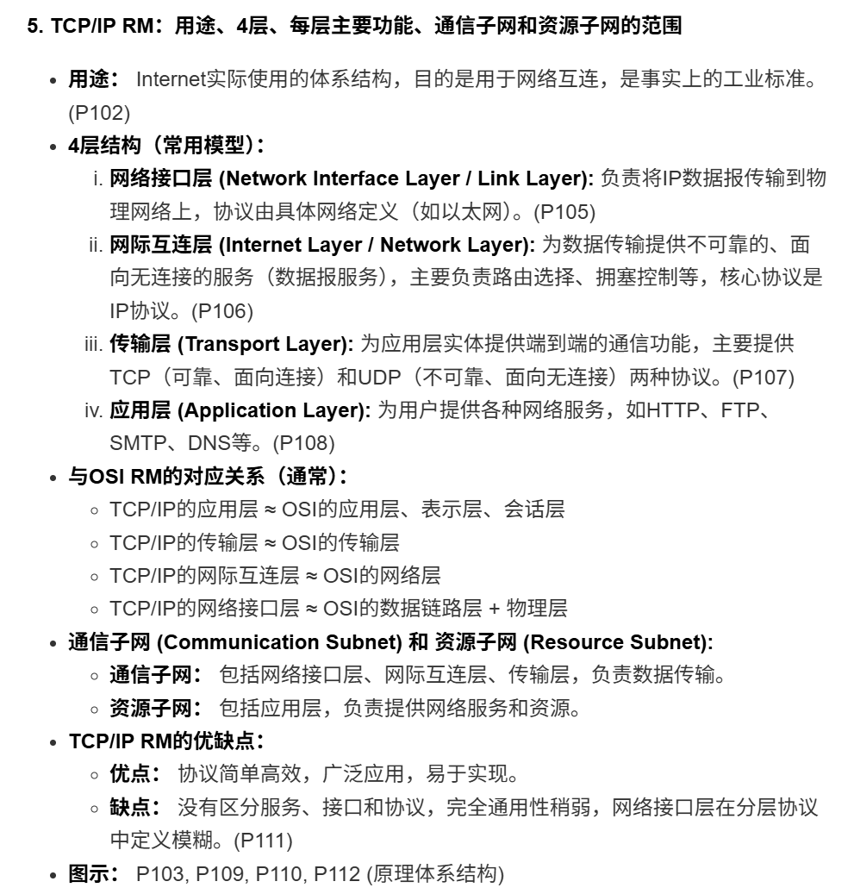

---

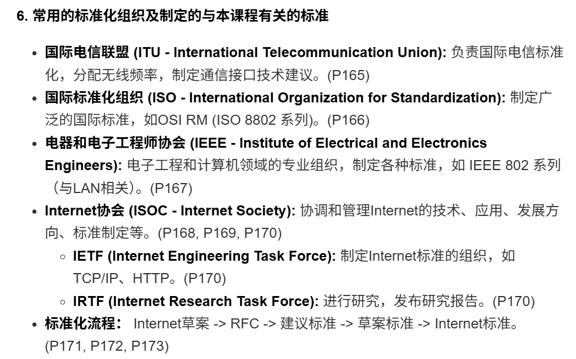

---