---
# 大题
---
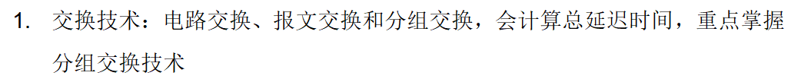
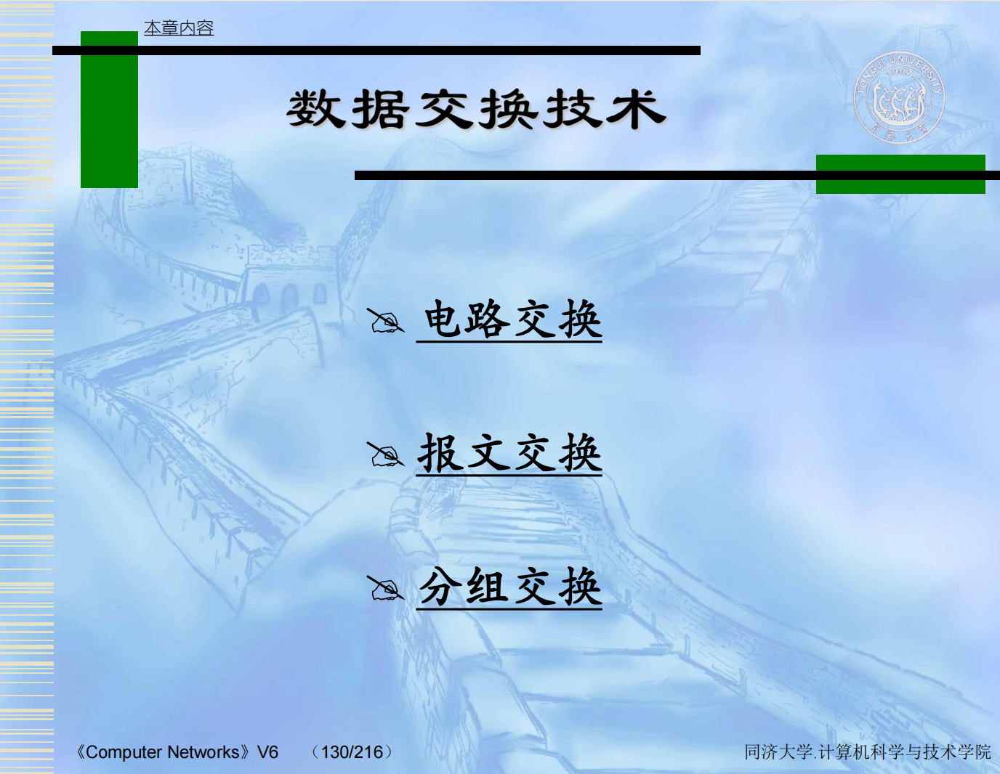
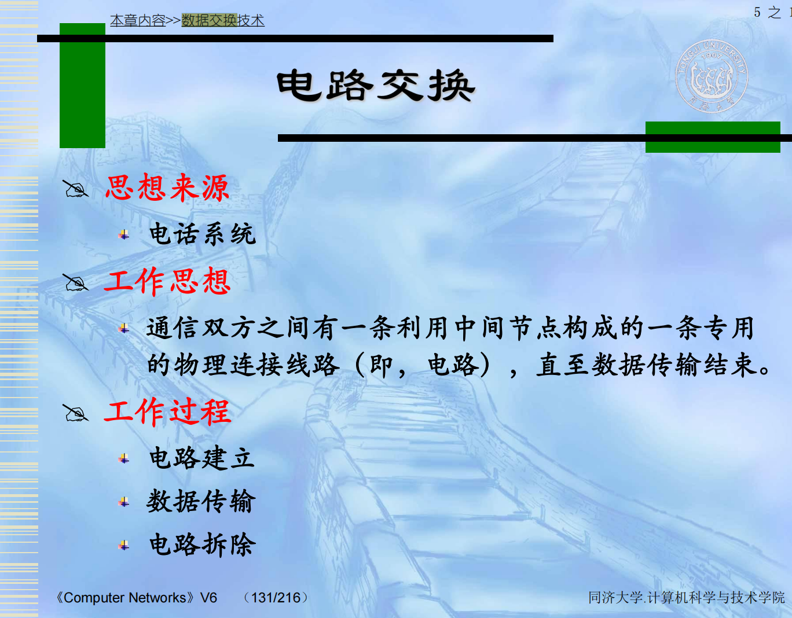
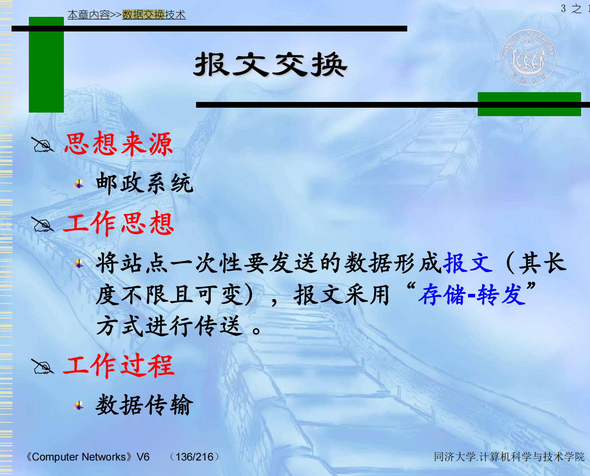
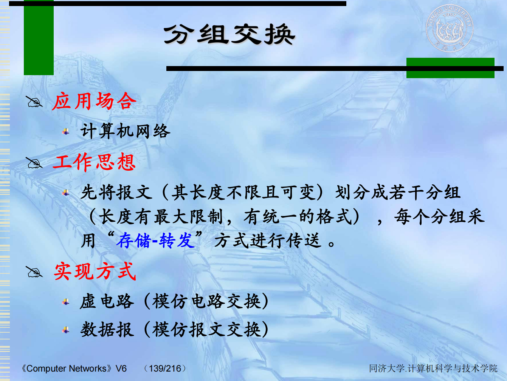
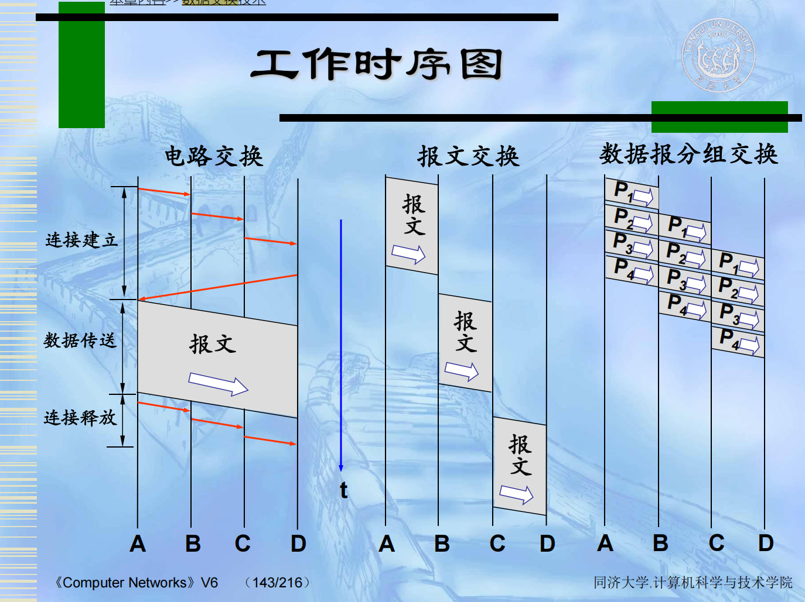
#### 1. 电路交换 (Circuit Switching)
*   **思想来源**：电话系统。
*   **工作过程**：三个阶段 —— **建立连接** (建立一条专用的物理通路) $\rightarrow$ **通话** (数据传输，独占资源) $\rightarrow$ **释放连接** (拆除电路)。
*   **特点 (P135)**：
    *   **优点**：通信可靠、迅速、保序（数据按序到达）。
    *   **缺点**：信道利用率低（连接期间即使无数据传输也占用资源）、连接建立时间长。
    *   **适用**：高质量的大量连续数据传输。

#### 2. 报文交换 (Message Switching)
*   **思想来源**：邮政系统。
*   **工作原理**：**存储-转发 (Store-and-Forward)**。
    *   站点将一次性要发送的整个数据块（报文）发送给中间结点。
    *   中间结点**完整接收**整个报文，存储下来，检查无误后，再转发给下一个结点。
*   **特点 (P138)**：
    *   **优点**：线路利用率高、可进行速度/代码转换、不需要收发双方同时激活。
    *   **缺点**：延迟时间长（每跳都要接收完整个报文才能转发）、对中间结点缓存要求高（报文长度不限）。

#### 3. 分组交换 (Packet Switching) —— **【重点掌握】**
*   **工作原理**：
    *   将长报文划分成若干个较短的、固定长度的**分组 (Packet)**。
    *   每个分组包含首部（地址信息等）。
    *   采用 **存储-转发** 方式，但以分组为单位进行转发。

*   **两种实现方式 (P140-142)**：
    1.  **虚电路 (Virtual Circuit)**：模仿电路交换。
        *   先建立逻辑连接（虚电路），所有分组沿同一路径传输。
        *   **特点**：开销少（建立后只需简短的虚电路号），可靠，保序；但如果结点故障，所有经过该结点的虚电路都会中断。
    2.  **数据报 (Datagram)**：模仿报文交换。
        *   无连接，每个分组独立选择路由。
        *   **特点**：开销大（每个分组都要完整地址），不可靠，可能失序；但适应性强，某个结点故障不影响整体（可绕行）。

*   **三种交换技术的总延迟时间计算与比较 (P143 工作时序图)**：
    *   这是计算题的重点，主要对比**总传输时间**。
    *   假设：报文大小为 $M$，分组大小为 $P$，链路带宽为 $B$，经过 $N$ 段链路（即经过 $N-1$ 个路由器）。忽略传播时延和建立连接时间（或题目另给）。

    1.  **电路交换**：
        $$ T_{\text{total}} = \text{连接建立时间} + \frac{M}{B} + \text{传播时延} $$
        *(一旦建立，数据像流水一样直接过去)*

    2.  **报文交换 (串行转发)**：
        $$ T_{\text{total}} = N \times \frac{M}{B} $$
        *(每一跳都要把整个大报文 $M$ 接收完才能发往下一跳)*

    3.  **分组交换 (流水线/管道效应)**：
        *   **原理**：第一个分组在第二段链路传输时，第二个分组可以在第一段链路传输。
        *   **计算逻辑**：
            总时间 = **第一个分组到达目的地的全部时间** + **剩余分组在最后一段链路的发送时间**。
        *   **公式推导**：
            *   分组数量 $k = M/P$。
            *   第一个分组经过 $N$ 段链路的时间：$N \times (P/B)$。
            *   剩下的 $(k-1)$ 个分组紧随其后，每隔 $P/B$ 的时间到达一个。
            *   $$ T_{\text{total}} = N \times \frac{P}{B} + (k - 1) \times \frac{P}{B} $$
            *   即：$$ T_{\text{total}} = (N + k - 1) \times \frac{P}{B} $$

    *   **结论**：当数据量较大且经过的跳数较多时，**分组交换**由于流水线效应，其总延迟通常远小于报文交换。
---
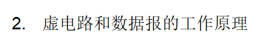
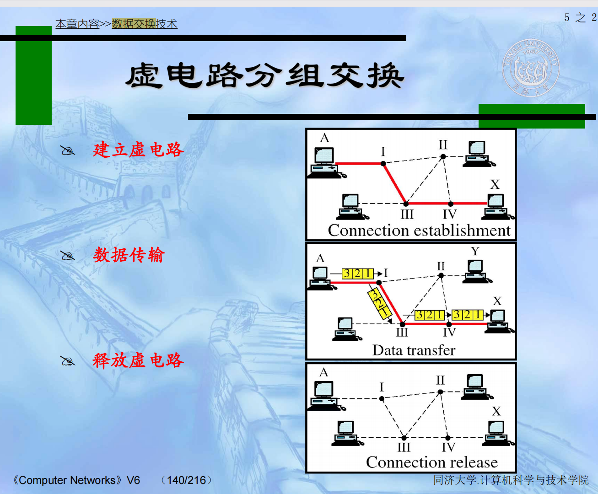
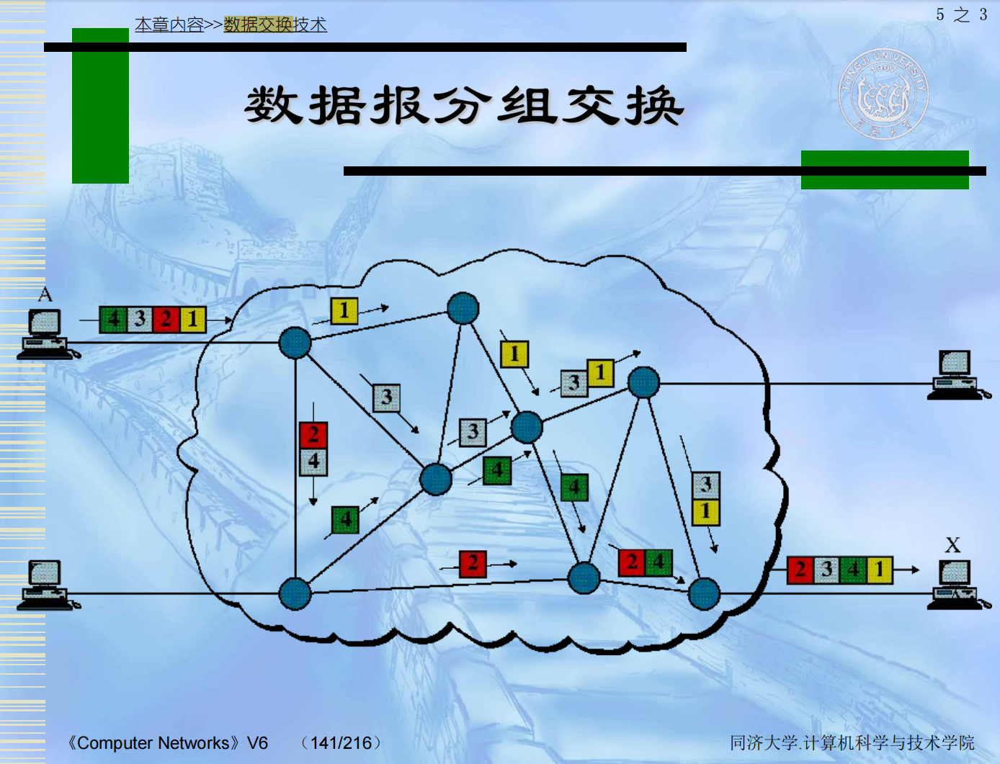
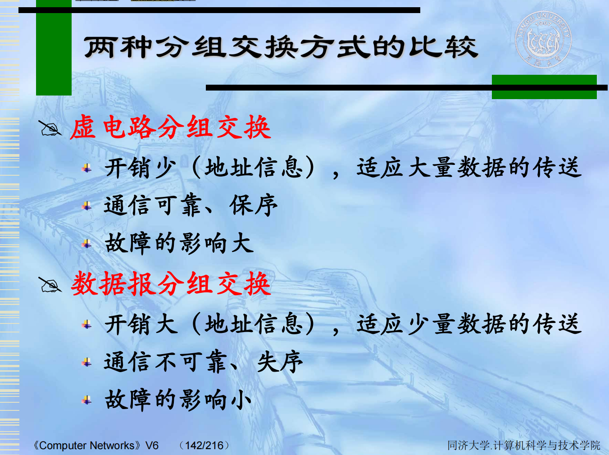

---
# 其他题
---
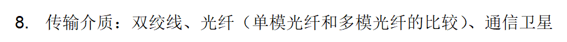
#### 1. 双绞线 (Twisted Pair)
*   **页码范围：** P35 - P36
*   **核心考点：**
    *   **结构：** 螺旋绞合的双导线（为了减少干扰）。
    *   **分类（P36）：**
        *   **STP (屏蔽双绞线)：** 有铜屏蔽层，抗干扰强，贵。
        *   **UTP (非屏蔽双绞线)：** 无屏蔽层，便宜，应用最广（如局域网）。
    *   **应用：** 距离短（100米），模拟/数字传输均可。
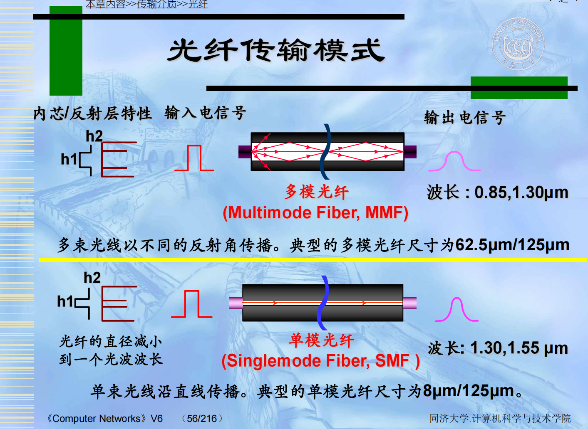
#### 2. 光纤 (Optical Fiber) —— **重点：单模vs多模**
*   **页码范围：** P54, P56, P59
*   **核心考点：**
    *   **原理 (P54)：** 全反射。
    *   **单模光纤 (Single-mode, SMF) (P56下半部分)：**
        *   内芯极细 (8-10μm)，一直径只有一个光波波长。
        *   光源：激光 (Laser)。
        *   特性：无模间色散，传输距离远，带宽高，适合长途干线。
    *   **多模光纤 (Multimode, MMF) (P56上半部分)：**
        *   内芯较粗 (50/62.5μm)。
        *   光源：发光二极管 (LED)。
        *   特性：多束光反射传输，衰减大，距离短，适合局域网。
    *   **优点 (P59)：** 带宽极大、抗电磁干扰、重量轻。

#### 3. 通信卫星 (Satellites)
*   **页码范围：** P80 - P87
*   **核心考点：**
    *   **特点 (P80)：** 广播特性（一点发多点收）、通信成本与距离无关、延时大（270ms）。
    *   **分类 (P81-87)：**
        *   **GEO (同步卫星)：** 高度35800km，相对地面静止，覆盖广（3颗覆盖全球），延时最大。
        *   **MEO (中轨道)：** 如GPS。
        *   **LEO (低轨道)：** 如铱星系统 (Iridium)，延时小，需要多颗卫星接力。

---

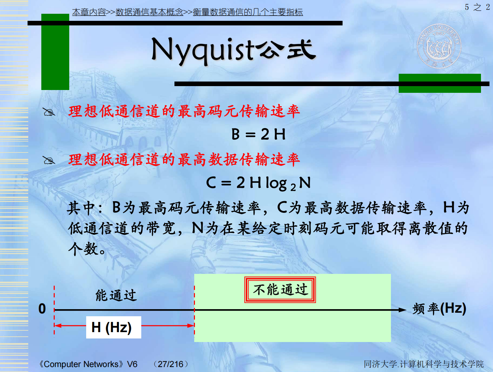
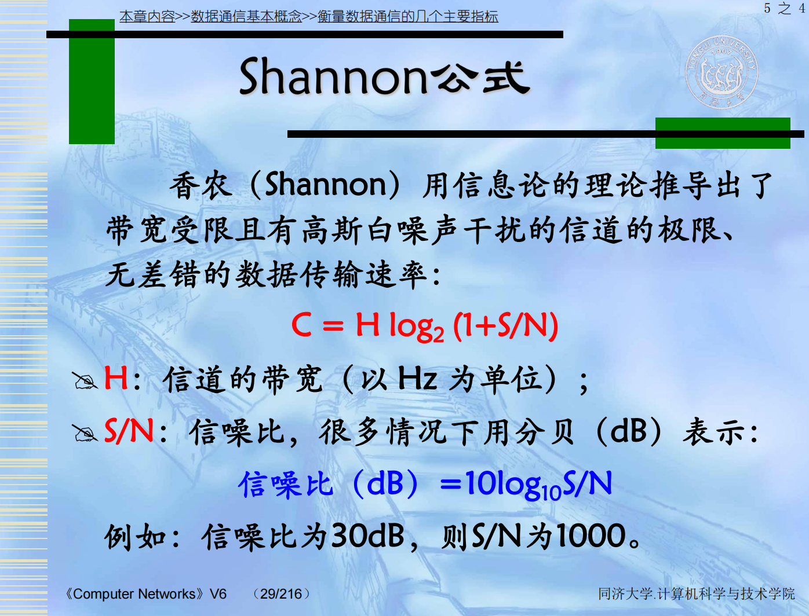
#### PCM (脉码调制) 与速率计算
**重点：T1/E1载波计算（必考计算题）**

*   **页码范围：** P105 - P109 (原理), P173 - P177 (计算)
*   **核心考点：**
    *   **PCM原理 (P173)：** 采样 -> 量化 -> 编码。
    *   **基准速率：** 电话语音带宽4kHz -> 奈奎斯特采样率8000Hz -> 每次采样8bit -> **64 kbps** (标准话路速率)。
    *   **T1载波计算 (P174-175) [北美/日本标准]：**
        *   **复用路数：** 24路。
        *   **帧结构：** (24路 × 8 bit) + 1 bit (帧同步) = 193 bits。
        *   **总速率：** 193 bits × 8000 帧/秒 = **1.544 Mbps**。
    *   **E1载波计算 (P177) [欧洲/中国标准]：**
        *   **复用路数：** 30路语音 + 2路控制 = 32路。
        *   **总速率：** 32路 × 8 bit × 8000 帧/秒 = **2.048 Mbps**。

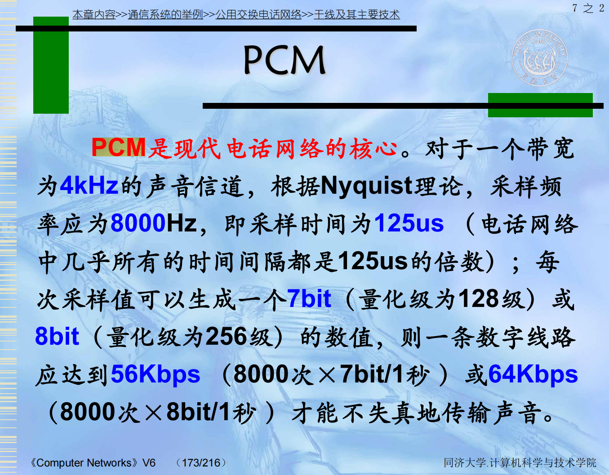
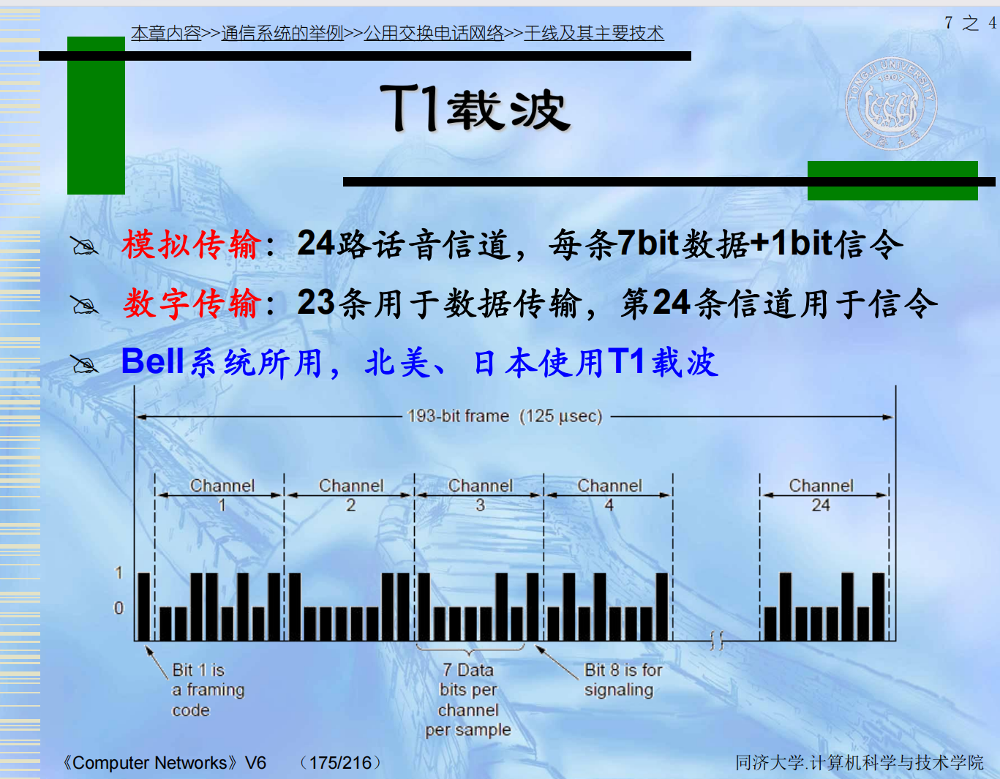
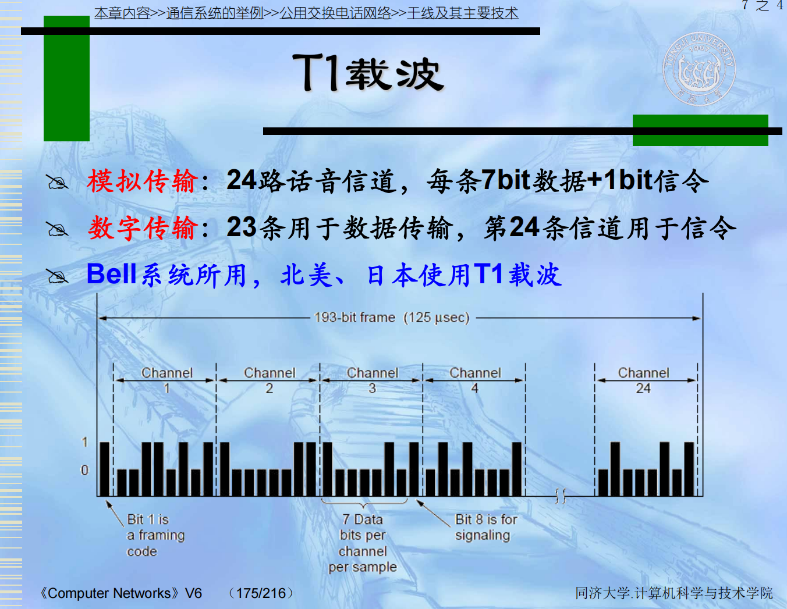
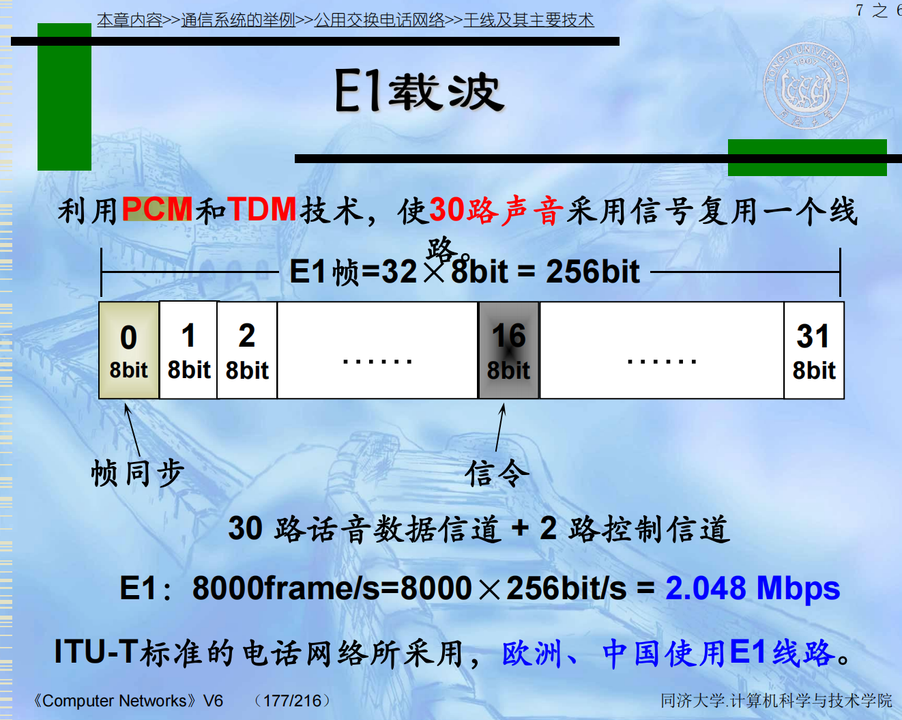

---
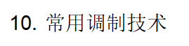
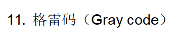
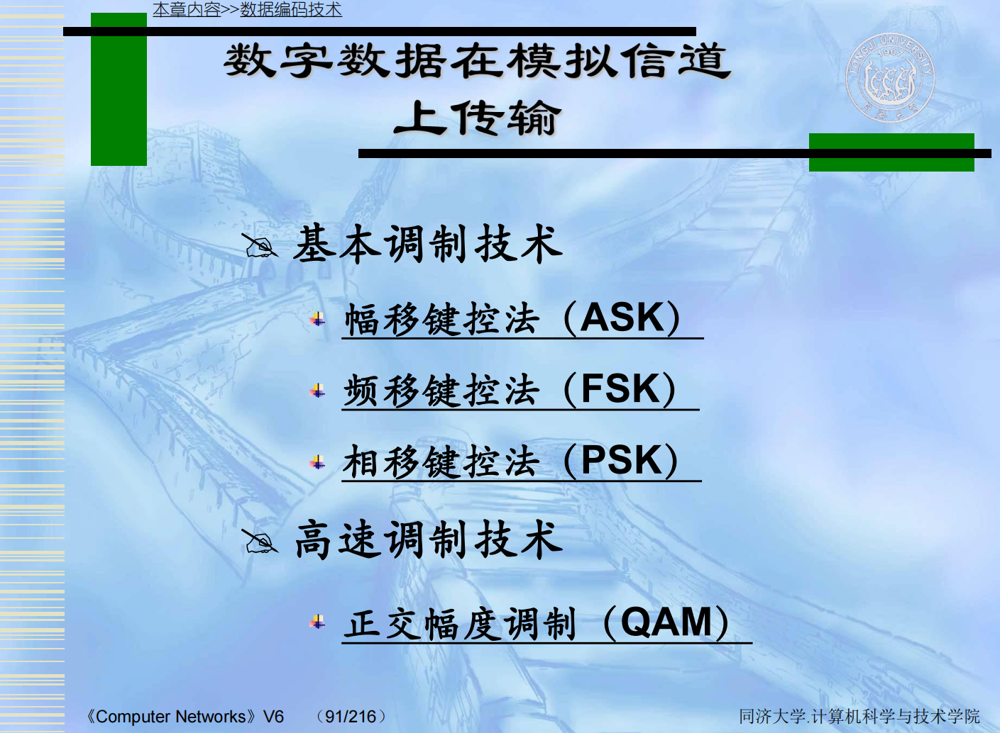
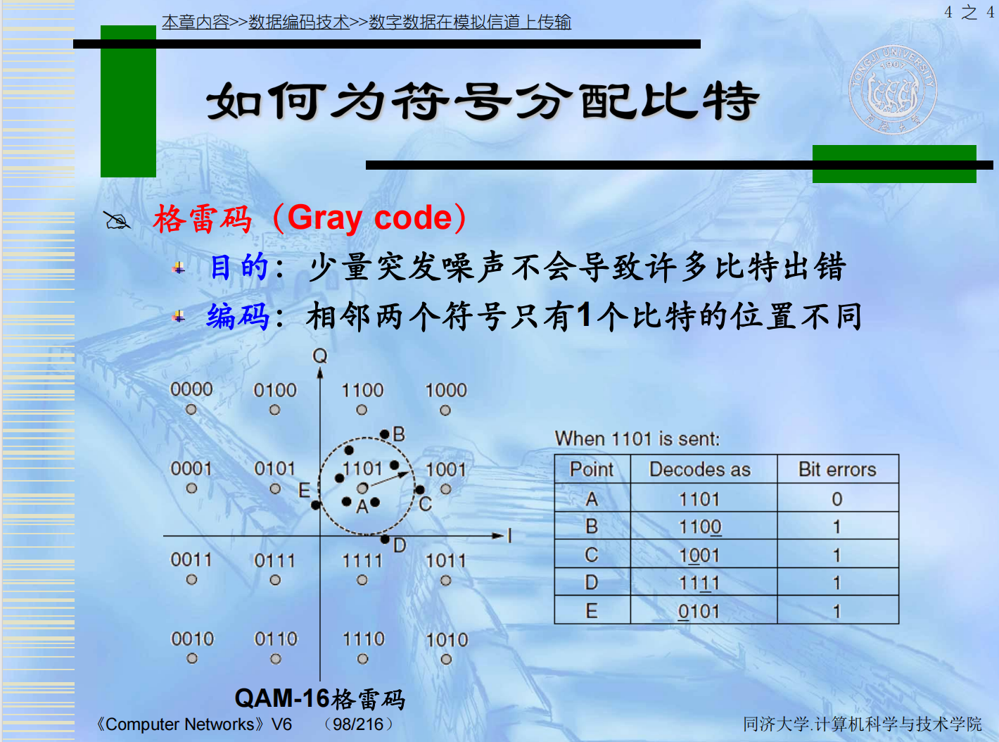
#### 1. 常用调制技术
*   **页码范围：** P92 - P97
*   **核心考点：**
    *   **ASK (幅移)：** 调振幅 (P92)。
    *   **FSK (频移)：** 调频率 (P93)。
    *   **PSK (相移)：** 调相位 (P94)。
    *   **QAM (正交幅度调制) (P95-97)：** 结合PSK和ASK，同时调节**相位**和**振幅**。
        *   **星座图 (P96)：** 点越多，传输效率越高，但抗噪能力越差。
        *   **比特率计算 (P97)：** 例如QAM-16有16个点，每个点代表 $log_2(16) = 4$ bits。

#### 2. 格雷码 (Gray Code)
*   **页码范围：** P98
*   **核心考点：**
    *   **定义：** 相邻两个符号之间只有**1个比特**不同。
    *   **目的：** 减少突发噪声引起的误码扩散。

---
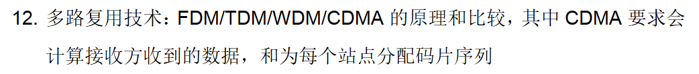
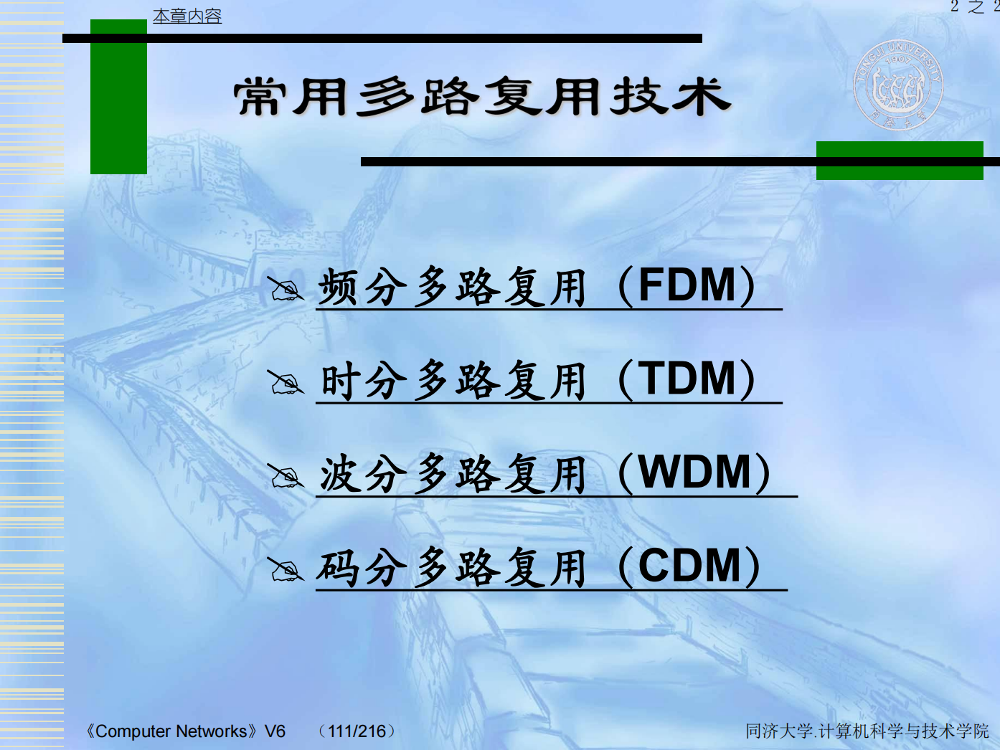
### 第一部分：四种多路复用技术总结与比较

#### 1. 原理简述

| 技术名称 | 英文全称         | 核心原理 (如何区分信号)                                                                                                                                  | 典型应用场景                         |
| :------- | :--------------- | :------------------------------------------------------------------------------------------------------------------------------------------------------- | :----------------------------------- |
| **FDM**  | **频分**多路复用 | **按频率划分**：将信道的总带宽切分成多个互不重叠的子频带，每个用户占用一个固定的频带。中间需**保护频带**防止干扰。                                       | 传统电话、无线电广播、ADSL、有线电视 |
| **TDM**  | **时分**多路复用 | **按时间划分**：将时间切分成一个个**时间片(Slot)**，用户轮流占用信道传输数据。分为**同步TDM**（固定分配，效率低）和**异步TDM**（按需分配，需带地址头）。 | 数字电话(PCM)、GSM移动通信           |
| **WDM**  | **波分**多路复用 | **按波长划分**：本质是光纤中的FDM。利用棱镜/光栅将不同波长（颜色）的光信号合并到一根光纤传输。                                                           | 光纤通信、互联网骨干网 (DWDM)        |
| **CDMA** | **码分**多路复用 | **按码型划分**：所有用户在**同一时间**使用**同一频段**。利用**正交的码片序列**来区分不同用户。信号是叠加的，通过数学运算分离。                           | 3G/4G移动通信、GPS、抗干扰军事通信   |

#### 2. 横向比较

*   **信道利用率：**
    *   **CDM > 异步TDM > 同步TDM/FDM**。
    *   FDM浪费了保护频带；同步TDM浪费了空闲时间片；CDMA由于频率复用系数高，系统容量最大。
*   **抗干扰能力：**
    *   **CDMA 最强**（类似白噪声，保密性好，抗多径衰落）；
    *   FDM 和 TDM 较弱，容易受特定频率或时间脉冲干扰。
*   **技术复杂度：**
    *   **CDMA 最复杂**（需要严格的时间同步和复杂的数学运算）；
    *   FDM 需要复杂的模拟滤波器；
    *   TDM 数字电路实现相对简单（但在高速下同步困难）。

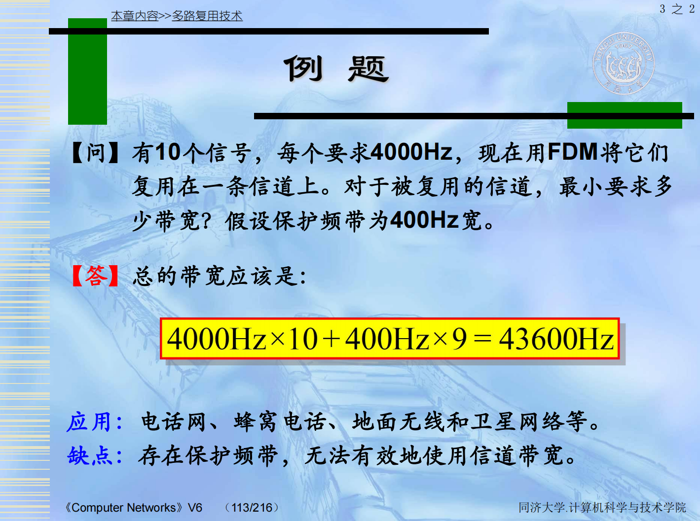

### 第二部分：CDMA 核心专题总结

这是考试和理解的重难点，分为**计算**和**分配**两个环节。

#### 1. 如何计算接收方收到的数据？
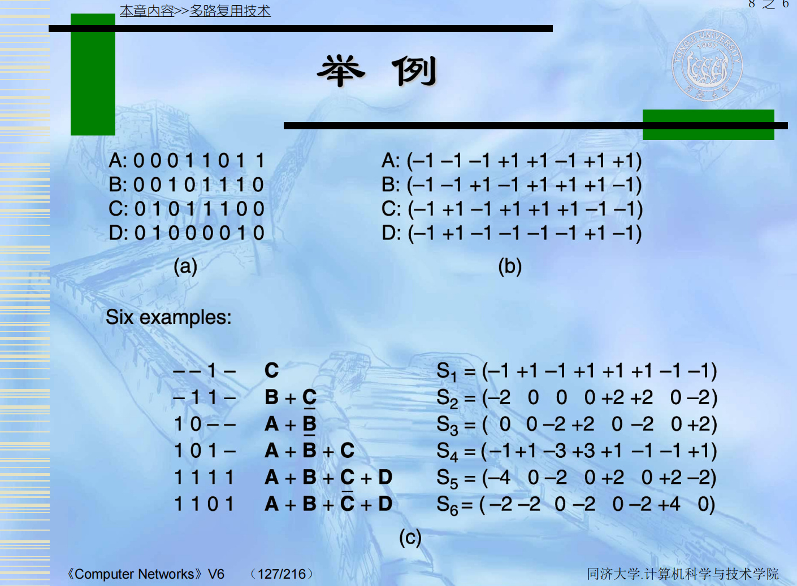
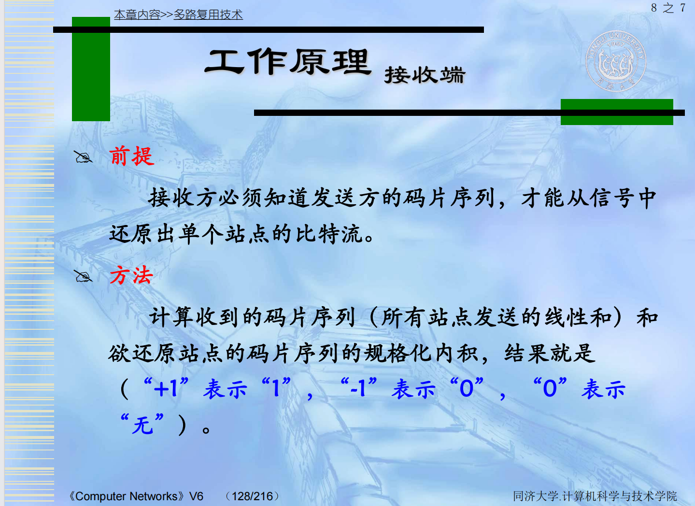
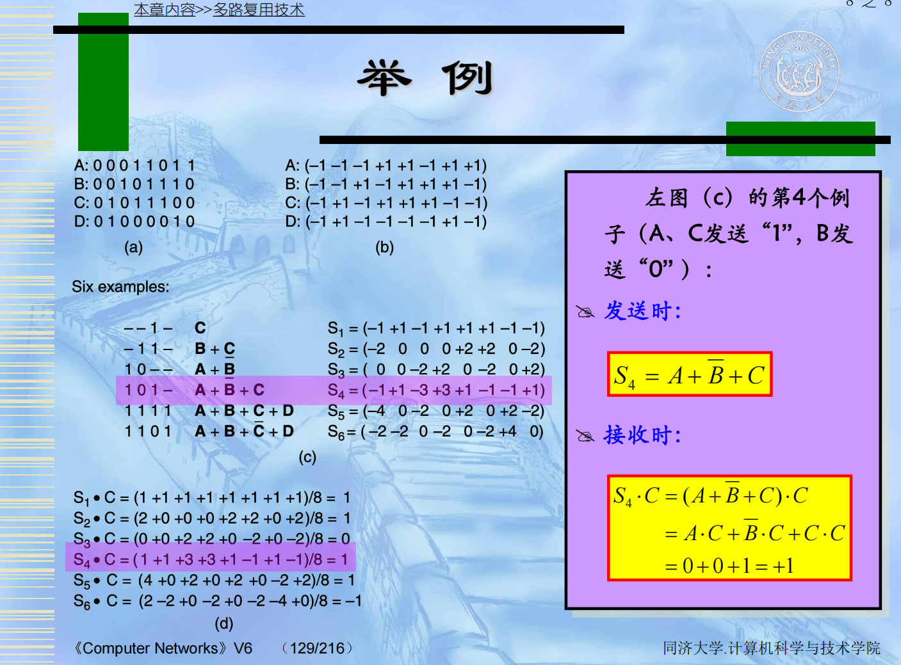
接收方从空中收到的是所有站点信号的**线性叠加**（混合信号），要从中提取出特定站点的数据，步骤如下：

*   **第一步：准备数据**
    *   **混合信号向量 ($R$)：** 接收到的总信号。
    *   **目标站点码片向量 ($S$)：** 你想听谁的数据，就拿谁的码片序列。
    *   **码片长度 ($m$)：** 序列中包含多少个数字（通常题中为8或64）。

*   **第二步：进行规格化内积运算**
    *   公式：$\text{数据} = S \cdot R = \frac{1}{m} \sum_{i=1}^{m} (S_i \times R_i)$
    *   **操作口诀：** 对应位相乘，结果求和，最后除以 $m$。

*   **第三步：判决结果**
    *   若计算结果为 **$+1$** $\rightarrow$ 该站点发送了比特 **$1$**。
    *   若计算结果为 **$-1$** $\rightarrow$ 该站点发送了比特 **$0$**。
    *   若计算结果为 **$0$** $\rightarrow$ 该站点 **未发送数据**（静默）。

> **数学原理：** 基于正交性。
> $S \cdot R = S \cdot (S + \text{噪音}) = (S \cdot S) + (S \cdot \text{噪音}) = 1 + 0 = 1$。

#### 2. 如何为每个站点分配码片序列？
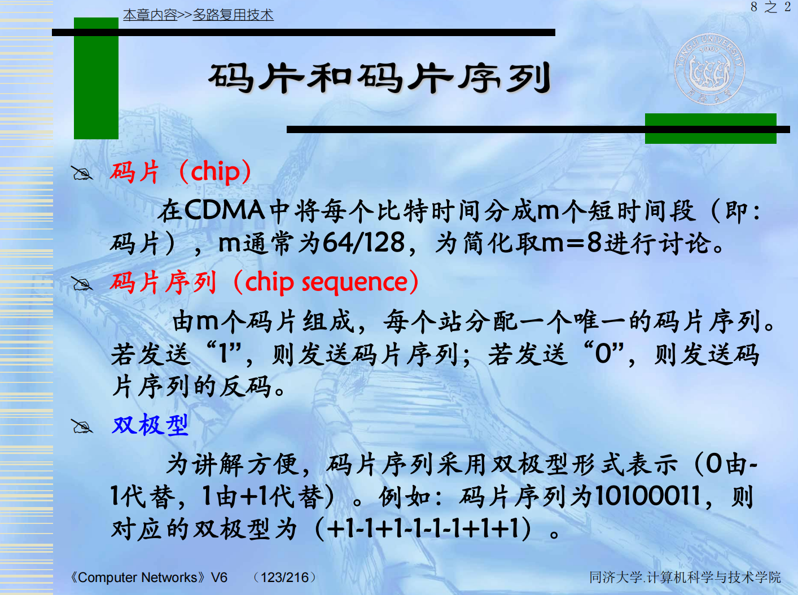
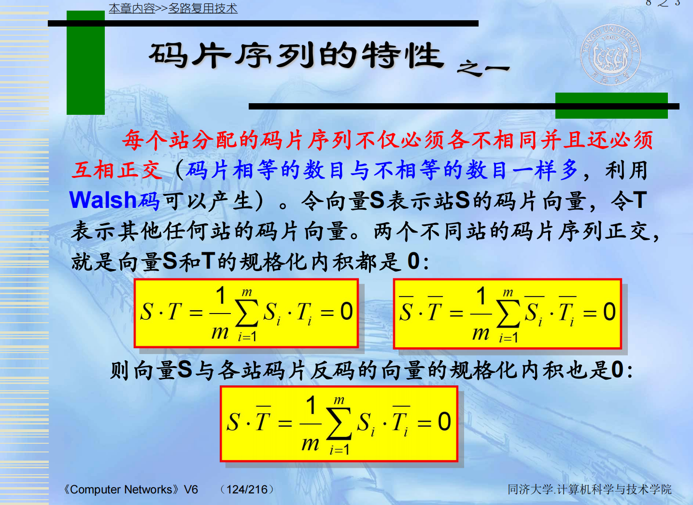
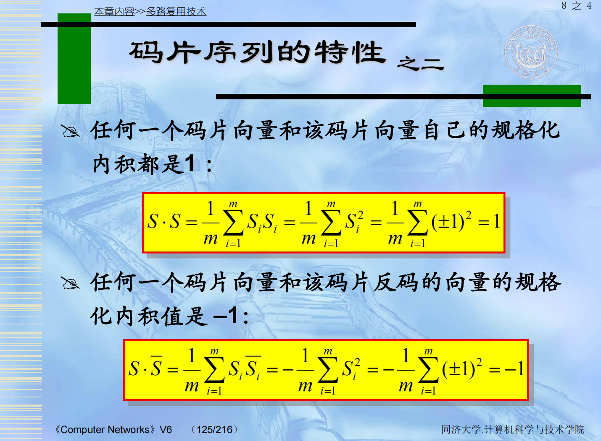

---