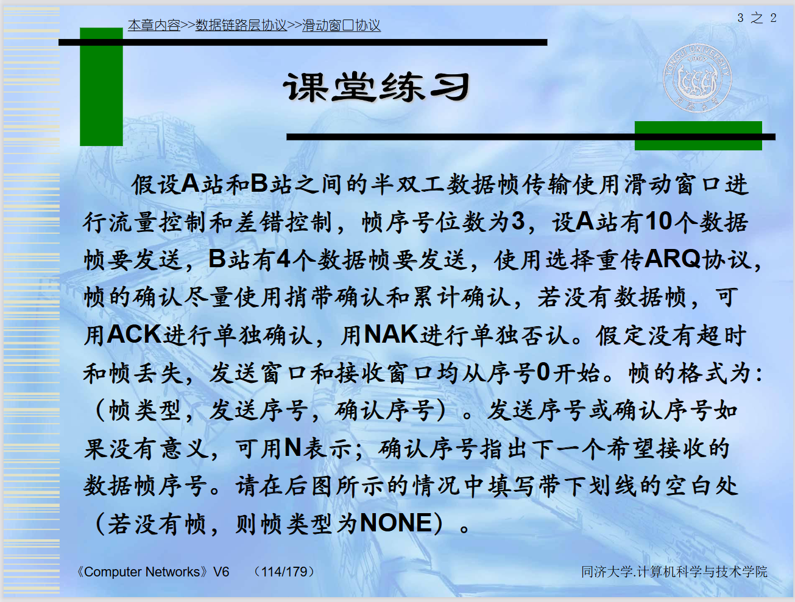
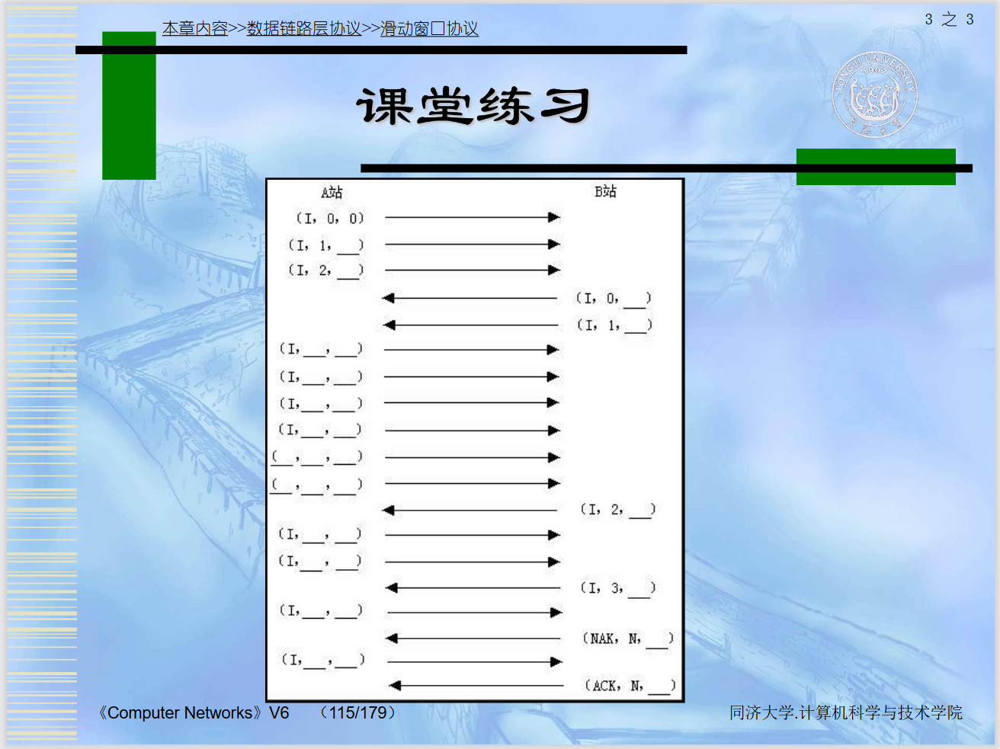

这份复习资料是根据你提供的考纲和PDF课件内容定制的。针对**“时间非常紧张”**的情况，我只提炼了**最核心的公式、结论和关键概念**，并标注了对应的PPT页码以便你快速查阅。

---

### 第一部分：大题（计算与分析）

#### **考点 4：停-等协议的性能分析（信道利用率）**
*   **定义**：发送方发送一帧后，必须等待接收方的确认收到后，才能发送下一帧。
*   **窗口大小**：发送窗口 $W_T = 1$，接收窗口 $W_R = 1$。
*   **性能分析（信道利用率）**：
    *   **问题**：当链路具有较大的**带宽-延迟乘积**（Bandwidth-Delay Product）时，停-等协议的效率极低。
    *   **信道利用率公式**：
        $$ U = \frac{T_{frame}}{T_{cycle}} = \frac{T_f}{T_f + 2T_p} $$
        *   $T_f$：发送一帧所需的时间（帧长 / 带宽）。
        *   $T_p$：单向传播时延（距离 / 光速）。
        *   $2T_p$：往返时延（RTT）。
    *   **结论**：如果 $T_p$ 很大（如卫星链路）或者带宽很大（发送时间 $T_f$ 很小），信道大部分时间处于空闲等待状态，利用率 $U$ 会非常低。
    *   **改进**：引入**管道化技术**（Pipelining），即允许发送方在未收到确认的情况下连续发送多帧，这就是滑动窗口协议的由来（课件第16页）。

#### **考点 5：全双工滑动窗口流量与差错控制（选择重发 ARQ & 后退 N 帧 ARQ）**
滑动窗口协议允许发送方维护一个“发送窗口”，在窗口内的帧都可以连续发送。根据接收窗口大小和出错处理策略的不同，分为以下两种：

#### (1) 后退N帧 ARQ (Go-Back-N, GBN)
*   **原理 (课件第17-19页)**：
    *   **发送方**：可以连续发送多个帧（窗口大小 $W_T > 1$）。
    *   **接收方**：**接收窗口大小 $W_R = 1$**。这意味着接收方只能按序接收帧。
*   **出错处理**：
    *   如果接收方收到一个失序帧（例如期望收#2，但收到了#3），接收方会**丢弃**#3以及后续所有帧，并不发ACK（或者重发对#1的ACK）。
    *   发送方超时后，必须**重传**出错帧及其随后发送的所有帧（即“后退N帧”）。
*   **特点**：接收方逻辑简单（不需要缓存乱序帧），但发送方重传代价大，信道利用率在误码率高时会降低。

#### (2) 选择重发 ARQ (Selective Repeat, SR)
*   **原理 (课件第27-29页)**：
    *   **发送方**：窗口大小 $W_T > 1$。
    *   **接收方**：**接收窗口大小 $W_R > 1$**。接收方可以缓存乱序到达的正确帧。
*   **出错处理**：
    *   如果接收方收到乱序帧（如收到#3，缺#2），它会**缓存**#3，并向发送方发送**NAK**（否定确认）请求重传#2。
    *   发送方只**选择性地重传**出错的那一帧（#2），一旦#2到达，接收方将#2与缓存的#3一起上交。
*   **特点**：效率高，只重传坏帧，但接收方需要复杂的缓存排序逻辑。

#### **考点 6：帧序号比特数计算（窗口大小与 $n$ 的关系）**
*   **核心公式（$n$ 为序号比特数）：**
    1.  **停-等协议：** $W_T=1, W_R=1$。序号只需 1位 (0/1)。
    2.  **后退N帧 (GBN)：** $W_T \le 2^n - 1$。
        *   *例：*若 $n=3$，则 $W_T \le 7$。
    3.  **选择重发 (SR)：** $W_T + W_R \le 2^n$，且通常 $W_T = W_R$。
        *   即：$W_T \le 2^{n-1}$。
        *   *例：*若 $n=3$，最大窗口 $2^3 = 8$，则 $W_T \le 4$。
*   **PDF页码：** **P96**（GBN定理证明）、**P106**（SR定理证明）

---

### 第二部分：其它题（概念与简答）

#### **考点 14：CRC码（生成与验证）**
*   **操作步骤：**
    1.  **发送端：** 在数据后补 $r$ 个0（$r$是生成多项式的阶数）。
    2.  **模2除法：** 用异或运算（相同为0，不同为1，不借位）。
    3.  **余数：** 余数即为FCS（校验码），替换掉补的0。
    4.  **接收端：** 将收到的数据除以生成多项式，余数为0则正确。
*   **PDF页码：** **P29-31**（计算步骤与示例，**P30-31**有详细除法演示）

#### **考点 15：海明码（计算冗余位位数）**
*   **核心不等式：**
    $$ 2^r \ge k + r + 1 $$
    *   $k$：信息位位数（数据）。
    *   $r$：冗余位位数（校验位）。
*   **示例：** 若传输7位数据 ($k=7$)，代入公式 $2^4 \ge 7+4+1 \rightarrow 16 \ge 12$ (成立)，所以 $r=4$。
*   **PDF页码：** **P41**（定理与证明）

#### 考点 16：数据链路层数据成帧（解决帧同步）的四种方法，重点是面向比特的首位定界符法，掌握0bit插入/删除
为了解决“帧同步”问题（即接收方如何知道一帧从哪开始、到哪结束），主要有以下四种方法：

1.  **字节计数法 (Byte Count)**
    *   **原理：** 头部用一个字段记录帧长度。
    *   **缺点：** 计数字段出错会导致后续所有帧失去同步，极不可靠。

2.  **字符填充的首尾定界符法 (Character Stuffing)**
    *   **原理：** 用特定字符（如FLAG）定界。数据中出现FLAG时，前面加转义字符（ESC）。
    *   **应用：** PPP协议。
    *   **缺点：** 依赖字符集（8位），不够通用。

3.  **比特填充的首尾定界符法 (Bit Stuffing) —— 【重点掌握】**
    *   **原理：** 用特定比特模式 `01111110` 定界。
    *   **0比特插入/删除规则：**
        *   **发送方：** 检查数据载荷，只要发现**连续5个“1”**，立即在后面插入一个**“0”**。
        *   **接收方：** 检查接收到的比特流，只要发现**连续5个“1”**，就把后面的**“0”删除**，还原数据。
        *   **标志判断：** 如果接收方看到连续6个“1”（即 `01111110`），则认定为帧的边界。
    *   **优点：** 实现了透明传输，不依赖特定字符集，硬件处理容易，广泛用于HDLC等协议。

4.  **违法编码法 (Physical Layer Coding Violations)**
    *   **原理：** 利用物理层编码中不使用的电平组合（如曼彻斯特编码中的“高-高”电平）作为定界符。
    *   **应用：** IEEE 802标准（以太网）。
    *   **优点：** 不需要任何填充，效率最高。

#### **考点 17：ARQ协议三要素**
**ARQ (Automatic Repeat reQuest)** 是数据链路层实现可靠传输的核心机制。根据课件（如协议4、5、6的描述），其包含以下三个关键要素：

1.  **确认 (Acknowledgement)**：
    *   使用**捎带确认**技术，放在数据帧首部的 `ack` 字段中。
    *   仅在反向无数据传输且确认定时器超时时，才发送独立 ACK。
2.  **定时器 (Timer)**：
    *   **重传定时器 (Data Timer)**：防止数据丢失。
    *   **确认定时器 (Ack Timer)**：防止因等待“捎带”时间过长而导致对方误判超时。
3.  **帧编号 (Sequence Number)**：
    *   `seq`：标识自己发送的数据。
    *   `ack`：标识期望收到对方的下一个数据（或确认已收到的数据）。

#### **考点 18：滑动窗口协议比较（窗口大小总结）**
假设帧序号位数为 **$n$ bit**，则序号空间大小为 **$2^n$**（编号从 $0$ 到 $2^n - 1$）。

#### (1) 协议关系对比表

| 协议类型 | 发送窗口 $W_T$ | 接收窗口 $W_R$ | 窗口与序号位数 $n$ 的关系 (最大窗口) | 备注 |
| :--- | :--- | :--- | :--- | :--- |
| **停-等协议** | $W_T = 1$ | $W_R = 1$ | $n \ge 1$ (即1bit即可，序号0,1) | 简单，效率低 |
| **后退N帧 (GBN)** | $W_T > 1$ | **$W_R = 1$** | **$W_T \le 2^n - 1$** | **重点记忆**：发送窗口不能等于 $2^n$，必须留一个空缺以区分新旧轮次。 |
| **选择重发 (SR)** | $W_T > 1$ | $W_R > 1$ | **$W_T + W_R \le 2^n$**   通常 $W_T = W_R = 2^{n-1}$ | **重点记忆**：发送窗口最大为序号空间的一半。 |

#### (2) 详细计算示例 (考点6)

*   **后退N帧 (GBN) 的计算**：
    *   **定理**：若序号位数为 $n$，则 $W_T \le 2^n - 1$。
    *   **原因**：(课件第19页证明) 如果 $W_T = 2^n$（例如序号0-7，窗口8），发送方发完0-7后，若所有ACK丢失，发送方超时重传0号帧。接收方（期望接收下一轮的0号）会无法分辨这是“重传的旧0号”还是“新一轮的0号”。因此窗口必须限制。
    *   **例题**：若 $n=3$ (3bit)，则序号范围 0-7。
        *   GBN的最大发送窗口 $W_T = 2^3 - 1 = 7$。

*   **选择重发 (SR) 的计算**：
    *   **定理**：若序号位数为 $n$，则 $W_T + W_R \le 2^n$。通常取 $W_T = W_R$，故 **$W_T \le 2^{n-1}$**。
    *   **原因**：(课件第29页证明) 为了避免接收窗口向前移动后，新窗口的序号与旧窗口的序号重叠导致接收方混淆。
    *   **例题**：若 $n=3$ (3bit)，则序号范围 0-7。
        *   SR的最大发送窗口 $W_T = 2^{3-1} = 2^2 = 4$。

### 总结复习口诀：
*   **停等**：1 发 1 收。
*   **GBN**：多发 1 收，**窗口最大 $2^n - 1$**，累积确认，坏一帧重传一串。
*   **SR**：多发多收，**窗口最大 $2^{n-1}$** (一半)，独立确认，坏一帧重传一个。

#### **考点 19：HDLC协议**
*   **特点：** 面向比特、同步传输、全双工、可靠。
*   **帧类型（会区分）：**
    *   **I帧 (信息帧)：** 传输数据，第一位是 `0`。
    *   **S帧 (监控帧)：** 流量/差错控制 (RR, RNR, REJ, SREJ)，前两位 `10`。
    *   **U帧 (无编号帧)：** 链路建立/拆除 (SABM, DISC, UA)，前两位 `11`。
*   **PDF页码：** **P139-140**（帧结构）、**P141-150**（帧类型详解，重点看**P146-147**的S帧）

#### **考点 20：PPP协议**
*   **应用：** 拨号上网、路由器之间直连。
*   **组成：**
    1.  将IP封装到串行链路的方法（成帧）。
    2.  **LCP** (Link Control Protocol)：建立、测试链路（如身份验证协商）。
    3.  **NCP** (Network Control Protocol)：协商网络层参数（如IP地址）。
*   **透明传输：**
    *   同步链路：硬件0比特插入。
    *   异步链路：字符填充（0x7D转义）。
*   **PDF页码：** **P160**（组成）、**P162**（帧格式）、**P163**（透明传输方法）

---

### ⚡️ 极速复习建议（按优先级）：
1.  **先搞定计算题：** 记住 **信道利用率公式** (P77) 和 **海明码位数公式** (P41)。
2.  **攻克难点：** 对照 **P114-115** 的课堂练习，自己在纸上画一遍GBN和SR的传输过程，搞清楚ACK和NAK怎么回，什么时候重传。
3.  **死记硬背：** 0比特插入法是“见5个1填1个0” (P16)；GBN和SR的窗口公式 (P96, P106)。
4.  **扫盲：** 快速浏览HDLC的三种帧类型 (P141) 和PPP的三个组成部分 (P160)。