---
# 大题
---

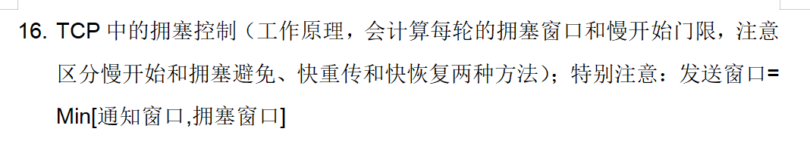
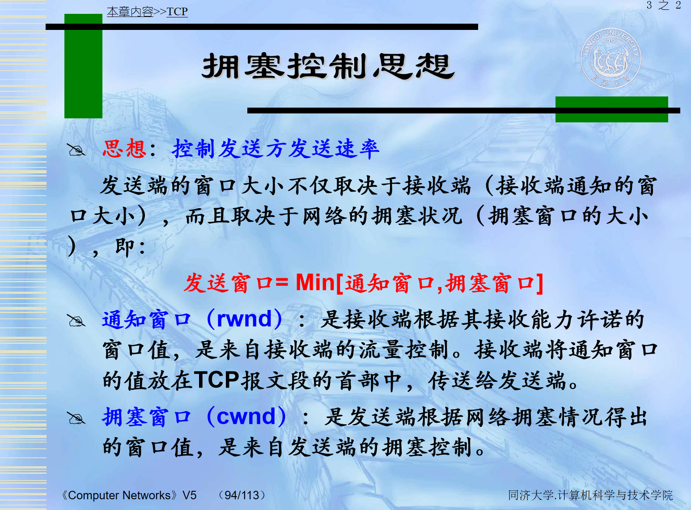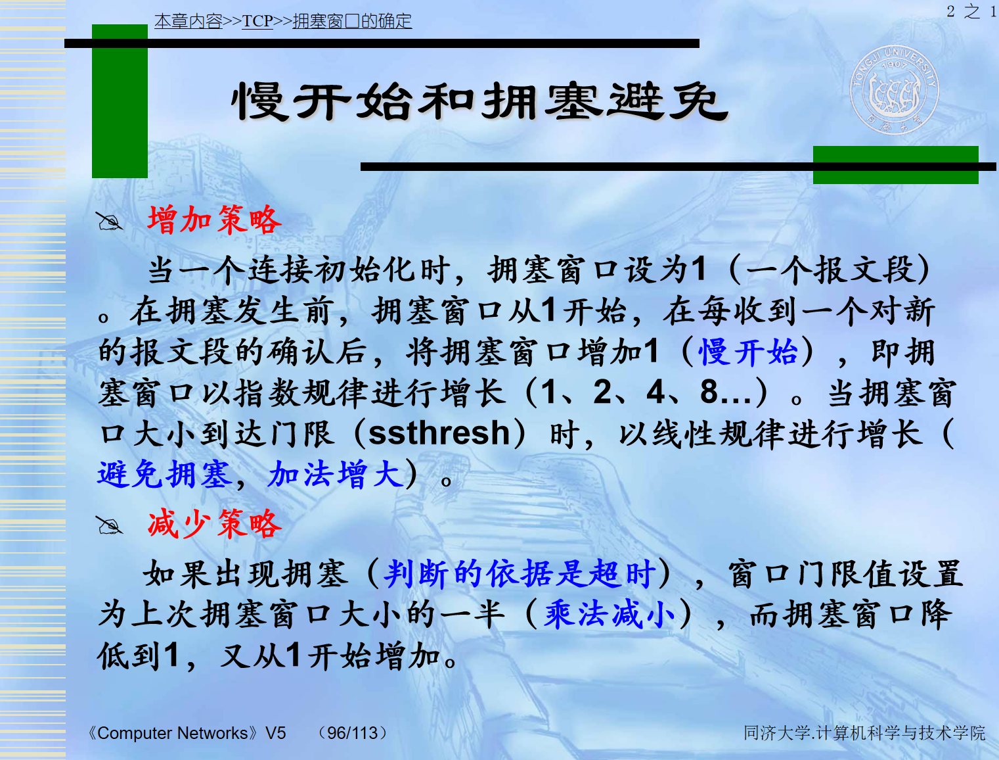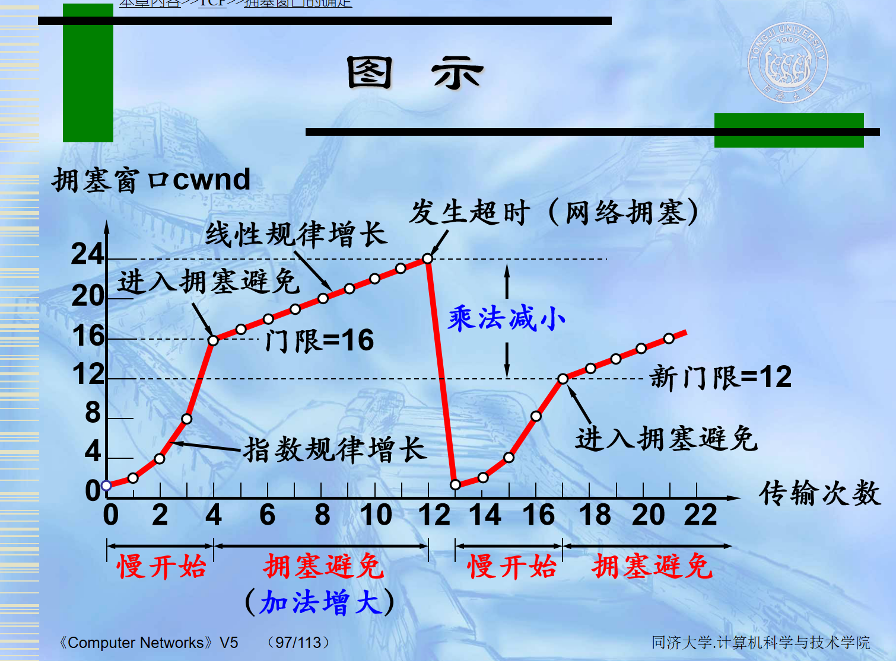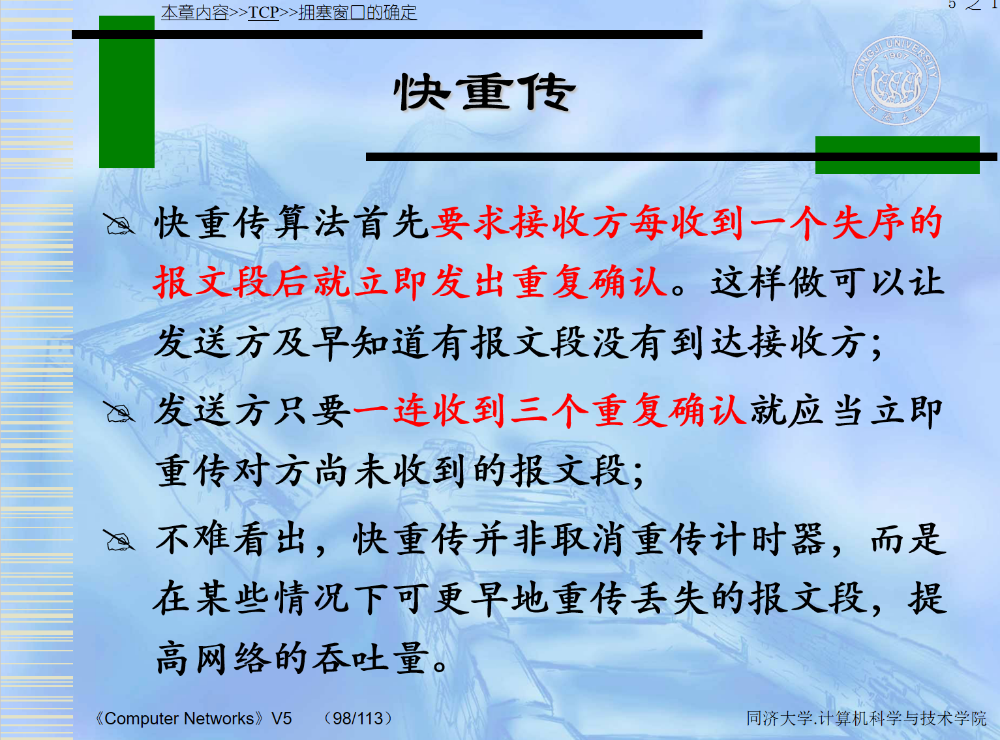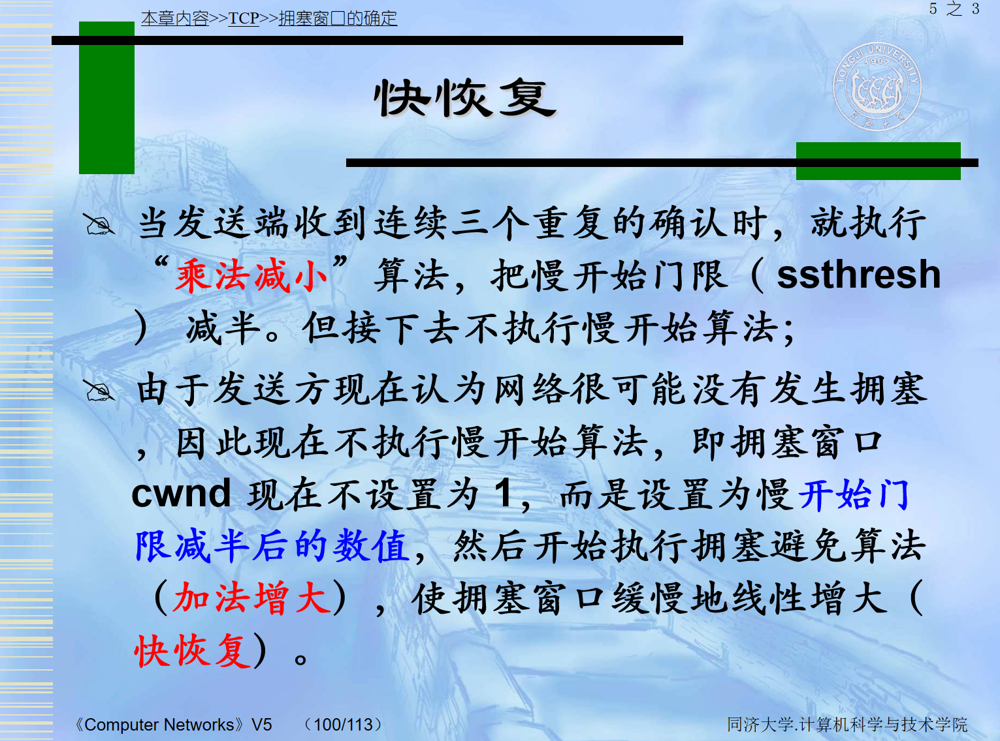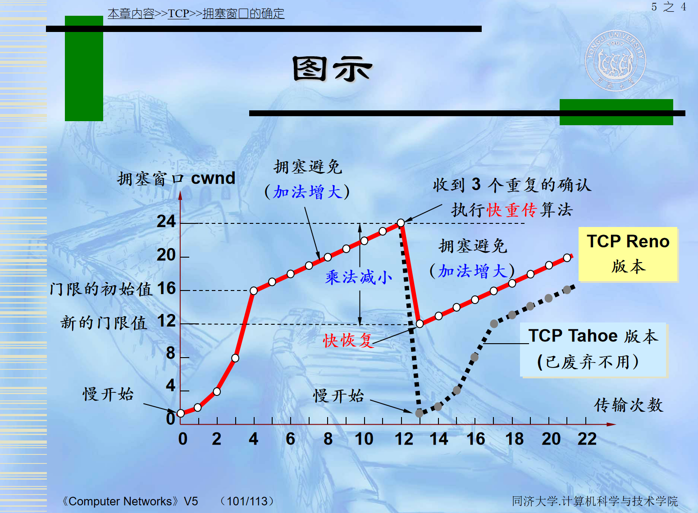
**核心公式**：
$$ \text{发送窗口} = \min [ \text{通知窗口 (rwnd)}, \text{拥塞窗口 (cwnd)} ] $$
*   **通知窗口 (rwnd)**：接收端根据接收能力给出的窗口值（流量控制）。
*   **拥塞窗口 (cwnd)**：发送端根据网络拥塞程度计算出的窗口值（拥塞控制）。

#### 1. 工作原理与算法
TCP拥塞控制主要包含四个核心算法，分为两个阶段进行调节：

**阶段一：慢开始 (Slow Start) & 拥塞避免 (Congestion Avoidance)**
*   **慢开始**：
    *   **初始**：连接建立时，`cwnd = 1` (个报文段, MSS)。
    *   **增长规则**：每收到一个对新报文段的确认，`cwnd` 加 1。即每经过一个传输轮次（RTT），`cwnd` **加倍**（指数增长：1, 2, 4, 8...）。
    *   **门限 (ssthresh)**：为了防止增长过快，设置慢开始门限 `ssthresh`。
        *   当 `cwnd < ssthresh` 时，使用慢开始算法。
        *   当 `cwnd > ssthresh` 时，改用拥塞避免算法。
        *   当 `cwnd = ssthresh` 时，两者皆可。
*   **拥塞避免**：
    *   **增长规则**：每经过一个 RTT，`cwnd` 增加 1（加法增大，线性增长）。
    *   **目的**：让拥塞窗口缓慢增大，探测网络容量，避免过早引发拥塞。

**阶段二：网络拥塞的处理 (超时 vs 3个重复ACK)**
这是考试计算题的关键区分点：

*   **情况 A：发生超时 (Timeout)** —— 认为网络拥塞严重
    1.  **新门限**：`ssthresh` 设为当前 `cwnd` 的一半（乘法减小）。
    2.  **重置窗口**：`cwnd` 重置为 1。
    3.  **重新开始**：执行**慢开始**算法。

*   **情况 B：收到3个重复ACK (3 Duplicate ACKs)** —— 认为网络状况尚可
    *   **快重传 (Fast Retransmit)**：
        *   接收方：收到失序报文段立即发送重复确认。
        *   发送方：一连收到3个重复确认，立即重传对方未收到的报文段，不必等待超时。
    *   **快恢复 (Fast Recovery)**：
        1.  **新门限**：`ssthresh` 设为当前 `cwnd` 的一半。
        2.  **新窗口**：`cwnd` 设置为新的 `ssthresh` 值（注意：有些版本是 ssthresh+3，课件P100描述为“设置为慢开始门限减半后的数值”）。
        3.  **继续执行**：直接开始执行**拥塞避免**算法（线性增长），**不执行慢开始**。

#### 2. 计算题解题套路
1.  画出 `cwnd` 随传输轮次（RTT）变化的折线图。
2.  **指数增长**直到 `ssthresh`。
3.  **线性增长**直到发生丢包事件。
4.  **判断丢包类型**：
    *   若题目说“超时”，`cwnd` 降为 1，`ssthresh` 减半。
    *   若题目说“收到3个重复确认”，`cwnd` 降为一半，`ssthresh` 减半，然后线性增长。

---
# 其他题
---

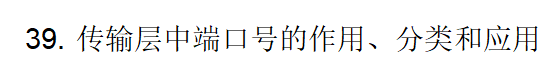
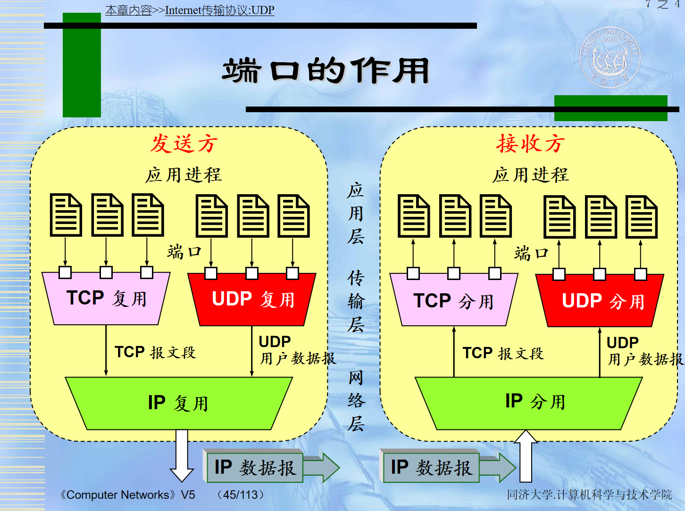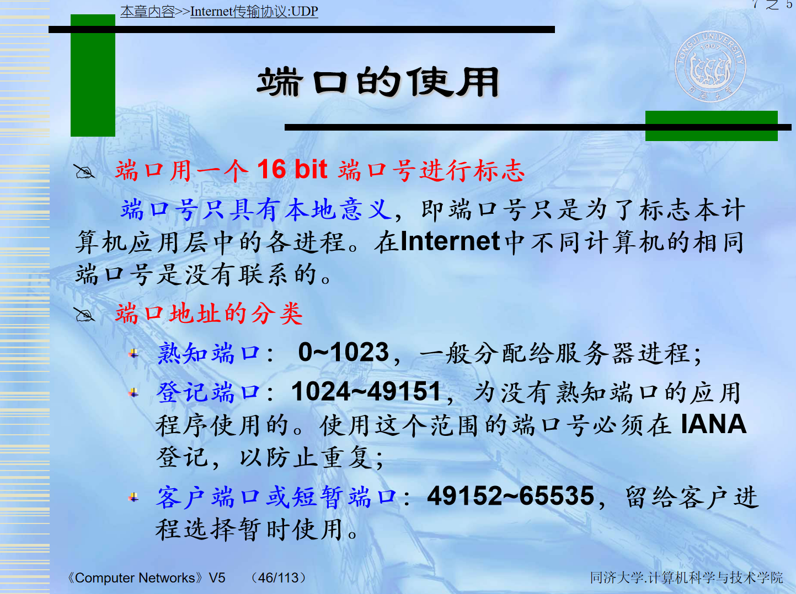
在计算机网络体系结构中，端口号（Port Number）是传输层（TCP和UDP）最重要的概念之一。如果说 **IP地址** 标识的是网络上的一台 **主机**，那么 **端口号** 标识的就是这台主机上的一个具体的 **进程（应用程序）**。

### 1. 端口号的作用

端口号的主要作用是实现 **“复用”** 和 **“分用”**，即：

*   **分用（Demultiplexing）：** 当传输层从下层（网络层）接收到报文后，需要根据报文头部的“目的端口号”，将数据准确地交付给应用层中特定的进程。
*   **复用（Multiplexing）：** 不同的应用进程都可以通过传输层发送数据，它们共用底层的网络连接，通过不同的“源端口号”来区分。
*   **建立连接的唯一标识：** 在网络通信中，一个 **套接字（Socket）** 由 `(源IP, 源端口, 目的IP, 目的端口, 协议)` 这个五元组唯一确定。没有端口号，数据包就不知道该交给哪个软件处理（例如，是给浏览器还是给QQ）。

**形象比喻：**
*   **IP地址** = 收件地址（某栋大楼）。
*   **端口号** = 房间号（大楼里的某个具体公司或住户）。

### 2. 端口号的分类

端口号是一个 **16 位** 的二进制数，取值范围是 **0 到 65535**。根据 IANA（互联网数字分配机构）的规定，分为以下三类：

#### ① 熟知端口号（Well-known Ports）：0 ~ 1023
*   **用途：** 分配给全球通用的核心网络服务。
*   **特点：** 这些端口是固定的，除非获得特权，否则普通用户程序不能占用。
*   **典型例子：** HTTP (80), HTTPS (443), FTP (21), SSH (22), DNS (53)。

#### ② 登记端口号（Registered Ports）：1024 ~ 49151
*   **用途：** 分配给特定的商业软件或公司开发的应用程序。
*   **特点：** 必须在 IANA 登记以防止冲突，但普通程序也可以使用。
*   **典型例子：** MySQL (3306), Redis (6379), Tomcat (8080), Microsoft SQL Server (1433)。

#### ③ 动态/私有端口号（Dynamic/Private Ports）：49152 ~ 65535
*   **用途：** 留给客户端进程短暂使用（也叫“临时端口”或“短暂端口”）。
*   **特点：** 当你打开浏览器访问网页时，操作系统会随机从这个范围内选一个空闲端口分配给浏览器。当关闭浏览器或连接结束，该端口会被释放。

### 3. 常见端口的应用汇总表

掌握这些端口号是网络工程和考试中的基本要求：

| 协议类型 | 端口号      | 应用协议名称 | 作用说明                          |
| :------- | :---------- | :----------- | :-------------------------------- |
| **TCP**  | **21**      | **FTP**      | 文件传输协议（控制连接）          |
| **TCP**  | **22**      | **SSH**      | 安全外壳协议（远程登录加密）      |
| **TCP**  | **23**      | **Telnet**   | 远程登录（明文，不安全）          |
| **TCP**  | **25**      | **SMTP**     | 简单邮件传输协议（发邮件）        |
| **TCP**  | **80**      | **HTTP**     | 超文本传输协议（网页浏览）        |
| **TCP**  | **110**     | **POP3**     | 邮局协议（收邮件）                |
| **TCP**  | **443**     | **HTTPS**    | 安全超文本传输协议（加密网页）    |
| **UDP**  | **53**      | **DNS**      | 域名系统（网址转IP，有时也用TCP） |
| **UDP**  | **67 / 68** | **DHCP**     | 动态主机配置协议（自动分配IP）    |
| **UDP**  | **161**     | **SNMP**     | 简单网络管理协议                  |

### 4. 重点总结与注意事项

1.  **进程与端口的关系：** 一个进程可以同时占用多个端口（例如一个Web服务器同时监听80和443），但**同一个端口在同一时刻、同一协议下只能被一个进程占用**。
2.  **UDP 和 TCP 的端口独立：** TCP 的 80 端口和 UDP 的 80 端口是完全独立的，互不冲突，因为它们属于不同的协议栈。
3.  **客户端端口的随机性：** 服务器通常需要固定端口（为了让别人找得到它），而客户端通常使用随机生成的动态端口。
4.  **安全提示：** 在防火墙设置中，通常会封锁不必要的端口（如关闭 135、445 等容易被病毒利用的端口）以增强安全性。

**一句话总结：** 端口号是应用层进程与传输层之间的“接口”，它确保了数据能在纷繁复杂的网络应用中精准地投递到对应的软件手中。

---

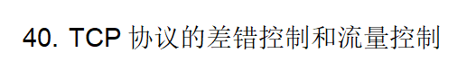
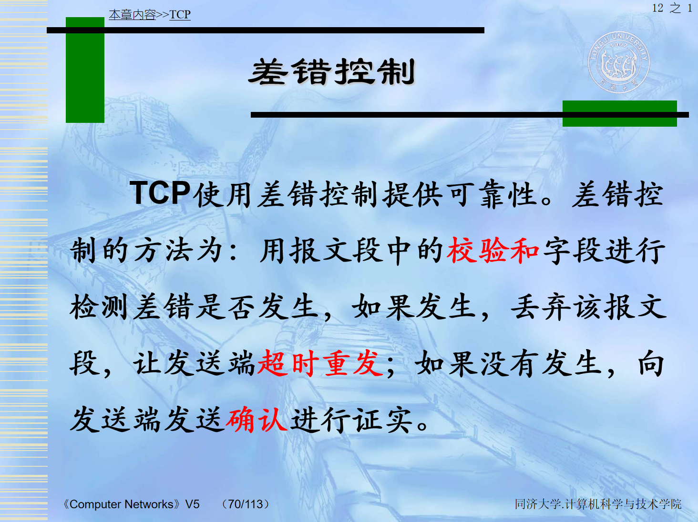
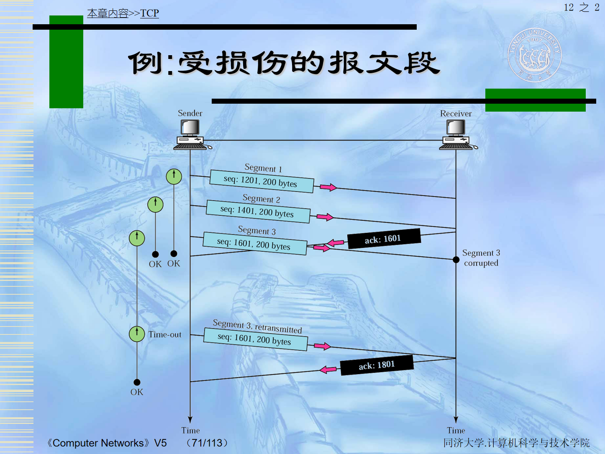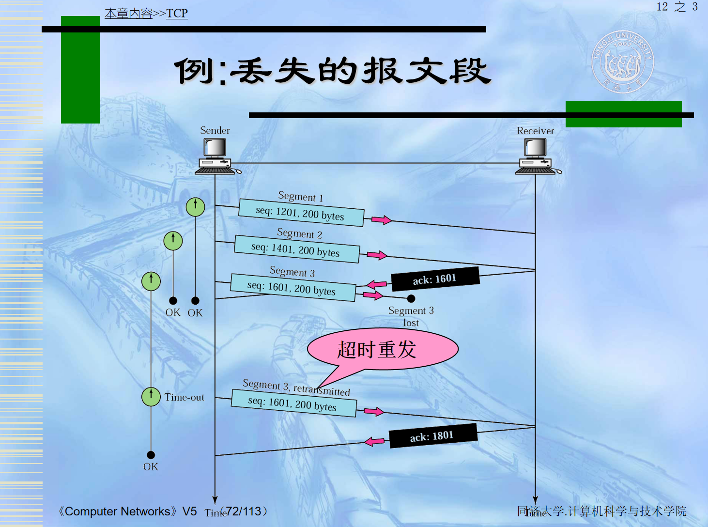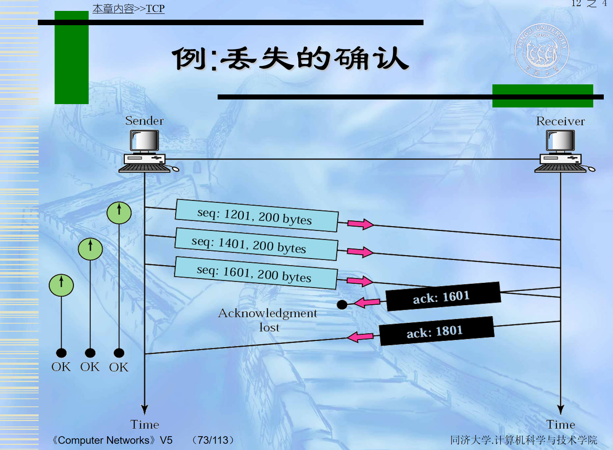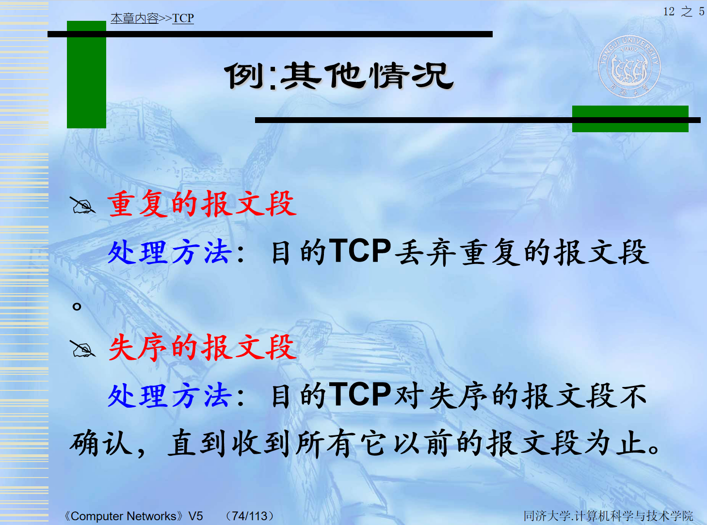
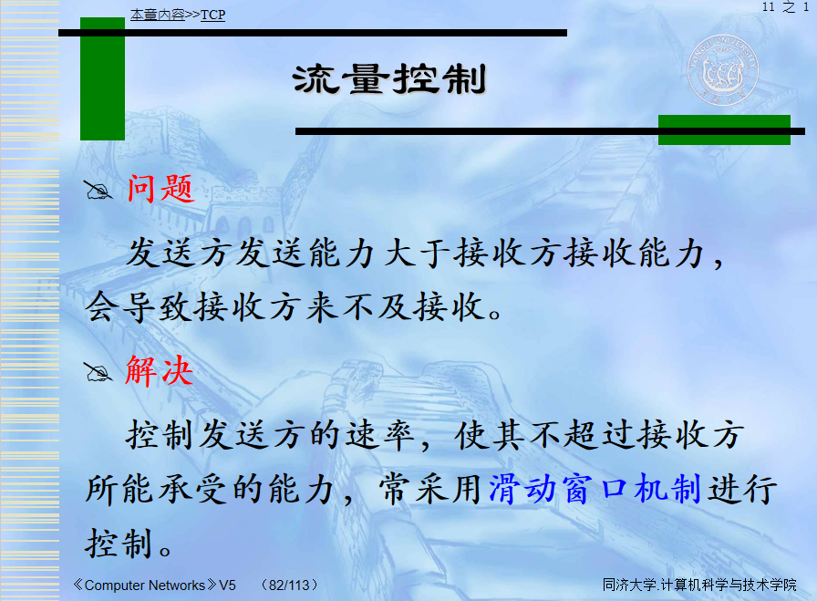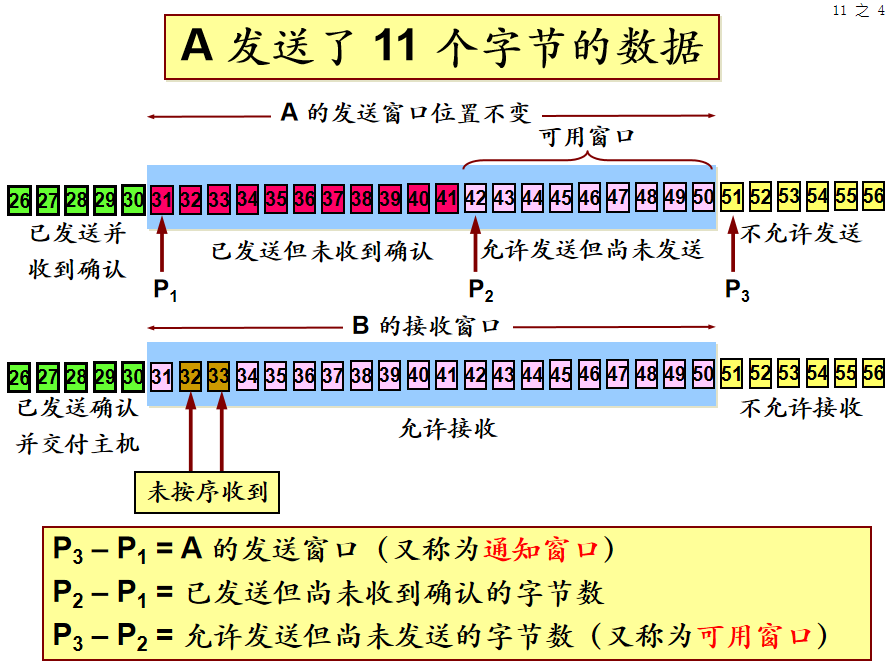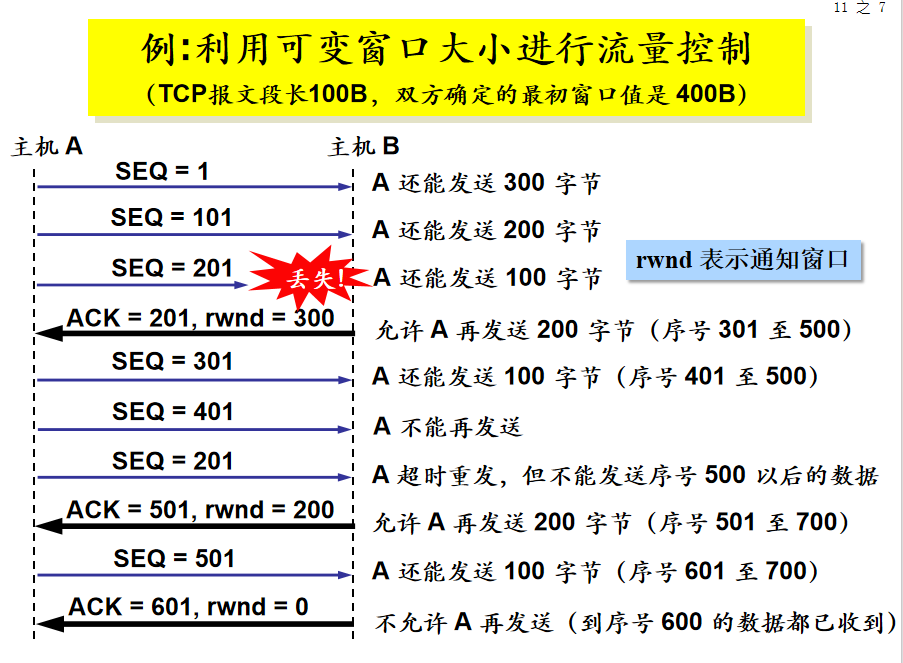

---

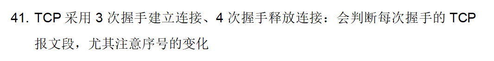
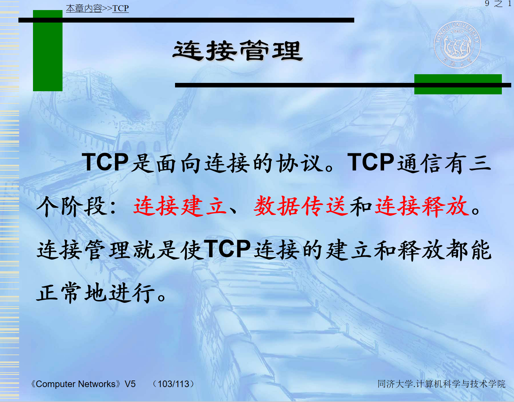
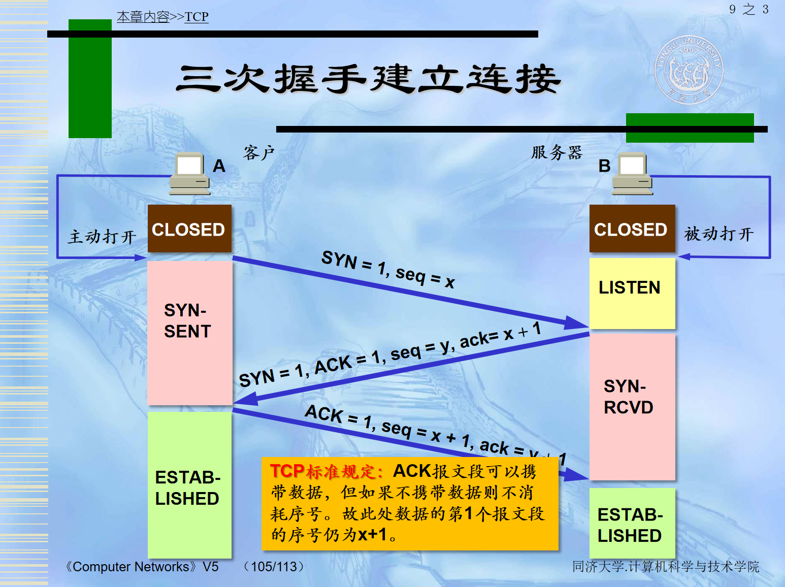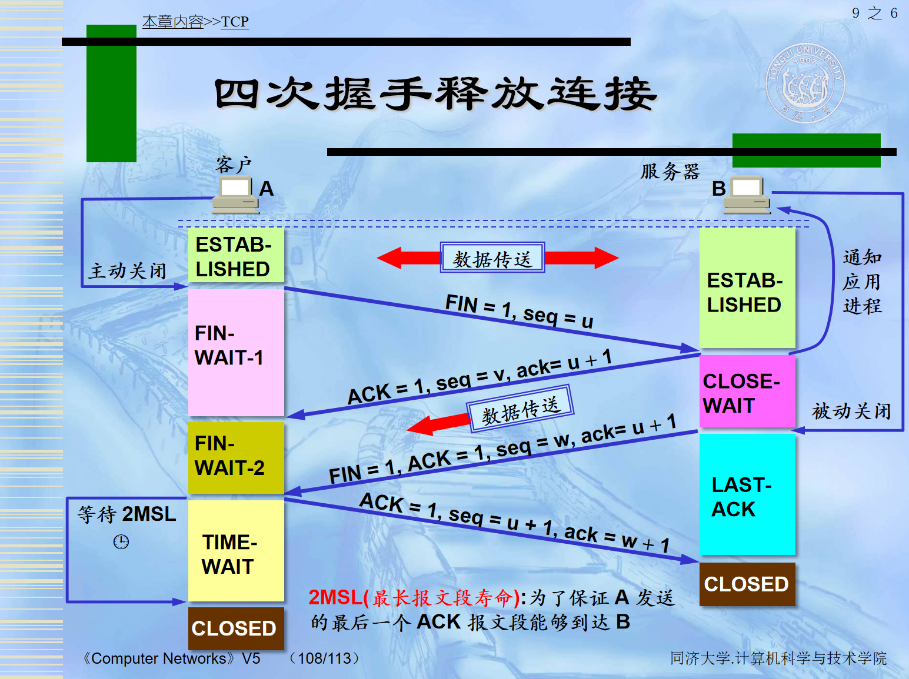
根据您的考试要求，重点在于**判断每次握手的 TCP 报文段内容**以及**序号（seq）和确认号（ack）的变化规律**。

以下是基于您提供的两张 PPT 截图的详细解析，专门针对考点进行了拆解。

---

### 一、 TCP 三次握手（建立连接）
**核心考点：SYN 标志位消耗一个序号。**

#### 第一步：客户端请求连接（Client $\to$ Server）
*   **动作**：客户端 A 主动打开，发送连接请求报文。
*   **报文段特征**：
    *   **标志位**：`SYN = 1`（表示这是一个同步/连接请求报文）。
    *   **序号**：`seq = x`（x 是客户端随机生成的初始序号）。
    *   **确认号**：无效（因为还没收到服务器发来的东西）。
*   **状态变化**：客户端进入 `SYN-SENT`。

#### 第二步：服务器确认并请求连接（Server $\to$ Client）
*   **动作**：服务器 B 收到请求，同意连接，并向 A 发起反向连接。
*   **报文段特征**：
    *   **标志位**：`SYN = 1, ACK = 1`（SYN 表示我也要连你，ACK 表示确认收到你的请求）。
    *   **序号**：`seq = y`（y 是服务器随机生成的初始序号）。
    *   **确认号**：`ack = x + 1`。
        *   **考点解析**：为什么是 `x+1`？因为 TCP 规定，**SYN 报文段虽然不携带数据，但要消耗一个序号**。所以期望收到对方下一个报文的序号是 `x+1`。
*   **状态变化**：服务器进入 `SYN-RCVD`。

#### 第三步：客户端确认服务器的请求（Client $\to$ Server）
*   **动作**：客户端收到服务器的同意信号，给予确认。
*   **报文段特征**：
    *   **标志位**：`ACK = 1`（注意：此时不再需要 SYN 了，连接已建立）。
    *   **序号**：`seq = x + 1`（接上一步，自己消耗掉 x 后，下一个就是 x+1）。
    *   **确认号**：`ack = y + 1`。
        *   **考点解析**：为什么是 `y+1`？同样因为服务器发来的 SYN 报文消耗了一个序号 y。
*   **状态变化**：客户端进入 `ESTABLISHED`（连接建立）。服务器收到后也进入 `ESTABLISHED`。
*   **特殊考点（PPT黄色方框内容）**：
    *   如果第三步这个 ACK 报文段**不携带数据**，那么它**不消耗序号**。
    *   这意味着，客户端发送完这个报文后，**下一个**真正发送数据的报文段，其序号 `seq` **仍然是 x + 1**。

### 二、 TCP 四次握手（释放连接）
**核心考点：FIN 标志位消耗一个序号；中间有“半关闭”状态（CLOSE-WAIT）。**

#### 第一步：客户端请求释放（Client $\to$ Server）
*   **动作**：客户端 A 数据发完了，主动关闭连接。
*   **报文段特征**：
    *   **标志位**：`FIN = 1`（Finish，结束）。
    *   **序号**：`seq = u`（u 等于前面已传送数据的最后一个字节的序号 + 1）。
*   **状态变化**：客户端进入 `FIN-WAIT-1`。

#### 第二步：服务器确认收到释放请求（Server $\to$ Client）
*   **动作**：服务器 B 收到 FIN，先回一个 ACK。
*   **报文段特征**：
    *   **标志位**：`ACK = 1`。
    *   **序号**：`seq = v`。
    *   **确认号**：`ack = u + 1`。
        *   **考点解析**：为什么是 `u+1`？因为 TCP 规定，**FIN 报文段即使不带数据，也要消耗一个序号**。
*   **状态变化**：
    *   服务器进入 `CLOSE-WAIT`（关闭等待）。**注意**：此时连接处于“半关闭”状态，A 不发数据了，但 B 如果还有数据没发完，可以继续发，A 还要接收。
    *   客户端收到 ACK 后，进入 `FIN-WAIT-2`。

#### 第三步：服务器发送释放请求（Server $\to$ Client）
*   **动作**：服务器 B 的数据也都发完了，向 A 请求关闭连接。
*   **报文段特征**：
    *   **标志位**：`FIN = 1, ACK = 1`。
    *   **序号**：`seq = w`（如果在半关闭状态 B 发送了数据，w 会大于 v；如果没发数据，w 通常等于 v）。
    *   **确认号**：`ack = u + 1`（重复上一次的确认号，因为 A 没再发新数据）。
*   **状态变化**：服务器进入 `LAST-ACK`。

#### 第三步：客户端确认（Client $\to$ Server）
*   **动作**：客户端收到服务器的 FIN，回复确认。
*   **报文段特征**：
    *   **标志位**：`ACK = 1`。
    *   **序号**：`seq = u + 1`（回应第一步自己的 FIN 消耗掉的序号）。
    *   **确认号**：`ack = w + 1`。
        *   **考点解析**：因为服务器的 FIN 报文消耗了一个序号 w。
*   **状态变化**：
    *   客户端进入 `TIME-WAIT`。**注意**：客户端并不是立刻关闭，而是要等待 **2MSL**（最长报文段寿命）。
    *   服务器收到 ACK 后，进入 `CLOSED`。

### 三、 考试做题“万能公式”

在做序号计算题时，记住以下规则：

1.  **确认号计算公式**：
    $$ack (\text{期望收到的}) = \text{收到的 } seq + \text{收到的数据长度}$$

2.  **特殊长度规则（核心）**：
    *   如果收到的是数据包：长度 = 数据字节数。
    *   如果收到的是 **SYN** 包：长度算作 **1**。
    *   如果收到的是 **FIN** 包：长度算作 **1**。
    *   如果收到的是 **纯 ACK** 包（不带数据）：长度算作 **0**（不消耗序号）。

**举例验证（三次握手）：**
*   Server 收到 Client 的 `seq=x` (SYN)，SYN 长度算 1。
*   Server 回复 `ack = x + 1`。

**举例验证（四次挥手）：**
*   Client 收到 Server 的 `seq=w` (FIN)，FIN 长度算 1。
*   Client 回复 `ack = w + 1`。

---

## TCP报文段格式
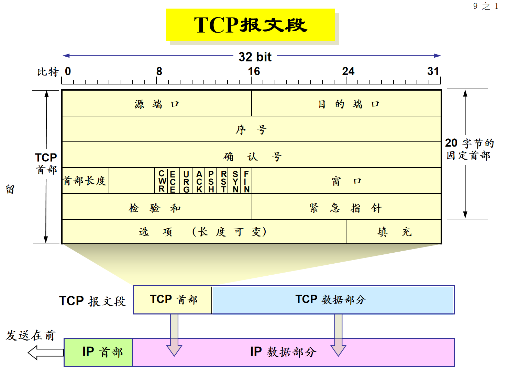

---

针对考试（特别是考研复试、本科期末考或计算机网络实验课考试），你不需要像网络安全专家那样精通 Wireshark 的所有高级功能。

考试侧重于**“验证理论”**。你需要掌握的核心技能可以总结为：**“一选、二搜、三看、四分析”**。

以下是为你整理的 **Wireshark 备考必掌握清单**：

---

### 一、 基础操作：界面与抓包位置

1.  **选择网卡**：
    *   知道该选哪个网卡（通常是有波动的那个）。
    *   *考点*：如果要抓本机回环测试（也就是自己 `ping 127.0.0.1` 或本机客户端连本机服务器），在 Windows 上通常要选 **Loopback Adapter**（环回接口）。

2.  **三面板结构（非常重要）**：
    *   **Packet List（上）**：数据包列表。你要能看懂 No.（序号）、Time（时间）、Source/Destination（源/目IP）、Protocol（协议）、Info（摘要信息）。
    *   **Packet Details（中）**：**这是核心考点**。这里是协议分层结构的树状展示。你要知道：
        *   `Frame` = 物理层概况
        *   `Ethernet II` = 数据链路层头部
        *   `Internet Protocol Version 4` = 网络层头部
        *   `Transmission Control Protocol` = 传输层头部
        *   `Hypertext Transfer Protocol` = 应用层
    *   **Packet Bytes（下）**：十六进制原始内容。考试可能会问：“请在十六进制中找到 IP 头部的 TTL 在哪里”。

### 二、 过滤器语法（必考）

考试通常会给你一个乱糟糟的包列表，让你迅速找到目标。你必须熟记以下 **显示过滤器 (Display Filter)** 语法：

1.  **按 IP 过滤**：
    *   `ip.addr == 192.168.1.1` （源或目是这个都行，最常用）
    *   `ip.src == 192.168.1.1` （只看源）
    *   `ip.dst == 192.168.1.1` （只看目的）

2.  **按协议过滤**：
    *   直接输入小写协议名：`http`、`tcp`、`udp`、`icmp`、`dns`、`arp`。

3.  **按端口过滤**：
    *   `tcp.port == 80`
    *   `udp.port == 53`

4.  **逻辑组合**：
    *   **与**：`and` 或 `&&` （例如：`ip.addr == 1.1.1.1 && http`）
    *   **或**：`or` 或 `||`
    *   **非**：`!` （例如：`!arp` 不看ARP包）

### 三、 重点协议分析（重中之重）

你需要能在 **Packet Details（中间那个窗口）** 中找到理论课学的字段。

#### 1. 以太网帧 (Ethernet II)
*   **查看位置**：`Ethernet II` 层。
*   **关键字段**：
    *   Destination/Source MAC地址。
    *   **Type**：知道 `0x0800` 是 IPv4，`0x0806` 是 ARP。

#### 2. ARP 协议
*   **场景**：`ping` 一个新 IP 时，最先出现的几个包。
*   **关键点**：
    *   **Opcode (操作码)**：知道 `1` 是请求 (Request)，`2` 是响应 (Reply)。
    *   **广播与单播**：观察 Request 的目的 MAC 是全 F（广播），而 Reply 是单播。

#### 3. IP 数据报 (IPv4)
*   **查看位置**：`Internet Protocol Version 4` 层。
*   **关键字段**：
    *   **Total Length**：总长度。
    *   **Identification**、**Flags**、**Fragment offset**：如果考试涉及 **IP分片**，必须会看这三个。
        *   Flags 里的 `More fragments` 是 1 还是 0？
    *   **TTL**：看它还剩多少跳。
    *   **Protocol**：知道 `6` 是 TCP，`17` 是 UDP，`1` 是 ICMP。

#### 4. ICMP 协议 (Ping)
*   **场景**：执行 `ping` 命令。
*   **关键字段**：
    *   **Type** 和 **Code**：
        *   `Type 8` = Echo Request (请求)
        *   `Type 0` = Echo Reply (回显)
        *   `Type 3` = Destination Unreachable (目标不可达)
        *   `Type 11` = Time Exceeded (TTL超时，Traceroute用)

#### 5. TCP 协议（最难也最常考）
*   **查看位置**：`Transmission Control Protocol` 层。
*   **关键字段**：
    *   **Src Port / Dst Port**：源/目端口。
    *   **Sequence Number (Seq)** 和 **Acknowledgment Number (Ack)**：
        *   *注意*：Wireshark 默认显示的是 **相对序号 (Relative)**（从0开始算）。考试如果问“真实序号”，你需要去首选项里关掉相对序号，或者看下方的 Hex 值。
    *   **Flags (标志位)**：**必考！** 点开 Flags 那个三角箭头。
        *   `SYN`: 建立连接
        *   `FIN`: 断开连接
        *   `ACK`: 确认
        *   `RST`: 重置
    *   **Window Size**：窗口大小（流量控制）。

#### 6. HTTP 协议
*   **关键点**：
    *   **Request Method**：`GET` 或 `POST`。
    *   **Status Code**：`200 OK`，`404 Not Found`，`301 Moved Permanently`。
    *   能看到报文体（比如 POST 上传的表单内容）。

### 四、 经典场景分析（如何把包串起来）

考试通常会让你抓一个过程，然后分析全流程。

#### 场景 1：TCP 三次握手 (The 3-Way Handshake)
你必须能在一大堆包里立刻识别出这三行：
1.  **[SYN]** `Seq=0` (客户端 -> 服务器)
2.  **[SYN, ACK]** `Seq=0, Ack=1` (服务器 -> 客户端)
3.  **[ACK]** `Seq=1, Ack=1` (客户端 -> 服务器)
*   *考题*：会问你第二次握手时，Seq 和 Ack 分别是多少？为什么是这个数？

#### 场景 2：TCP 四次挥手
寻找 **[FIN, ACK]** 包。注意有时候是三次（中间的 ACK 和 FIN 合并了），有时候是四次。

#### 场景 3：DNS 解析
*   先有 DNS Query（问 `www.baidu.com` 的 IP 是多少？）。
*   后有 DNS Response（回 `1.2.3.4`）。
*   *考点*：DNS 是基于 UDP 的（通常），端口 53。

#### 场景 4：DHCP 过程 (DORA)
*   Discover (广播)
*   Offer (单播或广播)
*   Request (广播)
*   Ack (单播或广播)

### 五、 一个实用的考试技巧：右键“追踪流”

如果在考试中允许操作软件，而你面对一堆乱七八糟的 TCP 包不知道谁跟谁是一伙的：

1.  选中其中一个包。
2.  **右键** -> **Follow (追踪)** -> **TCP Stream (TCP 流)**。
3.  **奇效**：Wireshark 会自动把属于这一次连接的所有包（握手、传输、挥手）单独过滤出来，并把应用层内容（比如网页代码）弹窗显示给你看。这对于分析 HTTP 内容或邮件内容的神器。

### 总结
考试时不要求你做复杂的网络排错，要求的是：
1.  **会过滤**（能找到包）。
2.  **懂封装**（知道哪一层对应哪个头）。
3.  **识标志**（认识 SYN, ACK, FIN, TTL, Type）。
4.  **懂流程**（能看懂握手和挥手的时序）。

---
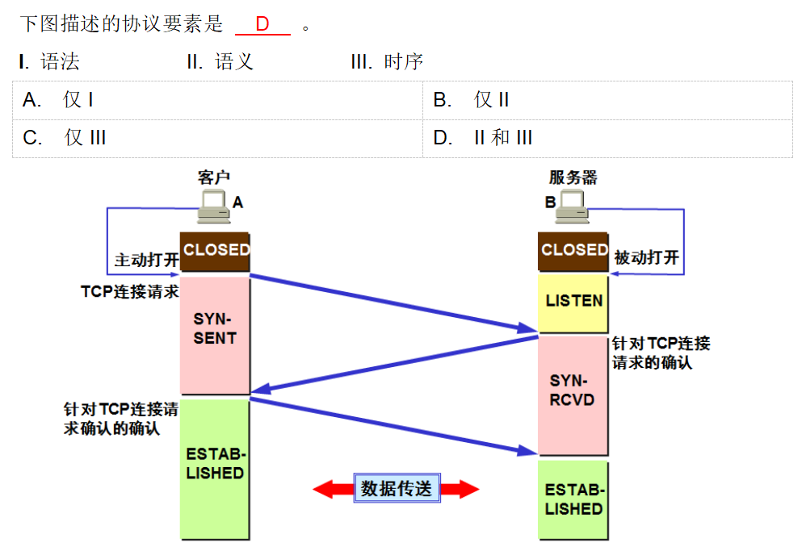

---