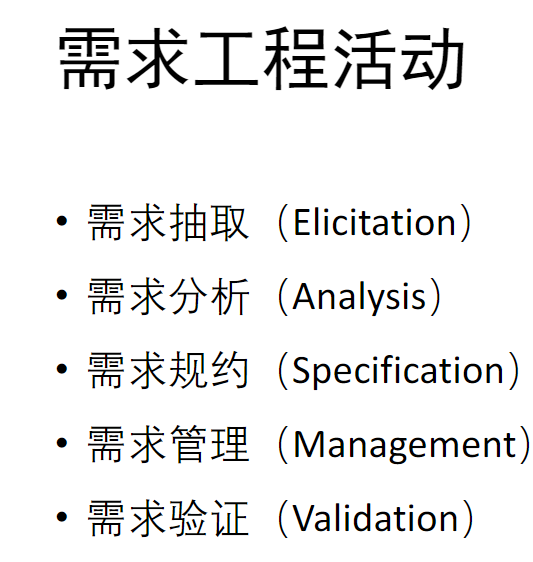

在软件工程中，**需求分析（Requirements Analysis）** 是决定项目成败最关键的阶段之一。它的核心目标是将用户模糊、非技术性的需求，转化为清晰、完整、一致且可测试的工程规格说明。

以下是需求分析阶段的详细步骤和常用方法的深度解析：

---

### 一、 需求分析的主要步骤

需求分析通常遵循一个迭代的过程，主要包含以下五个核心步骤：

#### 1. 需求获取 (Requirements Elicitation)
这是起步阶段，目标是挖掘利益相关者（Stakeholders）的真实需求。
*   **确定干系人**：不仅仅是客户，还包括最终用户、维护人员、监管机构等。
*   **挖掘隐性需求**：用户通常只说“我想要什么”，而不说“为什么想要”或“目前的痛点”，分析师需要挖掘背后的业务目标。

#### 2. 需求分析与建模 (Analysis & Modeling)
收集到的信息通常是杂乱、冲突甚至有误的。这一步需要对信息进行整理、抽象和细化。
*   **分类**：将需求分为功能性、非功能性和约束条件。
*   **解决冲突**：当不同部门的干系人提出矛盾的需求时，需要协调并达成一致。
*   **建模**：使用图形化工具（如UML或DFD）来可视化系统的逻辑、数据流和状态。

#### 3. 需求规格说明 (Specification)
将分析结果编写成正式文档，即**软件需求规格说明书 (SRS - Software Requirements Specification)**。
*   SRS 是开发、测试、验收的基准。
*   要求语言严谨，避免二义性（例如，避免使用“可能”、“大概”、“最好”等词汇）。

#### 4. 需求验证 (Verification & Validation)
确保写下来的需求是正确的，并且确实是用户想要的。
*   **一致性检查**：需求之间是否有逻辑矛盾？
*   **完整性检查**：是否有遗漏的业务场景？
*   **现实性检查**：在现有技术和预算下能否实现？

#### 5. 需求管理 (Requirements Management)
需求在整个生命周期中是会变化的。
*   **变更控制**：建立变更流程（提交->评估->批准->实施）。
*   **可追溯性 (Traceability)**：建立矩阵，确保每个需求都有对应的代码模块和测试用例，反之亦然。
### 

---

### 二、 核心方法与技术

根据软件开发流派的不同（结构化 vs 面向对象），方法有所侧重，但获取和验证的通用方法是一致的。

#### 1. 需求获取的方法
*   **访谈 (Interviews)**：
    *   一对一访谈或小组访谈。最直接，但依赖提问者的技巧。
*   **问卷调查 (Questionnaires)**：
    *   适用于用户群体庞大且分散的情况，适合获取宏观数据。
*   **联合应用开发 (JAD - Joint Application Development)**：
    *   让用户、开发人员、业务专家集中开会（Workshops），通过头脑风暴快速达成共识。
*   **原型法 (Prototyping)**：
    *   **抛弃型原型**：快速做一个界面草图或Demo，让用户“看到”并反馈，确定需求后丢弃原型重新开发。
    *   **演化型原型**：在原型基础上不断完善直到成为最终产品（敏捷开发常用）。
*   **观察法 (Observation)**：
    *   分析师旁观用户的实际工作流程，往往能发现用户自己都意识不到的习惯或痛点。

#### 2. 需求分析与建模的方法

这里主要分为两大流派：

**A. 结构化分析方法 (Structured Analysis, SA)**
侧重于数据在系统中的流动。
*   **数据流图 (DFD - Data Flow Diagram)**：
    *   核心工具。描述数据从哪来（源点）、经过什么处理（加工）、存到哪里（数据存储）、流向何处（终点）。
*   **数据字典 (DD - Data Dictionary)**：
    *   对DFD中所有数据元素进行精确定义（例如：“电话号码”必须是11位数字）。
*   **实体-关系图 (ERD - Entity Relationship Diagram)**：
    *   描述数据对象之间的关系（一对一、一对多等），主要用于数据库设计前奏。
*   **状态转换图 (STD)**：
    *   描述系统在不同事件触发下的状态变化（如：订单从“待支付”变为“已发货”）。

**B. 面向对象分析方法 (Object-Oriented Analysis, OOA)**
侧重于对象、类及其交互，主要使用 **UML (统一建模语言)**。
*   **用例图 (Use Case Diagram)**：
    *   从用户角度描述系统功能。识别“角色”(Actor)和“用例”(Use Case)。
*   **类图 (Class Diagram)**：
    *   描述系统中的静态结构（类、属性、方法及类之间的关系）。
*   **顺序图/时序图 (Sequence Diagram)**：
    *   描述对象之间消息传递的时间顺序，展现动态交互过程。
*   **活动图 (Activity Diagram)**：
    *   类似流程图，描述业务逻辑的执行流和并行行为。

#### 3. 需求优先级排序方法
*   **MoSCoW 模型**：
    *   **M**ust have (必须有)
    *   **S**hould have (应该有)
    *   **C**ould have (可以有)
    *   **W**on't have (这次没有)
*   **Kano 模型**：分析哪些功能能大幅提升用户满意度，哪些只是基本期望。

---

### 三、 需求分类（SRS中的核心内容）

在撰写规格说明书时，必须清晰区分以下三类需求：

1.  **功能需求 (Functional Requirements)**
    *   系统**必须做什么**。
    *   例如：“系统应允许用户通过手机号找回密码”、“系统应在每日24:00自动生成报表”。
2.  **非功能需求 (Non-functional Requirements)**
    *   系统**做得怎么样**（质量属性）。
    *   **性能**：响应时间<1秒，支持1万并发。
    *   **安全性**：数据传输加密，密码哈希存储。
    *   **可靠性**：年宕机时间不超过4小时。
    *   **可维护性**、**可移植性**等。
3.  **约束条件 (Constraints)**
    *   **技术约束**：必须使用Java语言，必须部署在Linux上。
    *   **业务约束**：预算上限50万，必须在10月1日前上线。

---

### 四、 优秀需求的标准 (SMART原则)

在审查需求时，应检查每一条需求是否符合以下标准：
*   **S (Specific) 具体**：不能模棱两可。
*   **M (Measurable) 可度量**：可以通过测试验证（例如“系统要快”是不合格的，“响应小于1秒”是合格的）。
*   **A (Attainable) 可实现**：技术上可行。
*   **R (Relevant) 相关**：符合业务目标。
*   **T (Time-bound) 有时效**：有明确的时间节点（主要针对项目整体）。
*   此外还包括：**无二义性 (Unambiguous)**、**完整性 (Complete)**、**一致性 (Consistent)**。

### 总结
需求分析是将**“想要”**转化为**“能做”**的过程。它不仅是一项技术工作，更是一项沟通艺术。结构化方法适合数据驱动的系统，而UML面向对象方法是目前主流的行业标准。无论使用何种方法，最终产出高质量的《软件需求规格说明书》(SRS) 是该阶段的终极目标。