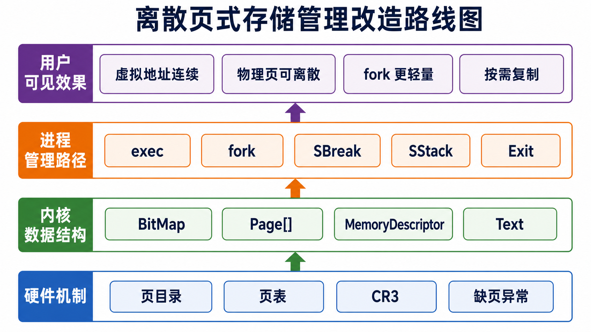
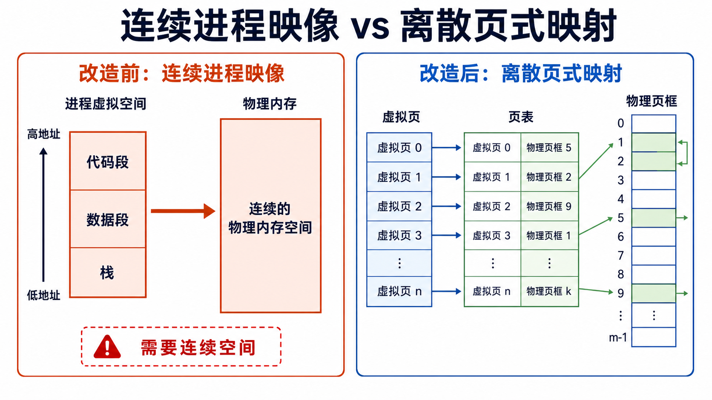
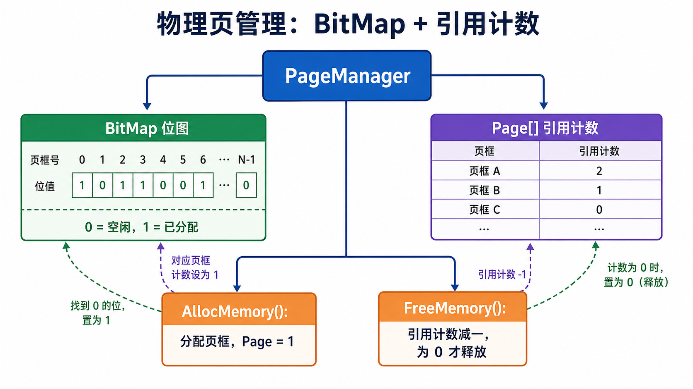
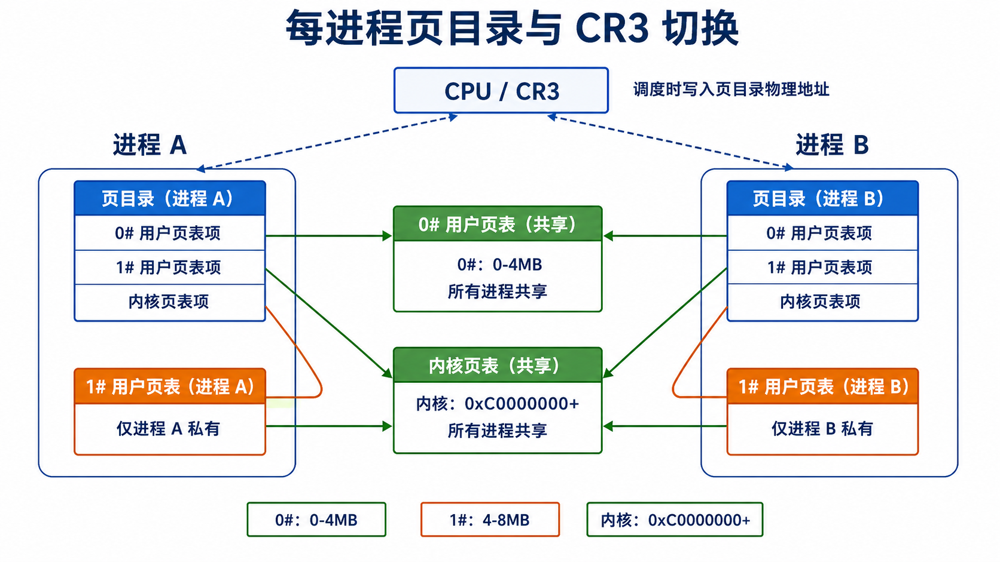
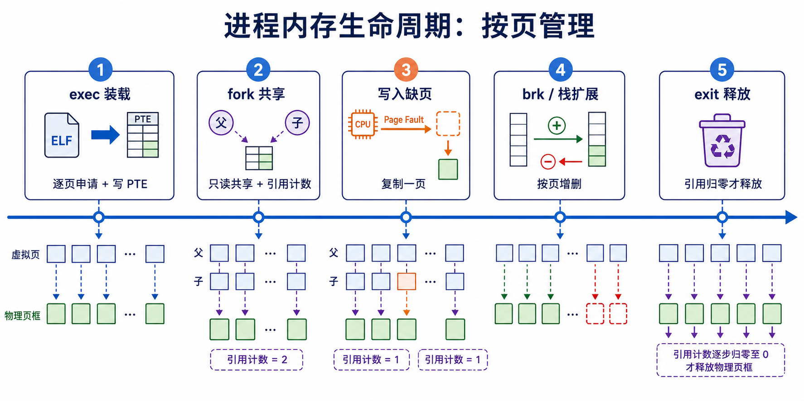
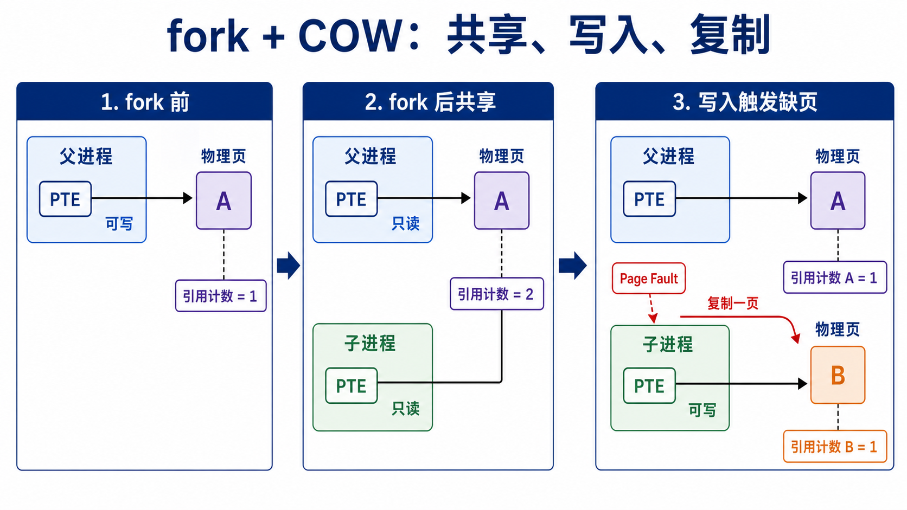
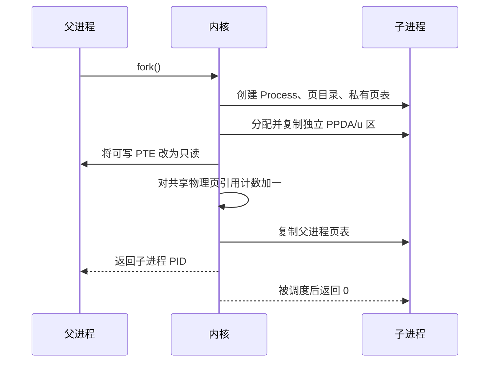

# UNIX V6++ 离散页式存储管理改造



## 1. 改造目标

原系统中的进程正文段、数据段和栈段更接近一个连续的“进程映像”。创建进程、扩展内存或交换进程时，许多操作都以整段连续内存为单位。这种设计实现简单，但存在以下问题：

1. 进程需要较大的连续物理内存，容易受到外部碎片影响。
2. `fork()` 时需要复制父进程的大部分进程映像，时间和空间开销较大。
3. 所有进程依赖系统当前使用的全局用户页表，进程地址空间隔离不够清晰。
4. 数据段和栈段扩展通常伴随整段重分配或交换，难以按需管理。

本次改造的主要目标是：

- 使用位图记录物理页框的占用情况。
- 让逻辑上连续的页面可以分别映射到不同物理页框。
- 为进程建立独立页目录和私有用户页表。
- 在进程切换时切换 CR3，从硬件层面切换地址空间。
- 使用引用计数和缺页异常实现 `fork()` 的写时复制。
- 将 `exec()`、`brk()`、栈扩展和进程退出等路径逐步改为按页处理。

## 2. 核心思路

“离散页式存储管理”的关键不只是增加一个位图，而是改变上层对内存的使用方式：

> 虚拟地址连续，不再要求对应的物理页框连续；系统通过页表保存每个虚拟页到物理页框的映射关系。



当前 `BitMapAllocator::Alloc()` 在一次申请多页时仍会寻找连续页框。本项目的离散性主要由上层路径实现：`exec()`、`SBreak()`、`SStack()` 和 COW 缺页处理等逻辑以单页为单位申请物理页，并分别写入 PTE。也就是说，本项目已经完成主要运行路径的按页化，但尚未彻底消除所有连续多页申请。

改造后的整体关系如下：


## 3. 改造前后对比

| 对比项 | 改造前 | 改造后 |
| --- | --- | --- |
| 物理内存记录 | `MapNode[]` 空闲区表 | 新增 `BitMap` 和 `BitMapAllocator` |
| 分配粒度 | 偏向连续内存块 | 主要路径按 4KB 页申请 |
| 用户页表 | 系统全局用户页表，切换时重建映射 | 每进程拥有页目录和私有 `1#` 用户页表 |
| 进程切换 | 固定页目录，刷新全局映射 | 根据目标进程页目录物理地址写 CR3 |
| `fork()` | 复制父进程大部分进程映像 | 共享物理页，写入时才复制 |
| 数据段/堆扩展 | 依赖 `Expand()` 和连续进程映像 | `SBreak()` 按页修改 PTE |
| 栈扩展 | 扩展进程映像 | 缺页异常触发 `SStack()`，每次增加一页 |
| `exec()` 装载 | 按连续正文、数据、栈映像处理 | 分段逐页申请并写入页表 |
| 内存释放 | 释放整段进程映像 | 根据页表逐页递减引用并释放 |

## 4. 主要改造内容

### 4.1 位图物理页分配



相关文件：

- `src/include/MapNode.h`
- `src/include/Allocator.h`
- `src/mm/Allocator.cpp`
- `src/include/PageManager.h`
- `src/mm/PageManager.cpp`
- `src/kernel/Kernel.cpp`

新增 `BitMap` 和 `BitMapAllocator`：

- 位图中的每一位对应一个物理页框。
- `0` 表示空闲，`1` 表示已分配。
- `Alloc()` 搜索可用页框并置位。
- `Free()` 清除对应位。

`KernelPageManager` 和 `UserPageManager` 改为使用 `BitMapAllocator`。位图比空闲区链式描述更适合按页分配，也便于快速判断某个物理页是否已被占用。

### 4.2 页引用计数

`PageManager` 中新增 `Page[]`，使用物理页框号作为下标记录引用计数：

- 新页分配后，引用计数设为 `1`。
- `fork()` 共享可写页后，引用计数增加。
- 进程释放页面时，先递减引用计数。
- 只有引用计数变为 `0` 时，才真正清除位图并释放物理页。

引用计数是 COW 能够正确释放共享页的基础。

### 4.3 每进程页目录与动态 CR3



相关文件：

- `src/include/Assembly.h`
- `src/include/Machine.h`
- `src/machine/Machine.cpp`
- `src/include/Process.h`
- `src/include/ProcessManager.h`
- `src/proc/ProcessManager.cpp`
- `src/proc/MemoryDescriptor.cpp`

`Process` 新增 `pPageDirectory`，记录该进程页目录的线性地址。创建子进程时，系统会：

1. 从内核页池为子进程分配一页页目录。
2. 页目录 `0#` 项引用公共低地址用户页表。
3. 页目录 `1#` 项引用该进程私有用户页表。
4. 页目录内核空间项引用公共内核页表。

当前用户空间大小为 8MB：

- `0x00000000 - 0x003FFFFF`：由共享 `0#` 用户页表映射。
- `0x00400000 - 0x007FFFFF`：由每进程私有 `1#` 用户页表映射。
- `0xC0000000` 以上：由共享内核页表映射。

进程切换时，`SwtchUStruct` 一方面更新内核页表中当前进程 PPDA/u 区的映射，另一方面调用 `FlushPageDirectory(process->GetPageDirectoryPhyAddr())`，把目标进程的页目录物理地址写入 CR3。

### 4.4 `MemoryDescriptor` 从“相对映射表”转为“私有页表”

改造前，`MemoryDescriptor` 保存相对页映射，进程切换时再根据正文段和进程映像的物理起始地址重建系统用户页表。

改造后：

- `Initialize()` 只为进程申请一张私有 `1#` 用户页表。
- PTE 直接记录真实物理页框号。
- `MapToPageTable()` 不再复制大量页表项，而是刷新当前进程页目录。
- `ClearUserPageTable()` 按一张私有页表清理。

这使页表从“进程切换时临时生成的数据”变成了“进程地址空间本身的持久描述”。

### 4.5 `fork()` 改为写时复制

相关文件：

- `src/proc/ProcessManager.cpp`
- `src/mm/PageManager.cpp`
- `src/interrupt/Exception.cpp`

改造前，`NewProc()` 为子进程申请与父进程映像同样大小的内存，并逐段复制。

改造后，`NewProc()` 只立即复制必须独立的 PPDA/u 区；父子进程的数据页和栈页暂时共享。父进程的可写 PTE 被改为只读，引用计数增加，随后页表复制给子进程。

当父进程或子进程第一次写共享页时，CPU 因写只读页触发缺页异常，缺页处理程序再决定是否复制该页。

### 4.6 `exec()`、数据段和栈按页管理



相关文件：

- `src/proc/ProcessManager.cpp`
- `src/proc/Process.cpp`
- `src/proc/Text.cpp`
- `src/pe/PEParser.cpp`

主要变化：

- `exec()` 为正文段、数据段和用户栈逐页申请物理页，并写入对应 PTE。
- 正文段页保持只读，并通过 `Text` 结构共享。
- `SBreak()` 根据新旧 `brk` 边界逐页申请或释放堆页面。
- 合法栈缺页调用 `SStack()`，每次增加一个栈页。
- 进程退出时，根据页表逐页释放数据段和栈段。

## 5. 深入讲解：`fork + COW`



### 5.1 为什么选择 COW

一般情况下，`fork()` 后子进程很可能立即执行 `exec()`。如果 `fork()` 时完整复制父进程的数据段和栈段，那么刚复制的大部分内容会马上被 `exec()` 丢弃。

COW 的思想是：

> 创建子进程时先共享；只有某一方真正写入时，才为它复制被写的那一页。

这样可以把 `fork()` 的开销从“复制整个进程映像”降低为“复制页表和少量必要数据”，实际物理页复制则按需发生。

### 5.2 `fork()` 阶段

`ProcessManager::NewProc()` 的关键过程如下：



假设父进程原来有一个数据页：

```text
父进程 PTE -> 物理页 A，可写，Page[A] = 1
```

执行 `fork()` 后：

```text
父进程 PTE -> 物理页 A，只读
子进程 PTE -> 物理页 A，只读
Page[A] = 2
```

此时没有复制物理页 A。

### 5.3 第一次写入阶段

父进程或子进程写入共享页时，CPU 触发 INT 14 缺页异常。`Exception::PageFault()` 读取 CR2 获得出错虚拟地址，并检查：

1. 地址是否位于数据段或栈段。
2. PTE 是否为只读。
3. 对应物理页是否存在有效引用计数。

之后分为两种情况：

#### 情况一：引用计数为 1

说明其他进程已经不再共享该页，不需要复制。缺页处理程序只需把当前 PTE 恢复为可写。

```text
当前进程 PTE -> 物理页 A，可写
Page[A] = 1
```

#### 情况二：引用计数大于 1

说明该页仍被多个进程共享。缺页处理程序执行：

1. 为当前进程申请新物理页 B。
2. 将物理页 A 的内容复制到物理页 B。
3. 将当前进程 PTE 改为指向 B，并设置为可写。
4. 将 `Page[A]` 减一，将 `Page[B]` 设为一。

```text
父进程 PTE -> 物理页 A，只读或稍后恢复可写，Page[A] = 1
子进程 PTE -> 物理页 B，可写，Page[B] = 1
```

### 5.4 COW 串联了哪些模块

COW 不是一个孤立函数，而是一条跨模块链路：

| 环节 | 作用 | 代码位置 |
| --- | --- | --- |
| 物理页分配 | 提供新页和释放页 | `BitMapAllocator`、`PageManager` |
| 引用计数 | 判断共享关系和释放时机 | `PageManager::Page[]` |
| 进程创建 | 将可写页改为只读并共享 | `ProcessManager::ModifyPageTable()`、`NewProc()` |
| 地址空间隔离 | 父子进程拥有各自页表 | `AllocPageDirectory()`、`InitProcPageDirectory()` |
| 写入检测 | CPU 对只读页写入产生异常 | 页表 `ReadWriter` 位 |
| 延迟复制 | 缺页时复制单个物理页 | `Exception::PageFault()` |
| 数据复制 | 完成 4KB 页内容复制 | `Utility::CopySeg()` |

这一点很适合作为答辩重点：它能够展示改造不是局部替换分配器，而是同时改变了进程创建、进程切换、异常处理和资源回收。

## 6. 改造成果

本次改造已在主要路径上实现以下能力：

- 使用位图统一管理内核页池和用户页池。
- 使用 PTE 保存离散物理页映射。
- 为进程创建独立页目录和私有用户页表。
- 进程切换时动态切换 CR3。
- `fork()` 不再立即复制完整进程映像。
- 写共享数据页时通过缺页异常完成单页复制。
- 数据段、栈段和程序装载开始按页分配与释放。

从设计层面看，系统的内存管理单位已经由“进程映像”转向“页面”，为后续实现请求调页、页面置换和更完整的虚拟内存机制提供了基础。

## 7. 当前实现边界与后续工作

本项目完成的是一次教学型、渐进式改造，当前仍有以下边界：

1. **交换机制尚未完全移除或完全页式化。** `Sched()`、`XSwap()`、`Exit()` 中仍保留旧交换逻辑，`SStack()` 分配失败时仍可能进入交换路径。
2. **部分内存不足路径尚未完整处理。** 多处代码明确按“暂不考虑内存不足”实现，分配失败后的回滚和错误传播仍需补全。
3. **并非所有多页申请都已离散化。** `BitMapAllocator::Alloc()` 对多页申请仍寻找连续页框，部分调用路径仍一次申请多页。
4. **引用计数结构需要进一步完善。** 当前 `Page[]` 容量按 8MB 用户虚拟空间计算，但用户物理页池可大于该范围；多页申请也需要逐页维护引用计数。
5. **COW 修改 PTE 后应显式失效对应 TLB 项。** 当前缺页处理主要修改 PTE 后直接返回，后续可增加 `invlpg` 或重新加载 CR3。
6. **正文段和交换路径仍有硬编码。** `Text::x_caddr[10]` 限制正文页数，部分代码注释也标记了旧交换逻辑仍需改造。
7. **测试尚未完全同步。** 现有 `TestPageManager` 等测试仍基于旧 `Allocator` 接口，需要增加位图分配、引用计数、COW 和缺页异常的专项测试。
8. **初始化代码仍存在新旧路径并存。** `InitKernelPageTable()`、`InitZeroUserPageTable()` 已实现，但主启动流程仍主要使用原有初始化函数。

答辩时应将本项目表述为“完成主要运行路径的离散页式改造和 COW 原型”，而不是“已经实现完整、可置换的现代虚拟内存系统”。

## 8. 关键文件索引

| 模块 | 关键文件 |
| --- | --- |
| 位图与分配器 | `src/include/MapNode.h`、`src/include/Allocator.h`、`src/mm/Allocator.cpp` |
| 页管理与引用计数 | `src/include/PageManager.h`、`src/mm/PageManager.cpp` |
| 页目录与 CR3 | `src/include/Assembly.h`、`src/include/Machine.h`、`src/machine/Machine.cpp` |
| 进程地址空间 | `src/include/MemoryDescriptor.h`、`src/proc/MemoryDescriptor.cpp` |
| 进程创建与 COW 建立 | `src/include/ProcessManager.h`、`src/proc/ProcessManager.cpp` |
| COW 缺页处理 | `src/interrupt/Exception.cpp` |
| 堆和栈扩展 | `src/proc/Process.cpp` |
| 正文段与程序装载 | `src/include/Text.h`、`src/proc/Text.cpp`、`src/pe/PEParser.cpp` |

## 9. 编译与运行

项目使用 MinGW 工具链和 Bochs。根目录中已包含构建产物和虚拟磁盘镜像。

```powershell
cd src
make all

cd ..\targets\UNIXV6++
.\run.bat
```

调试启动：

```powershell
cd targets\UNIXV6++
.\debug.bat
```

## 10. 答辩讲解建议

可以按照以下顺序讲解：

1. **先讲问题：** 原系统依赖连续进程映像，`fork()` 需要完整复制，进程切换依赖全局用户页表。
2. **再讲总体方案：** 位图管理物理页，每进程私有页表，CR3 切换地址空间，引用计数支持共享页。
3. **展示完整链路：** 以 `fork + COW` 为例，讲清“共享只读页 -> 写入触发缺页 -> 单页复制 -> 更新引用计数”。
4. **说明其他路径：** `exec()`、`brk()`、栈扩展和退出都开始按页管理。
5. **主动说明边界：** 当前是教学型原型，交换、OOM、TLB 和测试仍有后续完善空间。

一句话总结：

> 本次改造把 UNIX V6++ 的进程内存管理核心单位从“连续进程映像”推进到了“可独立映射和共享的页面”，并通过每进程页表与写时复制建立了离散页式存储管理的基本框架。
