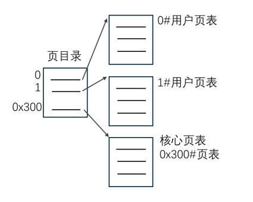
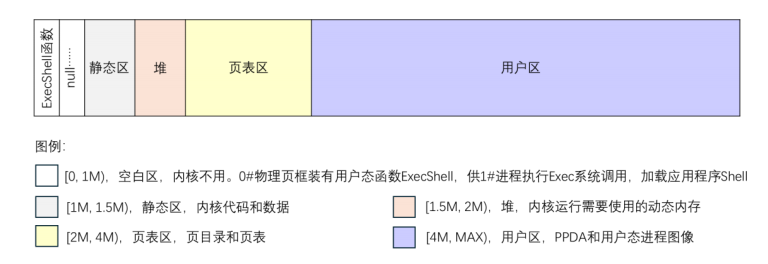
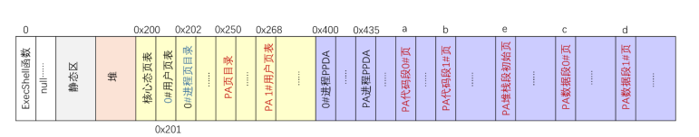
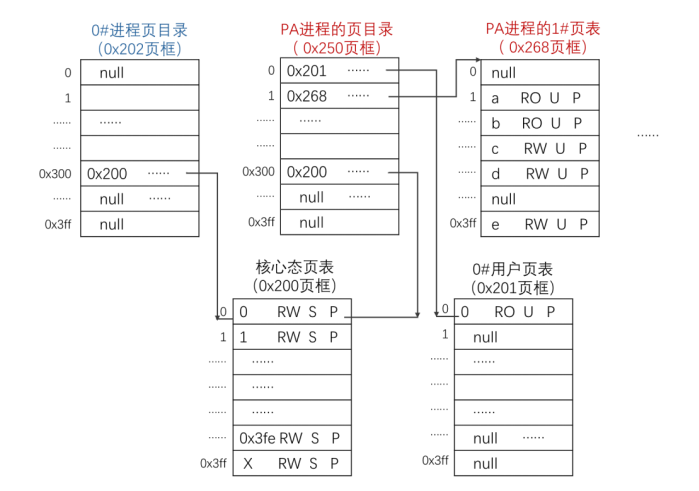
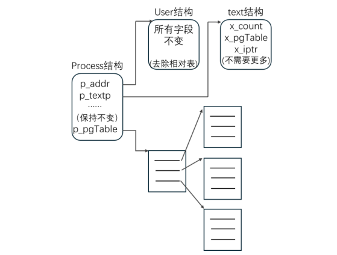
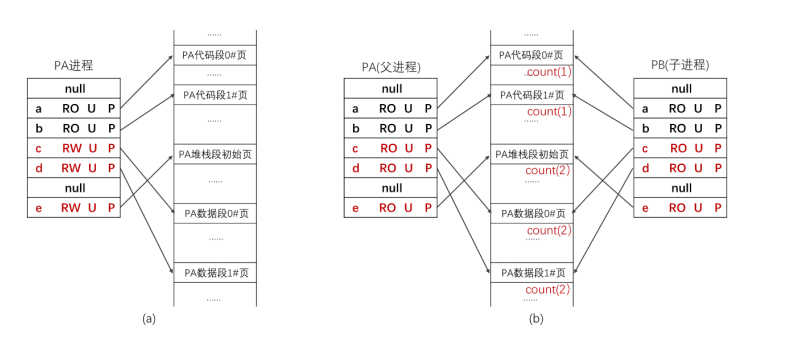
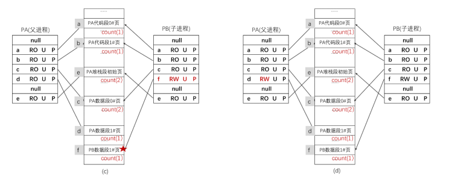
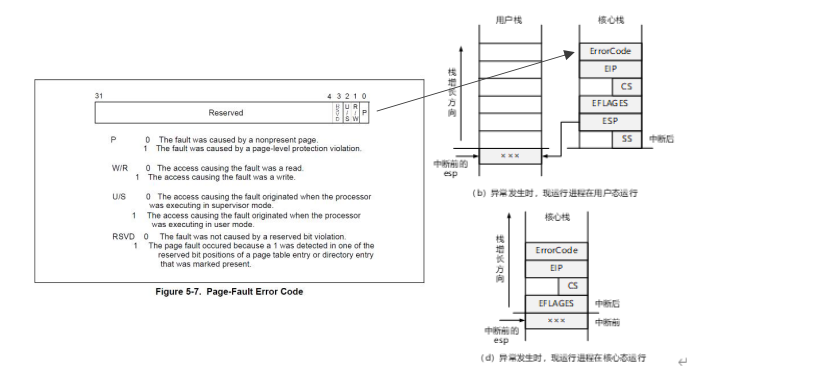

操作系统课程设计，离散化 Unix V6++系统
同济大学计算机系 2025/1/18
实验准备
配置完成的 Unix V6++系统。
实验要求
（1） 离散的存储管理方式，页式。不使用盘交换区。
（2）
下面的实验指导描述了一个中规中矩的页式 Unix 系统。同学们把它和 Unix V6++织起来。
先把系统理顺，之后融入自己的洞见和优雅的设计，会是一个优秀的作品，加油。
实验指导
1、用位示图管理物理内存
标准的设计：内存管理系统维护 1 张位示图。位图中每个 bit 对应一个物理页框，4096
字节；0 表示空闲，1 表示已分配。
2、离散的存储管理方式
离散化后的 Unix V6++系统允许进程相邻用户页面存放在不相邻的物理页框，进程用自
己的页表记录分配给每个逻辑页面的物理页框号。
参考设计方案如下：
（1）为每个进程设置一份二级页表，包括 1 个页目录，1 张核心页表和 2 张用户页表。
（2）虚空间的使用策略，沿用 Unix V6++
的设计，进程代码段、数据段、用户栈和
PPDA 区在虚空间中存放的位置不变。
（3）物理空间的使用，沿用 Unix V6++功
能区布局，如图 1 所示。0#物理页框存放
ExecShell 函数。静态区，[1M,1.5M)，存放
内核代码和数据。内核堆，[1.5M,2M)，为
内核提供动态内存。页表区，[2M,4M)，存
放页目录和页表。其余空间是用户区，用
来存放 PPDA 区和进程的用户页面。

图 1、Unix V6++物理内存功能区
具体而言，页表方面：
�7�3 页目录和 1#用户页表进程私有。创建进程时，从页表区为其分配物理页框。
�7�3 核心页表和 0#用户页表，所有进程共用，即物理内存只存一份。所有进程，0#PDE 引
用同一个物理页框，这里存放共用的 0#用户页表；0x300#PDE 引用共用核心页表。
逻辑页面方面：
�7�3 核心空间：由核心页表（0x300#页表）管理，其中：
�7�3 0~0x3fe#页面所有进程共享，映射至物理内存前 1023 个物理页框（前 4M 字节）。
用来存放内核代码和数据，不包括每个进程的 PPDA 区。
�7�3 0x3ff#（1023#）页面进程私有，是 PPDA 区。创建进程时从用户区分配物理页框。
�7�3 用户空间：由用户页表（0#页表和 1#页表）管理
�7�3 用户空间的逻辑页面用来存放应用程序的代码和数据。物理页框从用户区分配。

图 2、离散化的 Unix V6++系统。
图 2 是一个可行的示例。关键页目录、页表、PPDA 和进程图像在物理内存中存放的位
置列表如下：
�7�3 0x200#物理页框：核心态页表（所有进程共享）
�7�3 0x201#物理页框：0#用户页表（所有进程共享）
�7�3 0x202#物理页框：0#进程的页目录（私有）
�7�3 页表区其它物理页框：分配给普通进程，存放私有的页目录和 1#用户页表
�7�3 0x400#物理页框：0#进程的 PPDA 区，是用户区第 1 个物理页框
�7�3 用户区其余物理页框：分配给普通进程，存放应用程序的代码、数据和堆栈

图 3、进程的二级页表，以 0#进程 和 PA 进程为例。
图 3 是 0#进程和 PA 进程的二级页表细节。结合图 2 示例系统，观察它们的二级页表和
进程图像。
�7�3 0#进程
�7�3 PPDA 区存放在 0x400#物理页框。这是用户区的第一个物理页框。
�7�3 二级页表包括 1 个页目录和 1 张核心态页表，没有用户页表是因为 0#进程是内核
线程不会执行应用程序。页目录登记在 0x202#物理页框。其中，0x300#PDE 有效，
base=0x200，核心空间[0xC0000000, 0xC0400000)映射至存放在 0x200#物理页框
中的共用核心态页表。注：[0xC0000000, 0xC0400000)是 0x300#PDE 映射的虚地
址范围。
�7�3 PA 是普通进程，会在用户态下执行应用程序，要配用户页表。
�7�3 PPDA 区存放在 0x435#物理页框。这是系统为 PA 进程的 PPDA 区分配的物理页
框。
�7�3 二级页表包括 1 个页目录，1 张核心态页表和 2 张用户页表。 其中，页目录登记
在 0x250#物理页框，0x300#PDE，base=0x200，引用共用的核心态页表；0#PDE，
base=0x201，引用共用的 0#用户页表；1#PDE，base=0x268，引用私有的 1#用户
页表。PA，2 页代码、2 页数据、1 页堆栈，分别存放在不相邻的物理页框 a,b,c,d,e，
为其建立地址映射关系，1#用户页表，1#、2#、3#、4#和 0x3ff# PTE 的 base 分
别为 a,b,c,d,e。
下面是一种可行的编码实现方案，仅列出与离散化有关的设计，对原 Unix V6++改动不
大的地方不再赘述。
�7�3 Process 结构增设字段 p_pgTable，登记页目录的起始虚地址。
p_addr 依然很重要，它是 PPDA 区的起始物理地址。p_addr >> 12 是分配给 PPDA 区的
物理页框号。
�7�3 进程切换操作 Swtch( )
保留 Unix V6++的设计，核心页表中 0x3ff#页面是现运行进程的 PPDA 区。进程被选中
后，需要将 PPDA 区所在的物理页框号 X 填入核心态页表的最后一个 PTE，为其建立地
址映射关系。如果选中的是 0#进程，X 是 0x400；PA 进程，X 是 0x435。
离散化后，Swtch( )只需 2 步，便可为新选中进程建立地址映射关系。耗时极短。
第 1 步，PPDA 区的主存页框号 X 填入核心态页表的最后一个 PTE。
第 2 步，页目录的起始物理地址（p_pgTable�C 0xC0000000）填入 CR3 寄存器。
注：第 2 步会刷新 TLB。完成后 CPU 的 MMU 单元获得新选中进程的地址映射关系。
需要重新定义宏 SwtchUStruct 和 FlushPageDirectory，去除 MapToPageTable 函数。
#define SwtchUStruct(p) \
Machine::Instance().GetKernelPageTable().m_Entrys[Kernel::USER_PAGE_INDEX]. \
m_PageBaseAddress = (p)->p_addr>>12; \
FlushPageDirectory( (p)->p_pgTable �C 0xC0000000 );
#define FlushPageDirectory(pgTable) \
__asm__ __volatile__(" movl %0, %%cr3" : : "r"(pgTable) );
以下可能会有冗余的操作。过程看完整后，同学们自行设计、增删、修正。
�7�3 完整的进程图像和对共享正文段的支持

图 4、完整的进程图像
执行同一个应用程序的所有进程，p_textp 引用同一个 text 结构。text 结构中，x_count
是引用进程总数，x_pgTable 指向其中某个进程的页目录，会是第一个执行该程序的进
程。这个进程终止时，如果还有进程执行该应用程序，调整 x_pgTable 指向另一个进程
的页目录。
进程终止时（Exit），text 结构的处理逻辑如下：
代码 1：
1、 现运行进程的 text 结构 x_count--； 
2、 为 0，没有进程执行该应用程序，释放 RO 物理页框（释放代码段），释放 text 结
构。否则，遍历 Process 数组，找到 p_textp==现运行进程的 p_textp 的另一个进
程，把它的 p_pgTable 赋给 x_pgTable。
父进程创建子进程（Fork），text 结构的处理逻辑如下：
代码 2：
1、x_count++；
进程加载应用程序图像（Exec），text 结构的处理逻辑如下：
代码 3：
1、 对当前使用的 text 结构，执行代码 1 所示逻辑。
2、 处理新应用程序的 text 结构，具体而言：
�7�3 已有执行该程序的进程，目标 text 结构，x_count++；
�7�3 若无，新建 text 结构，x_count=1，x_pgTable=现运行进程的页目录。
�7�3 Fork
创建子进程。
1、 为子进程分配 pid、页目录和页表。
2、 复制父进程的 1#用户页表
3、 复制父进程的 PPDA 区和用户态图像。
4、 其余步骤基本不变。
复制父进程的用户态图像可以有 2 种方法：
1、简单实现：子进程共享父进程的正文段，分配足够物理页框复制父进程所有 RW 页。
这种实现方式的缺点在于，Fork 复制除共享正文段之外的全部进程图像，会付出大
量不必要开销。这是因为（1）子程序运行遵循局部性原理，访问不到的逻辑页不需要
复制（2）Fork 返回后，子进程经常立即执行 exec 系统调用。在这种情况下，子进程只
会访问包含命令行参数的数据页，其余数据页是不需要复制的。可以用写时复制（Copy 
On Write，COW）技术克服这个缺点。Linux 系统就是这么干的。
2、使用写时复制技术，细节如下。
�7�3 写时复制
Fork 执行时不复制数据页面。子进程创建完毕后，对写操作访问到的逻辑页，按需逐页
分配物理内存、复制父进程图像。这就是写时复制技术。具体而言，写时复制操作由第
1 次访问数据页的进程触发，缺页异常处理程序为其分配新物理页框，并复制旧物理页
框中的内容。实现方面：
�7�3 需要添加重量级核心数据结构 Page 数组，用来描述每个物理页框的使用情况。对
我们设计的简单的内核，Page 可以简化至只登记物理页框的引用次数。定义如下：
int Page[主存容量/页面大小]
其中，Page[i] 是物理页框 i 的引用次数。思考 Page 数组能否取代位示图。
�7�3 Fork 系统调用。避免复制父进程图像，子进程共享父进程所有逻辑页。为了触发
写时复制操作，需要将 RW 页的访问属性改为 RO。
实现方面，遍历父进程的 1#用户页表，
�7�7 将属性为 RO 的 PTE 复制给子进程。
�7�7 对每个属性为 RW 的 PTE，
（1）读取其中的物理页框号 base，Page[base]++；
（2）将属性 RW 改成 RO，复制给子进程。

图 5 上、使用 COW 的 fork 系统调用
(a) 创建子进程之前的 PA 的进程图像。(b) fork 完成后，PA 和子进程 PB 的进程图像。
�7�3 14#缺页异常处理程序

图 5 下、缺页异常处理程序执行的 COW 操作。
(c) 子进程先访问 1#数据页，缺页异常处理程序为其分配物理页框、复制父进程 1#数据
页，物理页框 d 引用计数器减 1。(d) 随后，父进程访问 1#数据页，物理页框 d 引用计数
器是 1，无需复制，父进程修正 PTE（RO→RW）后返回。
具体操作步骤如下：
1、在内存描述符中确定 CR2 所在的逻辑段，判断此次内存访问的合法性
若 Error Code（参见图 5） 显示写操作引发异常 && 目标逻辑段可写，执行如
下 COW 操作。
否则，执行堆栈扩展操作 或者 用信号 SIGSEGV 杀死现运行进程。这里我们上学
期上课说过，略。
2、COW 操作。
 从当前 PTE 中读出物理页框号 base
Page[base]==1？ // 观察引用这个物理页框的进程数量
是的。RW → RO，返回。//1 表示写时复制，先前访问该页面的进程已经做好啦
否则，分配一个物理页框 new，复制 base 页面，Page[base]--，Page[new]=1。
总结：使用写时复制技术，可以最大限度延迟物理内存分配和复制操作，降低内存管
理的系统开销。是现代操作系统常用的内存管理技术------惰性分配。
Linux 系统更进一步，为所有进程维护零页（Zero Page）。这个物理页框，4096 字节全
是 0，保存在物理内存的固定位置，起始虚地址是一个内核常量。进程加载应用程序时，
Exec 系统调用将所有 bss 页映射到这个页框，写时复制，获得私有 bss 物理页框，刷 0。
�7�3 Exec（不含对零页的处理）
进程加载应用程序。
1、 线性目录搜索目标可执行程序，检查现运行进程对其可执行权限。不通过，失败返
回。通过，继续。
2、 从可执行文件中读入 PE 程序头，计算用户空间尺寸。OOM，失败返回。虚空间足
够，将采集到的各个逻辑段尺寸和你需要的任何信息写入内存描述符。
3、 申请一个物理页框 Y，复制新应用程序的命令参数。这是新用户栈的栈底页。
4、释放原有进程图像（要考虑 COW 页面，细节这里没写，同学们补上）。
�7�3 释放代码段。
Text 结构，x_count--；
减至 0，释放代码段，具体而言，逐页执行以下操作：
（1） 释放物理页框 base：Page[base]=0，物理页框 base 写 4096 个字节的 0。
（2） 清理页表项。PTE=0。
�7�3 释放数据段。逐页执行上述（1）（2）操作。
5、 为新的应用程序所有逻辑段分配物理页框，写页表，建立虚实地址映射关系。
6、 对物理页框执行清 0 操作（释放物理页框时，若系统安排有清 0 操作，不必清 0）。
7、 读入可执行程序的代码段、只读数据段和数据段。
8、 更新栈底 PTE，base=Y。
9、 其余操作与原版 Exec 相同，不再赘述。
�7�3 Exit、Wait……自行设计、实现
�7�3 注意 main0 函数，初始化你使用的新数据结构

图 5、14#缺页异常发生时，CPU 硬件会将 Error Code，连同 CS、EIP、SS、ESP 和 EFLAGS
压入核心栈。触发 COW 时，W/R 位是 1。