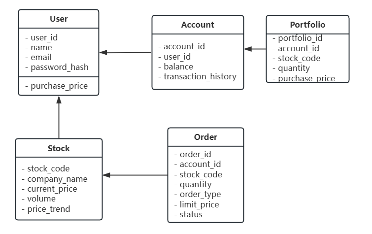
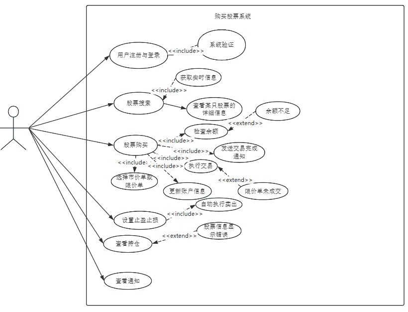

# 在线券商账户购买股票

### 1. 软件需求分析

#### 功能性需求

1. **用户注册与身份验证**：系统需要支持新用户的注册及身份验证功能，以确保账户的安全。
2. **账户管理**：用户能够查看账户余额、充值及资金流动情况。
3. **股票搜索和查看**：提供股票搜索功能，用户可通过股票代码或公司名称查询股票，并查看详细信息（实时价格、波动趋势、交易量等）。
4. **股票购买**：用户可以选择购买股票数量或金额，选择订单类型（市价单或限价单），并进行确认。
5. **订单管理与执行**：系统应实时处理订单。对于市价单应立即执行，限价单则等待市场价格达到条件再执行。
6. **持仓管理**：用户可以在账户中查看当前持仓的股票和交易记录。
7. **通知与提醒**：系统应在交易完成后通知用户，并支持止盈止损功能及实时价格提醒。

#### 非功能性需求

1. **安全性**：系统需保护用户的个人信息和账户资金安全。
2. **实时性**：提供实时的股票价格、交易处理和余额更新。
3. **可扩展性**：支持将来添加其他金融产品或交易类型的扩展。
4. **用户友好性**：界面易用，信息清晰，操作流程直观。

### 2. 数据模型设计

在数据模型设计中，主要涉及以下几个关键实体及其关系：

- **用户 (User)**
- **账户 (Account)**
- **股票 (Stock)**
- **订单 (Order)**
- **持仓 (Portfolio)**
- **通知 (Notification)**

以下是实体及属性的详细设计：

| **实体**                | **属性**                                                     | **说明**                                            |
| ----------------------- | ------------------------------------------------------------ | --------------------------------------------------- |
| **用户 (User)**         | 用户ID（user_id）、姓名（name）、电子邮件（email）、密码（password_hash） | 用户的基本信息，用于身份验证和关联账户。            |
| **账户 (Account)**      | 账户ID（account_id）、用户ID（user_id）、余额（balance）、交易历史（transaction_history） | 用户的资金账户信息，包含余额和交易记录。            |
| **股票 (Stock)**        | 股票代码（stock_code）、公司名称（company_name）、当前价格（current_price）、交易量（volume）、价格趋势（price_trend） | 股票的基本信息及实时市场数据。                      |
| **订单 (Order)**        | 订单ID（order_id）、账户ID（account_id）、股票代码（stock_code）、数量（quantity）、类型（order_type）、限价（limit_price）、状态（status） | 订单信息，包含交易类型（市价单/限价单）及执行状态。 |
| **持仓 (Portfolio)**    | 持仓ID（portfolio_id）、账户ID（account_id）、股票代码（stock_code）、持有数量（quantity）、买入价格（purchase_price） | 用户当前持有的股票信息，显示持仓情况。              |
| **通知 (Notification)** | 通知ID（notification_id）、账户ID（account_id）、类型（type）、内容（content）、时间（timestamp） | 用户的通知信息，包括交易成功、价格提醒等内容。      |

### 3. 系统流程模型设计

以下是主要流程的设计：

#### a. 用户注册和登录流程

1. 用户输入注册信息，系统创建用户账号并返回成功消息。
2. 登录时，系统验证用户输入的凭证，成功后进入账户主页。

#### b. 股票搜索和查看流程

1. 用户在搜索栏输入股票代码或公司名称。
2. 系统查询并返回相关股票信息，包括实时价格、价格趋势等。

#### c. 股票购买流程

1. 用户在股票详情页点击“买入”按钮。
2. 系统弹出订单填写窗口，用户选择数量、订单类型（市价单/限价单）。
3. 用户确认购买，系统检查账户余额是否足够。
   - 若余额不足，系统提示用户充值或减少购买数量。
4. 系统提交订单至交易市场。
   - 市价单：立即执行，按当前价格买入。
   - 限价单：等待市场价格达到设定值再执行。
5. 交易完成后，系统更新用户持仓信息和余额，并发送通知。

#### d. 持仓管理流程

1. 用户进入持仓页面查看持有股票情况，包括股票代码、数量、买入价格等信息。
2. 系统可提供止盈止损设置，用户可设定触发点，系统自动执行卖出指令。

#### e. 通知与提醒流程

1. 当交易完成、价格波动达到提醒条件时，系统发送通知给用户。
2. 用户可通过通知查看交易详情或价格波动提醒。

### 4. 系统类图设计

以下是系统的类图设计：

### 5. 系统界面设计

在界面上，可以设计以下关键页面：

- **注册和登录页面**：输入用户名、密码等基本信息，用户可注册和登录。
- **账户首页**：显示账户余额、持仓股票、近期交易记录。
- **股票搜索和详情页**：用户可以搜索股票，查看实时信息。
- **购买页面**：股票购买数量、订单类型和确认按钮。
- **持仓页面**：显示用户当前持有股票的列表，用户可设置止盈止损。
- **通知页面**：显示交易完成通知、价格提醒等。

以下是股票购买系统的详细用例和分析。

---

| **用例名称** | 用户注册与登录                                               |
| ------------ | ------------------------------------------------------------ |
| **参与者**   | 用户（投资者）                                               |
| **前提条件** | 无（用户初次访问）                                           |
| **触发条件** | 用户决定使用系统并访问注册页面                               |
| **基本流程** | 1. 用户进入注册页面，填写用户名、密码、电子邮件等信息。 2. 系统检查信息完整性并验证电子邮件格式。 3. 系统将用户信息存储在数据库中，返回注册成功提示。 4. 用户进入登录页面，输入用户名和密码。 5. 系统验证用户身份，成功后进入账户主页。 |
| **异常情况** | 1. 用户名已被使用 -> 系统提示选择其他用户名。 2. 密码不符合要求 -> 系统提示重新设置。 3. 登录信息错误 -> 系统提示登录失败。 |
| **后置条件** | 用户成功注册并登录，进入账户主页。                           |

---

| **用例名称** | 股票搜索与查看                                               |
| ------------ | ------------------------------------------------------------ |
| **参与者**   | 用户（投资者）                                               |
| **前提条件** | 用户已登录到系统                                             |
| **触发条件** | 用户希望查看某只股票的详细信息                               |
| **基本流程** | 1. 用户在搜索栏中输入股票代码或公司名称。 2. 系统匹配相关股票，并返回符合条件的股票列表。 3. 用户选择股票进入详情页面，系统显示详细信息（实时价格、历史波动趋势、交易量）。 |
| **异常情况** | 1. 无匹配结果 -> 系统提示“无匹配结果”，建议重新输入关键词。  |
| **后置条件** | 用户可以浏览所选股票的详细信息。                             |

---

| **用例名称** | 股票购买                                                     |
| ------------ | ------------------------------------------------------------ |
| **参与者**   | 用户（投资者）                                               |
| **前提条件** | 用户已登录系统，且账户余额足够                               |
| **触发条件** | 用户决定购买某只股票                                         |
| **基本流程** | 1. 用户点击股票详情页面的“买入”按钮。 2. 系统弹出购买窗口，用户选择数量或金额。 3. 用户选择市价单或限价单。 4. 用户点击“确认购买”，系统检查余额。 5. 市价单：系统立即执行交易；限价单：市场价格达到设定值时执行。 6. 系统更新账户余额、持仓信息，并发送交易完成通知。 |
| **异常情况** | 1. 余额不足 -> 系统提示充值或减少数量。 2. 限价单未成交 -> 系统在订单有效期内等待或取消。 |
| **后置条件** | 股票添加至用户持仓，账户余额减少。                           |

---

| **用例名称** | 查看持仓及管理                                               |
| ------------ | ------------------------------------------------------------ |
| **参与者**   | 用户（投资者）                                               |
| **前提条件** | 用户已登录系统，且持有股票                                   |
| **触发条件** | 用户希望查看或管理持仓                                       |
| **基本流程** | 1. 用户进入持仓页面，系统显示持仓股票列表。 2. 用户选择股票，设定止盈止损价格。 3. 系统记录设置并监控市场价格，达到条件时自动执行卖出。 |
| **异常情况** | 1. 股票信息显示错误 -> 系统定期同步数据。                    |
| **后置条件** | 用户的持仓更新，止盈止损设置记录在系统中。                   |

---

| **用例名称** | 通知管理                                                     |
| ------------ | ------------------------------------------------------------ |
| **参与者**   | 用户（投资者）                                               |
| **前提条件** | 用户已登录系统，且有交易活动                                 |
| **触发条件** | 交易完成、价格提醒条件触发等                                 |
| **基本流程** | 1. 交易完成或价格触发时，系统发送通知。 2. 用户进入通知页面，查看通知的详细信息（如交易完成时间、交易数量、价格）。 |
| **异常情况** | 1. 通知延迟 -> 系统保持实时更新，避免延迟。                  |
| **后置条件** | 用户了解交易状态或价格变动情况。                             |

---

### 用例分析总结表

| **需求类别**       | **需求内容**                                                 |
| ------------------ | ------------------------------------------------------------ |
| 账户安全           | 用户注册与登录需保证安全的身份验证和信息保护，避免密码或账户信息泄露。 |
| 实时性与数据准确性 | 股票搜索、查看和购买流程要求实时市场价格，确保数据更新及时。 |
| 订单执行逻辑       | 支持市价单和限价单的不同订单执行逻辑，保证用户选择的订单类型按规则执行。 |
| 通知系统           | 交易完成和价格变化需及时通知用户，系统应具备价格提醒和交易完成通知的功能。 |
| 持仓管理           | 用户需实时查看和管理持仓，止盈止损设置应当准确触发，并自动执行交易。 |
